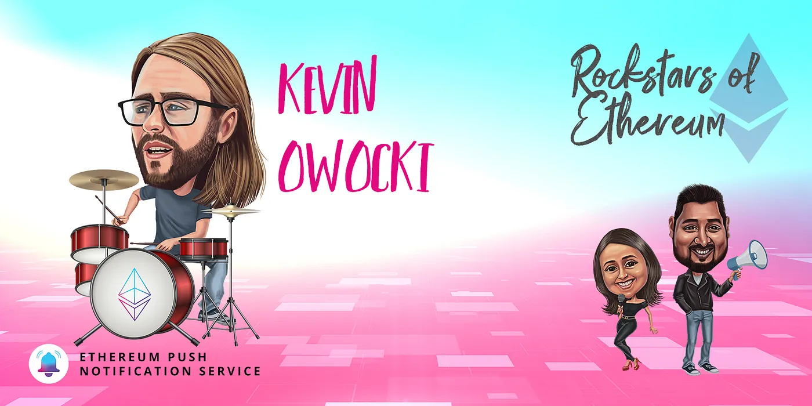

import { ImageText } from '@site/src/css/SharedStyling';

<!--truncate-->

With Gitcoin Grants Round 11 starting today, EPNS is proud to announce we will be sponsoring GR11 to continue supporting early projects in Web3.

💖Sponsoring [Gitcoin](https://twitter.com/gitcoin) this round is just the latest in our awesome journey from grantee to grantors.

This incredible journey with Gitcoin began with the **Ethereum Foundation**. We approached the EF with our idea for a communication and notification layer of Web3, leading to tons of research 🔬

That led us to HackMoney 2020 with [ETHGlobal](https://twitter.com/ETHGlobal) and the EPNS proof of concept was created! 👋🏼

Next up, we were selected for [IDEO Collab Ventures](https://twitter.com/IDEOVC) **Product Validation Day** in June 2020. Along with other Web3 projects, EPNS was selected out of 120+ teams to share the project for feedback, discussion, and iteration.

And just a few weeks later, EPNS was honored to have been selected for [Gitcoin KERNEL](https://twitter.com/KERNEL0x) (Genesis Block). We embarked on a 8 week journey of collaborating, testing, building, and iterating with leaders from across the Web3. Eight weeks later, we came out in the top 20 projects from KERNEL😎.

Next in line: **Gitcoin Grants Round 7!** We couldn’t have imagined the support and enthusiasm from the Gitcoin and wider Ethereum community. We ended the round in the top 5 projects, with over 210 contributors!

This successful Gitcoin Grants round participation led us to [announce our seed in December!](https://medium.com/ethereum-push-notification-service/ethereum-push-notification-service-successfully-raises-750k-usd-in-seed-round-bec41eadd84d) **$750k** in funding from [Balaji Srinivasan](https://twitter.com/balajis), [Scott Moore](https://twitter.com/notscottmoore), [DefiDad](https://twitter.com/DeFi_Dad), [Anthony Sassano](https://twitter.com/sassal0x), and many more!

But our journey with Gitcoin didn’t stop there! After the **$PUSH** token launch, we announced the 🎸[Rockstars of Ethereum](https://www.youtube.com/watch?v=nClMGshU1nU&list=PLyWTqFLqKt9Z_tlTGz29qcP36VqLjo3nu) series. Our inaugural episode was with none other than [**Kevin Owocki**](https://twitter.com/owocki) himself!

Just a month later, we announced our [**partnership with Gitcoin**](https://twitter.com/epnsproject/status/1388131533735661573?s=20). The partnership builds on the EPNS platform to allow notifications for the grant process, better connecting grantees to grantors.

And today, we’re excited to announce our **Sponsorship of Gitcoin Grants Round 11!** 🎉We’re psyched to see all the emerging projects and give our support to projects in the space that are at the stage we were at just a year ago.

Our journey from grantee to grantor “completes the circle” of our journey with [Gitcoin](https://twitter.com/gitcoin), but it doesn’t mark the end! We look forward to continuing to support and give back to the community that has given us so much.

Thank you Gitcoin! 💝

