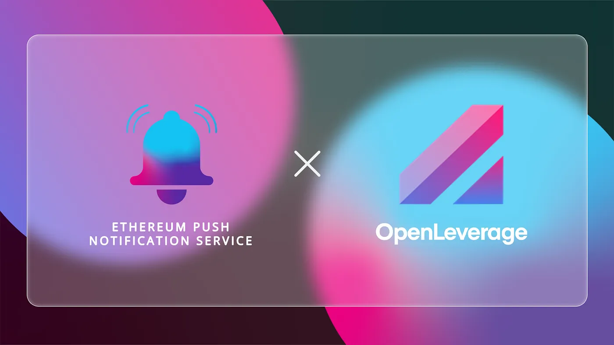

import { ImageText } from '@site/src/css/SharedStyling';

<!--truncate-->

The boom of decentralized finance allowed for permissionless trading, listing, and rapid growth of liquidity and volume. Although users have seen a plethora of DeFi applications, even the degen of degens finds it difficult to discover permissionless markets for leveraged trading. Existing decentralized leverage trading platforms provide minimal pairs and market depth. To truly build DeFi’s vision of global financial access, there needs to be a decentralized, permissionless, scalable, secure leverage trading facility that serves the long tail and fast-growing DeFi market.

OpenLeverage is a permissionless margin trading protocol, which enables traders to long or short any trading pair on DEXs efficiently and securely. OpenLeverage Protocol aims to create an entirely permissionless decentralized margin trading infrastructure. Therefore, no permission must be needed to create a margin trading market for any pair.

With the huge potential OpenLeverage possesses, we at EPNS, are glad to announce our pilot program collaboration with OpenLeverage. During this pilot program we will be working with OpenLeverage to:

- Provide notifications when prices move beyond a certain threshold.
- Provide notifications when your position is about to be liquidated or is approaching liquidation.

We are delighted that OpenLeverage is “leveraging” EPNS to push decentralized notifications and take one more step towards decentralizing the communication layer of DeFi and Web3.

# **About OpenLeverage.Finance**

OpenLeverage is a permissionless margin trading protocol, which enables traders to long or short any trading pair on DEXs efficiently and securely.

To learn more about [OpenLeverage](https://openleverage.finance/):

Join OpenLeverage [Discord](https://discord.com/invite/DmZCpgBZY3) | Follow [@OpenLeverage](https://twitter.com/OpenLeverage) on Twitter | Join OpenLeverage [Telegram](https://t.me/openleverage) group
