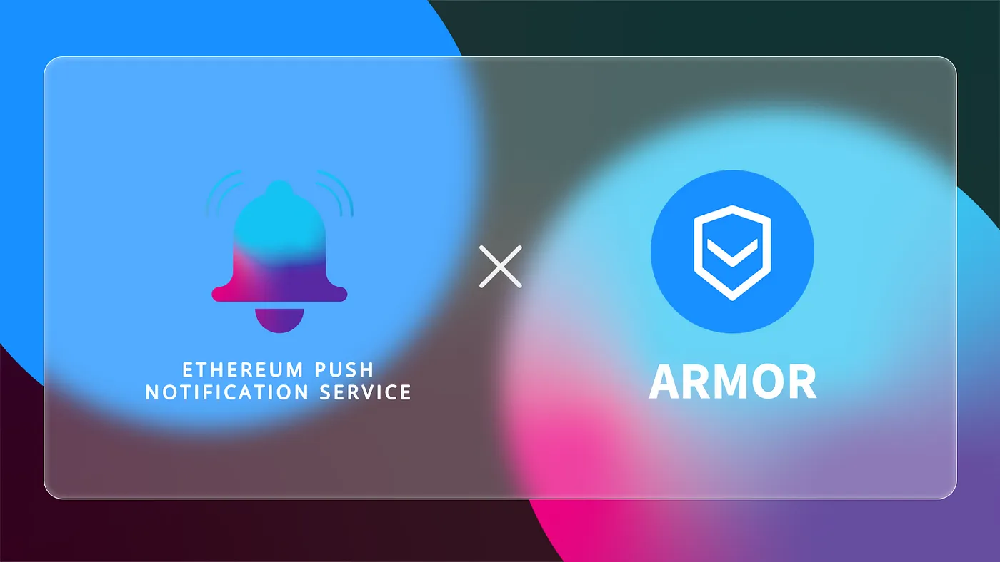

import { ImageText } from '@site/src/css/SharedStyling';

<!--truncate-->

The recent heist on Poly Network where almost $600M worth of assets were stolen has raised several questions on the security of DeFi protocols. While DeFi protocols managed to carve a space for themselves and gain popularity among users in the past few years, they also gained popularity among hackers.

Their largely open-source software and pseudonymous nature make it easier for hackers to siphon large amounts of money from the protocol in an almost untraceable way. When this happens, users, more often than not, end up losing their funds. This is where a protocol like Armor is needed. It is the blockchain equivalent of a mutual fund that provides discretionary cover aiming to protect user funds.

By partnering with this next-generation protocol, we aim to solidify the protection of assets by establishing proper communication between users and the protocol.

Armor Goes a Step Further with Push Notifications
=================================================

[Armor](https://armor.fi/) is a decentralized protocol that protects user assets held on different DeFi protocols to cover unforeseen situations like hacks and attacks. Armor provides pay-as-you-go coverage for user funds and investments across popular protocols such as Uniswap, AAVE, Compound, Balancer, and over 80 more. The coverage is underwritten by Nexus Mutual and is permissionless.

Users are required to buy a Nexus Mutual Cover for a certain amount of asset (eg. 100ETH) which is represented as an arNFT on-chain. arNFT holders can sell, trade, or stake the NFT to earn rewards. Armor also provides an arCore smart cover that tracks user funds as they move across different protocols and charge by the second. This results in cost efficiency and flexibility.

Now, users who have an arNFT or an arCore smart cover are definitely protected from hacks, but they need to keep a constant eye on third-party communication media to know if the protocol is hacked (as happened earlier this week with C.R.E.A.M.!) or if their cover is expiring. By enabling decentralized push notifications through EPNS, Armor would be able to circumvent these problems and provide timely updates to its users.

What Does the Partnership Entail?
=================================

Through our partnership with Armor, we aim to build a proper communication channel that reduces friction between the protocol and their users, and provides them with all the required updates. Users of Armor will be able to subscribe to the notification service to receive updates whenever:

*   Any of the protocols they have arCore smart cover for has been hacked.
*   Any of the protocols they have an arNFT for has been hacked.
*   Their arNFT is about to expire.
*   Their Smart Cover is below or above x% of the actual wallet value and should be updated.

These are just the first 4 out of a few dozen useful notifications we have identified with the Armor team. As Armor continues securing user funds on various protocols, we’re pleased to partner with them to provide notifications for their users. We wish to become an integral part of the Armor network and hope that the notifications help improve their user experience as a whole.

About Armor
===========

Armor makes investing in DeFi as safe as possible with crypto-native, dynamic smart coverage aggregation. As a decentralized brokerage, Armor’s innovations provide on-demand, real-time coverage and non-custodial security solutions for user assets. Armor’s focus is on building an ecosystem of interoperable protocols and products to secure and scale mass adoption of DeFi both with institutions and individuals.

[Twitter](https://twitter.com/armorfi) | [Telegram](http://t.me/ArmorFi) | [Discord](https://discord.gg/8HuTB22) | [Website](https://armor.fi/) | [Github](https://github.com/ArmorFi) | [Announcements](http://t.me/armor_ann)

