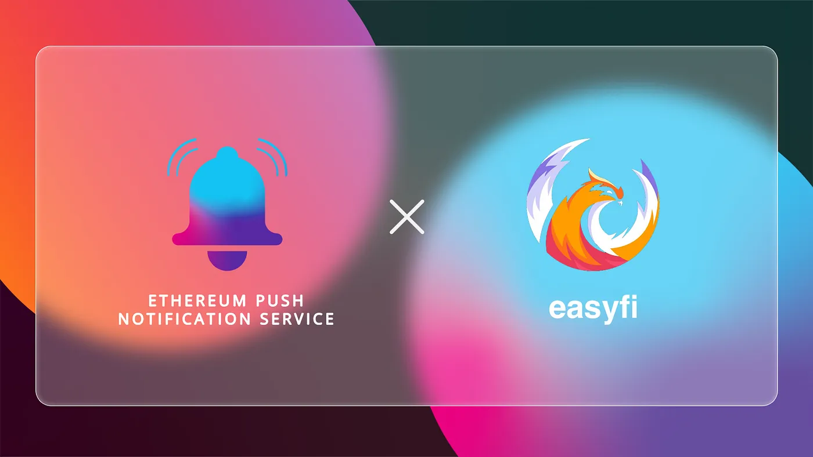

import { ImageText } from '@site/src/css/SharedStyling';

<!--truncate-->

EPNS is pleased to announce the launch of a pilot program to provide decentralized push notifications to EasyFi’s lending model and display the benefits of a decentralized communication layer in the rapidly growing DeFi lending markets.

EasyFi is a multi-chain lending protocol for digital assets built on the Polygon Layer 2 solution to provide faster, scalable, and low cost access to structured lending products.

### Removing Frictions With Push Notifications

Driven by innovative lending protocols like EasyFi, over 1 billion USD in interest has been earned in DeFi lending markets. Through permissionless lending lenders and borrowers have easy access to liquidity, yet sers on such DeFi platforms face a risk to their funds due to lack of proper communication from the platforms regarding any transaction or activity or incident that happens there.

So be it a change of interest rate that may result in low-yield, or a risk of liquidation of supplied collateral due to a sudden fall in asset price, timely interventions will go a long way in giving confidence to a user on a lending protocol.

Needless to say, timely and efficient communication tools are at the center of matching borrowers and lenders at the optimal interest rates for both parties. Managing lending and liquidation, however, involves messages from multiple platforms yet no central messaging service exists.

An essential element that will play a part in improving services and user adoption is **_decentralized push notifications_**. DeFi lending platform users are highly dependent on notification services to facilitate lending services, including:

- Loan liquidation alerts
- Changes in interest rates
- Collateralization ratios and liquidation alerts
- Governance-related notifications, and more.

A push notification service would hence remove the friction of the unknown and allow all platform users to receive and take timely action on important lending notifications while still protecting data privacy as users interact with internal and external data sources.

# The EPNS Solution

The EPNS decentralized push notification service sends timely notifications through a single source of communication, the investor’s wallet. All notifications go directly to the user’s wallet where they can take immediate action. EPNS is the first native, on-chain notification solution to stream all crucial time-sensitive information to a user’s wallet.

The partnership benefits to EasyFi users include:

- EPNS will send all data notifications directly to EasyFi user wallets.
- The EPNS and EasyFi teams will adapt the highly customizable EPNS protocol to meet the various push notification needs of lenders and borrowers.
- EPNS channels and users can customize their notification settings for different data notification requirements.

# How EPNS Will Support EasyFi

Under this pilot program,

- EPNS is building a dedicated channel for EasyFi (see our [litepaper](https://whitepaper.epns.io) for definitions of channels, services, and more).
- EasyFi users can subscribe to the EasyFi channel to receive customized notifications to their wallets.
- Through collaboration with the EasyFi team, we will gain insight into the push notification needs of users of lending platforms and what they want from the EPNS protocol.

Decentralized notifications will provide real-time data to one wallet so all users can act in a timely manner. Lenders and borrowers can identify the most attractive interest rates and fees across lending platforms. Meanwhile, all users can continue to operate within the private, secure ecosystem of EasyFi’s multi-chain lending ecosystem, without having to deal with integration pains across many different protocols.

\[“_The EPNS development team has enthusiastically embraced the excitement and possibilities of instant notifs on Layer 2 DeFi solutions. So are we delighted in the opportunity to work with EasyFi, a lending protocol pushing the innovation frontier in the development of structured lending products leveraging the speed and scale of Layer 2. EPNS push notifs will ensure EasyFi users never miss an opportunity to reduce risk and improve yields through EasyFi’s structured lending products,”commented Harsh Rajat, Founder and Project Lead of Ethereum Push Notification Service._\]

\[_Anshul Dhir, CoFounder & COO, EasyFi Network said — “As we move into high gear with full protocol launch and implementation of new products and services on EasyFi, we foresee a need to make engagement on our multichain protocol easier and intuitive for the user. Our collaboration with EPNS and the integration of push notifications on our protocol, will drive this commitment and improve overall engagement, with users taking their own decisions starting with which alert they want to receive!”_\]

# Looking Forward

We foresee many new EPNS notification channels being introduced for EasyFi in particular, and DeFi lending markets in general. Easy-to-configure push notifications will enable future EasyFi users to take advantage of all products and services on EasyFi App.

We view decentralized push notifications as an important service that will accelerate the mass adoption of decentralized lending. Since EasyFi is at the forefront of creating structured lending products that improve permissionless lending markets, we expect our partnership to yield many new useful notification services and features for the decentralized lending market.

The long-term goal of the pilot program is to develop a notification system for future versions of EasyFi. DeFi lending users — who can easily integrate the EPNS protocol into a wallet — will expect push notifications to be an integral service. Going forward, we also expect to work closely with EasyFi users to create new messaging solutions to meet their evolving push notification needs.

We are pleased to be partnering with EasyFi and anticipate EPNS push notifications becoming an indispensable tool in DeFi lending markets.

# About EasyFi

EasyFi is a universal layer 2 lending protocol built for DeFi focused on scalability, composability, and adoption. It has been designed as an open and inclusive financial network infrastructure running on public networks to facilitate the end-to-end lending and borrowing of digital assets and related financial products. EasyFi is being built upon the ethos of permissionless networks and the automation of smart contracts.

[Website](https://easyfi.network/) | [Twitter](https://twitter.com/EasyfiNetwork) | [Telegram](https://t.me/easyfiNetwork) | [Whitepaper](https://easyfi.network/easyfi-whitepaper.html) | [Blog](https://medium.com/easify-network) | [App](https://app.easyfi.network/)
