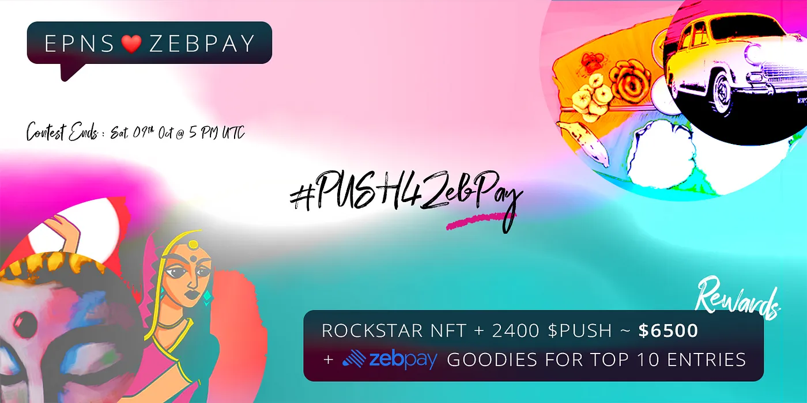

import { ImageText } from '@site/src/css/SharedStyling';

<!--truncate-->

Hey EPNS fam 🎎!

We have awesome news to share! To celebrate $PUSH listing on [ZebPay](https://zebpay.com/), we are thrilled to announce that this week’s $ROCKSTAR #NFT will be sponsored by none other than **ZebPay**. This week’s winner goes home with **$ROCKSTAR NFT** + **2400 $PUSH** (~$6,500), and 10 top shortlisted entries win **Goodies\*\* **from ZebPay** 🎁

So, let creativity invade your thinking and celebrate and share the EPNS x ZebPay collaboration with the world 🎭!

# ZebPay ❤️ EPNS ROCKSTAR Competitions Rules👇

- Follow [EPNS](https://twitter.com/epnsproject) and [ZebPay](https://twitter.com/zebpay) and RT the contest tweet
- Include EPNS and ZebPay elements in your submission.
- Get creative!!! create memes, infographics, videos, photos, reviews or anything cool or crazy and submit by replying to the tweet.
- Reply to the tweet with **#**PUSH4ZebPay and your creative to qualify for the competition.
- Contest ends on Saturday, 9th Oct at 5PM UTC.
- Top 4 entries will be shortlisted by ZebPay. Shortlisted entries will be submitted for voting via [EPNS Governance](https://medium.com/ethereum-push-notification-service/epns-governance-goes-live-lets-push-for-progressive-decentralized-governance-7448b58b89b4) to select the final winner.

Note that the ZebPay goodies are limited to India area only.

Good luck to everyone!🤞 🎨

p.s. Look out for a series of exciting contests coming soon with EPNS X ZebPay!
