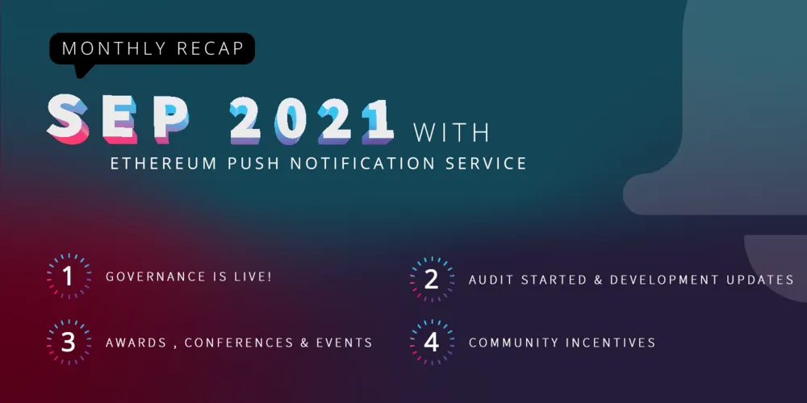
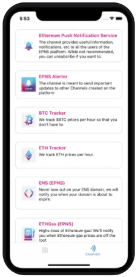
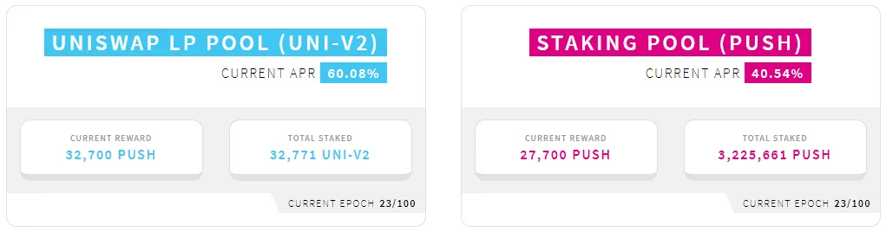

import { ImageText } from '@site/src/css/SharedStyling';

<!--truncate-->

As we come to close a very exciting Q3 full of great news and tons of progress, things are just warming up for a super interesting remainder part of the year.

Let’s check together all the happenings this month!

EPNS Governance 🎯
==================

Let’s start with one of our most important milestones for EPNS and the community: the **EPNS Progressive Decentralized Governance** went Live on September 16th!.

Make sure to go over the [official announcement blog post](https://medium.com/ethereum-push-notification-service/epns-governance-goes-live-lets-push-for-progressive-decentralized-governance-7448b58b89b4), as it covers all details about how Progressive Decentralized Governance for EPNS will start, what's going to take part in Phase 0, the Governance Roles, and the Governance Process itself.

Governance is just getting started ([https://gov.epns.io/](https://gov.epns.io/)) and it’s the perfect time to start getting involved and participate in the direction of the protocol.

**You can** [**submit your PUSH Delegatee nominations**](https://twitter.com/epnsproject/status/1438185866506104834?s=20) **now!** Currently, there is a total of 18 PUSH Nominees, which we are adding to the [Governance portal](https://incentives.epns.io/) so people can delegate voting power to them.

Additionally, we are just starting the process to “Choose our $ROCKSTARS together” aiming to leave the selection of each week’s ROCKSTAR OF EPNS winner in the hands of the community.

And finally, we are soon publishing more news in regards to how we are implementing a sound Game Theory into our Governance process. Adding incentives and penalties will greatly improve quality participation.

Development 🚧
==============

This month many development initiatives that we have been working on are coming together and started the release process.

Smart Contract Audit in progress 👮🏼
-------------------------------------

A big part of this month’s effort was towards finishing the Protocol segmentation and its corresponding test cases. The formal Audit Process with ChainSafe was initiated by mid-September, and we expect to finish this process within the next couple of weeks.

Showrunners Framework Plug & Play🤖
-----------------------------------

Upon passing a very intense period of testing in our development and staging environments, the Showrunners Framework Plug & Play is almost out! This framework allows services to trigger notifications using off-chain and on-chain logic.

Together with this framework release, we are also providing a step by step **video tutorial** to explain how to easily create your channels. Additionally, we are making things simpler by creating a Github template, and a step by step written guide.

Showrunners channels 📺
-----------------------

How could we battle-test our revamped Showrunners Framework? You are right! We developed and continue developing more new channels for our awesome Pilot Collabs with the most important protocols in the space.

**Channels in the release pipeline:** Oasis.App, bZx, B.Protocol, TracerDAO.

**Channels in Development:** PoolTogether, CVI (Crypto Volatility Index), Armor.fi, IDLE Finance.

As usual, with every channel, we learn something new that helps us improve our protocol and our tooling for developers. This month a lot of the lessons learned were applied to the development of the Showrunners framework itself.

Channel Discovery features 🔮
-----------------------------

This feature required coordinating and developing different components to communicate effectively. Backend APIs, Mobile application builds, updates to the Chrome Browser Extension. The good news is it's now complete and ready for release!

A new version of the mobile app will be released over the next couple of weeks. For now, here is a sneak peek in case you missed it before!

FrontEnd-SDK 🎨
---------------

Similarly to the Showrunners Framework, this release will happen soon and will also include code snippets and samples for developers to easily fetch, parse and show notifications on-screen on your dApps and Mobile Apps.

We are additionally including a WYSIWYG tool to preview how notifications will look like before you send them.

Github repo and documentation coming soon!

Sending Payloads directly to the PUSH Nodes 👾
----------------------------------------------

This was an Alpha leak 😜 by Harsh at [Messari Mainnet 2021](https://youtu.be/xDhyQQLishU?t=1363)!

In our mission to become the de-facto middleware communication layer for the web2 and the web3, we are opening for services the possibility to interface directly with the PUSH Nodes by dropping payloads directly to them. At this initial stage PUSH nodes will verify that the transaction is coming signed by either the channel owner or one of the delegated wallets for the channel.

While this is a work in progress and will require more testing and fine-tuning, the demo presented at the Messari Mainnet Conference is a fully working demo that we are hardening and extending as we see fit.

Polygon connect 🔷
------------------

Another Alpha leak dropped during Messari Mainnet. Following the mission mentioned above, our team set to the task of making sure that the EPNS protocol can work and communicate effectively across chains. With this in mind, we deployed the EPNS communicator contract in Polygon, and have been running rounds of testing to ensure that notifications are being triggered and delivered correctly.

Deploying the contracts is just a part of this task — ensuring that all other EPNS products are compatible is also a big part of it; and while PUSH Nodes play a very critical role in this equation, our team is making sure that Mobile App, Browser Extension, SDKs, and APIs are rock solid with this approach.

More frens, more fun! 🙌🏽
==========================

We keep growing our list of awesome Frens, and we couldn’t be more grateful and excited about this.

[**CVI (Crypto Volatility Index)**](https://twitter.com/epnsproject/status/1433439003215220738?s=20): to implement notifications for users about unexpected changes in index value, updates about upcoming market events, updates about user’s margin positions approaching liquidation, and even arbitrage opportunities specific to the CVI arbitrageurs group.

[**Kyber Network**](https://twitter.com/epnsproject/status/1440357337093398545?s=20): with this collaboration Kyber looks to notify users about the launch of new liquidity mining programs, pools, and integrations; as well as stream price feeds, alerts about new Kyber Improvement Proposals and more.

[**Open Leverage**](https://twitter.com/epnsproject/status/1441084477384495108?s=20): this collaboration looks to provide notifications to users when prices move beyond a certain threshold, and also when your position is about to be liquidated or is approaching liquidation.

[**Armor.fi**](https://twitter.com/epnsproject/status/1442489466799550475?s=20): aims at implementing notifications for their users when any of the protocols they have arCore smart cover for has been hacked, or any of the protocols they have an arNFT for has been hacked as well. Additionally, when user’s arNFT are about to expire, or if their Smart Cover is below or above x% of the actual wallet value and should be updated.

[**EasyFi**](https://twitter.com/epnsproject/status/1443214048808472576?s=20): with EasyFi, we are looking to implement Web3 notifications to alert about upcoming loan liquidations, changes in interest rates, collateralization ratios and liquidation alerts, Governance-related notifications, and more.

EPNS in the news 📺
===================

We are ecstatic with all the happenings on this front this month 😇. From participating in different events & conferences, and being featured in important podcasts, to being nominated to awards and recognitions.

*   EPNS got nominated for the [**ETStartupAwards2021**](https://twitter.com/epnsproject/status/1440601773870362624?s=20) in Top Innovator Category!
*   BestStartup.Asia named EPNS as [**one of the Top Singapore Blockchain Companies and Startups of 2021**!](https://twitter.com/epnsproject/status/1439260504120123393?s=20)
*   Our founder, Harsh gave a live demo of EPNS at [Messari Mainnet 2021](https://twitter.com/epnsproject/status/1440742825092517899?s=20) and also took a DeFi Masterclass at [**The Crypto Summit by Inc42**](https://twitter.com/epnsproject/status/1439569506599415818?s=20)
*   EPNS got featured by [**Inc42**](https://twitter.com/epnsproject/status/1439953665771462657?s=20)
*   Do check out [Show Me The Crypto podcast with Harsh](https://twitter.com/ShowCrypto/status/1441125165656465410?s=20)
*   EPNS got featured in [CA Rachana Ranade’s Youtube video](https://twitter.com/epnsproject/status/1432650334472572938?s=20)
*   EPNS got featured in [Anthony Sassano’s The Daily Gwei](https://twitter.com/epnsproject/status/1436562658346430472?s=20)

And finally, we hosted our first Twitter Space ‘[Crypto pe Charcha](https://twitter.com/epnsproject/status/1437451781055803393?s=20)’! It was a fun conversation between [@harshrajat](https://twitter.com/harshrajat), [@simplykashif](https://twitter.com/simplykashif) and [@PareenL](https://twitter.com/PareenL).

Token listings 🔥
=================

This was a very busy month for $PUSH as well! We were listed in 4 new exchanges and promoted to the mainboard in MEXC Global.

*   [Huobi](https://twitter.com/epnsproject/status/1432241447009411078?s=20): PUSH/BTC, PUSH/USDT
*   [Gate.io](https://twitter.com/epnsproject/status/1432683735372214276?s=20): PUSH/ETH, PUSH/USDT
*   [Bitbns](https://twitter.com/bitbns/status/1441388625350905857?s=20): PUSH/INR
*   [CoinDCX](https://twitter.com/epnsproject/status/1440315146350444547?s=20): Trading pairs: $INR $USDT $BTC
*   $PUSH was also transferred to [MEXC Global](https://twitter.com/epnsproject/status/1433058575849512965?s=20) Mainboard!

EPNS Community Incentives 🎪
============================

This was an awesome month for the EPNS community! On top of our usual activities, we ran many contests to celebrate our new listings, and we continue observing great APRs on our staking pools.

**ROCKSTARS of EPNS** continue being one of the community favorites. Submissions get more creative every month! From developer guides to explainer videos and spreading the word about EPNS.

> _Want to participate and win $ROCKSTAR, start over here:_ [_https://medium.com/ethereum-push-notification-service/kicking-off-the-epns-nft-community-drops-6a5c49808cf_](https://medium.com/ethereum-push-notification-service/kicking-off-the-epns-nft-community-drops-6a5c49808cf)

Now, let's go briefly over all the contests that took place this month:

*   **BIGGEST $ROCKSTAR contest of the season!** [EPNS x Huobi Contest](https://twitter.com/epnsproject/status/1433014678624559116?s=20) supporting Indian artists
*   [**$PUSH ‘Trade to Win’ Carnival**](https://twitter.com/epnsproject/status/1433410364281004036?s=20) on Huobi.
*   [$PUSH Hold & Win Event](https://twitter.com/epnsproject/status/1433058575849512965?s=20) exclusively for **MEXC Global** users.
*   [#HotDeFiSummer APR-guessing contest](https://twitter.com/epnsproject/status/1426906201758093316?s=20)
*   **Trading Contest!** [EPNS x Gate.io $PUSH Trading Competition](https://twitter.com/gate_io/status/1435921786022080515?s=20)
*   [$PUSH GIVEAWAY organized by Gate.io](https://twitter.com/gate_io/status/1435932266610503684?s=20)

We’d like to leave you with one of our favorite and most liked tweets this month. It has a very special meaning to us as it shows a little bit of **_Our journey from grantee to grantors_** 💖.
