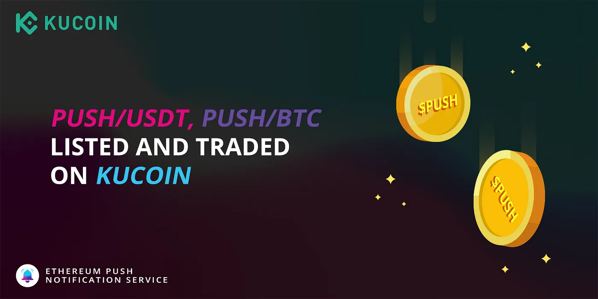

import { ImageText } from '@site/src/css/SharedStyling';

<!--truncate-->

We are thrilled to announce Ethereum Push Notification Service (PUSH) is now available on KuCoin.

Supported trading pairs are PUSH/USDT and PUSH/BTC.

**Please take note of the following schedule:**

*   **Deposits Effective Immediately (Supported Network: ERC20)**
*   **Trading:** 9:00 on October 12, 2021 (UTC)
*   **Withdrawal:** 10:00 on October 13, 2021 (UTC)

> Link to the original KuCoin blog: [https://m.kucoin.com/news/en-push-gets-listed-on-kucoin?utm\_source=twitterinfo](https://m.kucoin.com/news/en-push-gets-listed-on-kucoin?utm_source=twitterinfo)
