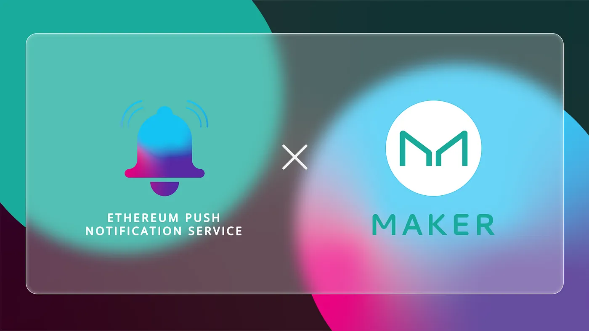

import { ImageText } from '@site/src/css/SharedStyling';

<!--truncate-->

Blockchain governance lets users become an integral part of the decision-making process of decentralized applications and protocols. It plays a key role in ensuring decentralization within the ecosystem.

All the present-day blockchain networks have robust governance and consensus protocols. But, what they lack is an effective communication channel that keeps the users updated on the voting process. This leads to reduced participation levels, ultimately reducing the level of actual degree of decentralization.

This is why we’ve partnered with the MakerDAO Development and UX (DUX) Core Unit to enable decentralized push notifications for polling and governance updates.

How MakerDAO can Leverage Decentralized Notifications
=====================================================

MakerDAO is a decentralized protocol that lets users generate Dai against a variety of crypto assets locked in a specialized smart contract called Vault. The project was built with a long-term goal of unleashing the full potential of DeFi by bringing innovative financial tools to the ecosystem.

For Maker, it all started with the vision to one day truly decentralize the protocol. And in July, Rune Christensen, Maker Foundation CEO, announced that MakerDAO had achieved complete decentralization.

To achieve this, the protocol has a two-tier voting system in place. In the first tier, a poll is created on the governance portal to establish a consensus among the community members. The second tier entails a process where an executive poll is created for community members to vote on technical changes proposed to the protocol.

In this context, all the community members need to keep a constant watch on the governance portal or social channels to be informed whenever a new poll is created. Failure to do so might result in missed voting chances and overall less community participation.

By enabling decentralized push notification for the community through EPNS, Maker Governance participants will be able to more easily stay informed of governance-related activities.

What Does the Collaboration Warrant?
====================================

By partnering with the MakerDAO Development and UX (DUX) Core Unit, we aim to build a proper communication medium between the network and users. This will reduce users’ dependency on third-party media and ensure that they receive timely polling and governance updates. This, in turn, will reduce friction and ensure that all users participate in the network governance. Users can subscribe to receive notifications whenever:

*   A new poll is created
*   A new executive proposal is created
*   A poll ends
*   An executive proposal ends
*   An executive proposal is passed

As MakerDAO continues working towards revolutionizing DeFi, we are pleased to be partnering with them in an effort to improve the network’s communication with its users. We are hopeful that EPNS push notifications will become an integral part of the Maker protocol.

About MakerDAO
==============

MakerDAO is a decentralized autonomous organization that enables the generation of Dai, against digital assets without the need for a middleman. Dai is the world’s first decentralized stablecoin on the Ethereum blockchain.

Stay in touch: [Website](https://makerdao.com/) | [Whitepaper](https://makerdao.com/whitepaper/DaiDec17WP.pdf) | [Reddit](https://www.reddit.com/r/MakerDAO/) | [Twitter](http://twitter.com/makerdao) | [Telegram](https://t.me/makerdaoofficial)

