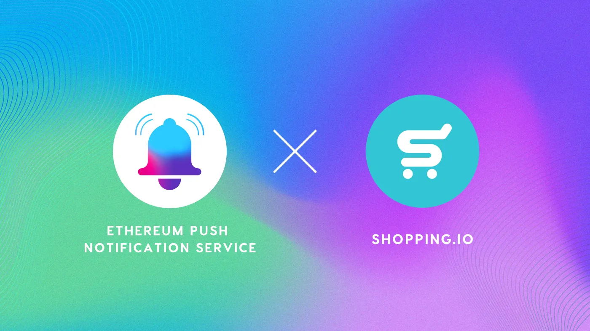

import { ImageText } from '@site/src/css/SharedStyling';

<!--truncate-->

Cryptocurrencies, for the most part, have been used within the decentralized framework, and the global markets are yet to integrate them into their operations. They’ve mostly been treated as a means of investment and massive real-life use of cryptocurrencies is yet to be realized.

Considering the minimal acceptance of crypto in the real world, the emergence of Shopping.io has come as a welcome windfall for crypto users. Shopping.io is an eCommerce platform that has been on the news lately for its revolutionary initiatives.

The platform acts as a bridge between the retail world and cryptocurrencies as it allows users to make real purchases on sites like Amazon, eBay, and Walmart using their favorite crypto assets.

On that note, we are excited to announce that Shopping.io has integrated $PUSH as a payment method on its platform, enabling $PUSH holders to make purchases on all popular websites like Amazon (US, UK, Canada, France, Italy, Spain, and Germany), eBay, Walmart, and Etsy using $PUSH.

The best part is that users will be able to avail a 2% discount that will be made available for 14 days through Shopping.io. Apart from this, holders of Shopping.io’s native token $SPI will enjoy an additional discount of 12% on purchases made using $PUSH.

Shopping.io’s integration of $PUSH creates a hassle-free user experience for $PUSH holders on Shopping.io, eliminating the complexity of swapping tokens before purchase.

We’re thrilled to see how this integration pans out in the future and we hope to become a crucial part of this growing crypto eCommerce ecosystem.

### About Shopping.io

Shopping.io was established as of December 2020 and was founded by drop-shipping veterans with a vision to change how we make purchases with crypto.

Shopping.io gives you the ability to make purchases seamlessly online with your favorite cryptocurrencies and enjoy exclusive rewards on the platform, along with a variety of token specific discounts.

SPI is Shopping.io’s native token and unlocks plan discounts and benefits on Shopping.io, including free international shipping. GSPI is Shopping.io’s governance token, unlocking our business plan for dropshippers and businesses alike, allowing discounts on various purchases.

We believe in the power of absolute freedom when it comes to E-commerce and changing the industry for the better, forever. One purchase at a time.

[Website](https://shopping.io/) | [Twitter](https://twitter.com/shopping_io?s=09) | [Telegram](https://t.me/shoppingio) | [Discord](https://discord.com/invite/4dG2bM2) | [Facebook](https://m.facebook.com/shopping.io) | [Reddit](https://www.reddit.com/r/Shopping_io?utm_medium=android_app&utm_source=share) | [Instagram](https://www.instagram.com/shopping.io_official/) | [LinkedIn](https://www.linkedin.com/company/shopping-io) | [Youtube](https://youtube.com/c/Shoppingio) | [TikTok](https://vm.tiktok.com/ZMdtpwpsL/)
