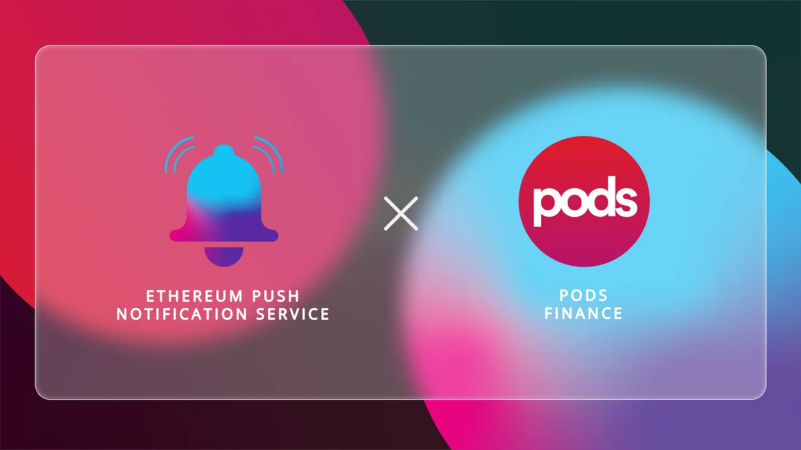

import { ImageText } from '@site/src/css/SharedStyling';

<!--truncate-->

As a result of the DeFi boom of 2020, investors in this space now have a plethora of ways to make profits off of their crypto assets instead of just HODLing them. Yield farming and staking have been popular for a while but recently, investors are leaning towards trading crypto derivatives. Crypto options have become immensely popular on cryptocurrency exchanges these days.

In this context, options traders need to be constantly updated about the status of the underlying asset, the expiry date of the contract, and when they can exercise their option. This is why EPNS partnered with the popular options trading platform Pods Finance to enable push notifications for their users (options buyers, sellers and liquidity providers).

### How Pods Finance Can Benefit from Push Notifications

Pods Finance is a decentralized options trading protocol that enables users to hedge or to get additional exposure to crypto assets on Ethereum. It has an specific Options AMM that allows users to buy, sell or provide liquidity to options of any ERC20 token. The simple user interface of the platform ensures that users can do such actions with minimal friction.

Users can choose an option on the platform, pay the premium to receive its rights, and wait for the expiration period. Once the expiration date approaches, if the option is in-the-money, users can exercise their right and sell or buy the underlying asset at strike price.

For the smooth running of this process, there needs to be a proper communication channel between users and the network. The lack of such a channel creates friction and users have to constantly keep a check on their options or they might end up missing their exercising time period, which can cause financial losses to users.

This is why we’ve partnered with Pods Finance to create a robust communication channel for the users and the network.

What Does the Partnership Entail
================================

Through our partnership with Pods Finance, we at EPNS aim to facilitate decentralized push notifications for their users. These notifications help users stay on track with options contracts and exercise them at the right time. Users of Pods Finance can subscribe to receive notifications whenever

*   The price of the underlying asset approaches the sell threshold.
*   The price of the asset approaches the buy threshold.
*   The expiry date of the contract approaches.

As Pods Finance continues to revolutionize crypto derivatives, we’re pleased to partner with them to amplify their efforts and take the protocol to new heights. We hope to be an integral part of the Pods ecosystem.

About Pods
==========

Pods is a decentralized non-custodial options protocol. Users can create options and trade them through an Options AMM on the Ethereum Blockchain. Pods is the easiest way to hedge crypto in DeFi. Join the Pods community

[App](https://app.pods.finance/) | [Website](https://pods.finance/) | [Documentation](https://docs.pods.finance/) | [Blog](https://blog.pods.finance/) | [Twitter](https://twitter.com/PodsFinance) | [Youtube](https://www.youtube.com/channel/UCRbBvHcv2jVDFj7Mk5m1mSw) | [Telegram](https://t.me/podsfinance) | [Discord](https://discord.gg/Qf7utym)

