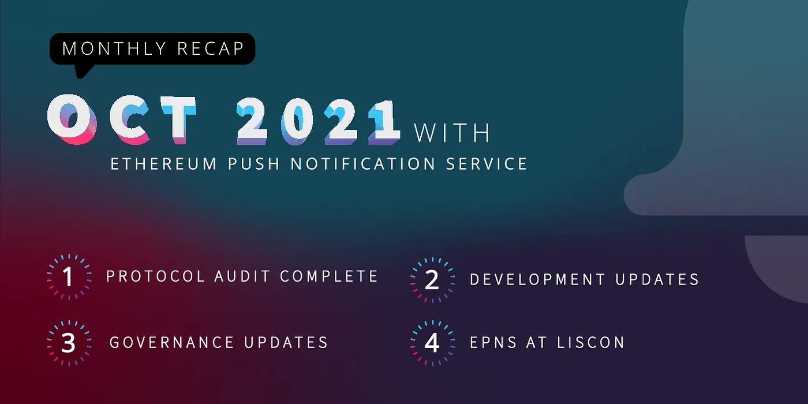
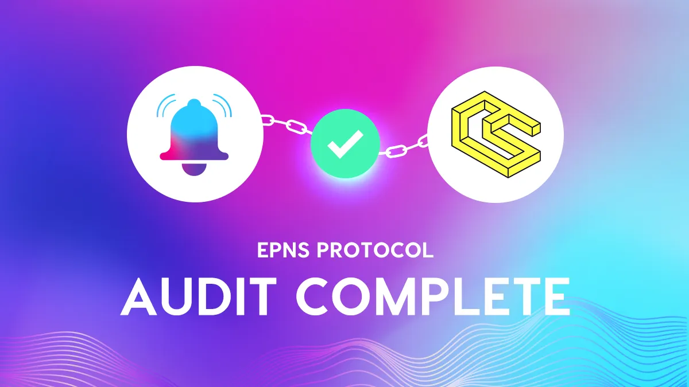

import { ImageText } from '@site/src/css/SharedStyling';

<!--truncate-->

October was an incredibly fun month in the crypto-space, and it came fully loaded with awesome news for EPNS in so many ways. Its time for our monthly recap!

EPNS Protocol Audit complete ✅
==============================

One of the most important milestones in our roadmap is now complete. After months of hard work and rigorous validation internally and with the Audit firm, our protocol is ready for prime-time! 😎

The latest additions and enhancements to the protocol gives us the capability to be multi-chain and platform agnostic, staying in line with our mission to become the de-facto communication layer of the Web3.

Development 🤖
==============

We are thrilled to announce that all of the roadmap items met the deadline except for the Third Party Mobile SDK. We took the decision of shifting priorities in our roadmap to speed up other foundational items to be ready to become multi-chain and hence the Mobile SDK was pushed to Q4.

Also — as we have been announcing — we are soon releasing a series of articles explaining in detail all the moving pieces that make possible for EPNS to be blockchain agnostic. Starting with an overall article that explains EPNS at a high level, and drilling down into some of the most critical components of EPNS:

*   PUSH Nodes
*   Showrunners Framework Plug and Play
*   FrontEnd-SDK
*   The EPNS Protocol: Core and Communicator
*   Manual Payloads to send off-chain notifications.

All these articles are the finishing step towards releasing all the components mentioned above, and they come together with developer guides, templates, and even video tutorials. 🤓

Another project that has kept us busy this month, is testing and validating all components working smoothly in Polygon and communicating perfectly with our Core Smart Contract in Ethereum. This is just the first network we decided to integrate, but of course there are more in the oven 🤫

Showrunner Channels
-------------------

With the release of our new Showrunners Framework, many new channels will be coming LIVE with it! Lots of great progress have been made through the month fine-tuning these channels for release: _Crypto Volatility Index (CVI), IDLE, Mover, Proof of Humanity, and MakerDAO_.

To finalize, over the month a new version of our Mobile App (both for Android and iOs) was released featuring **Channel Discovery!** Make sure to get the latest version and check it out!

The EPNS circle of frens gets bigger🎎
======================================

An important validation to ensure EPNS is what the Web3 needs, is making sure we are able to fulfil the needs from important and well known protocols in the space. This month we proudly announced 5 new collaborations:

[**Proof of Humanity (PoH)**](https://medium.com/ethereum-push-notification-service/epns-joins-proof-of-humanity-to-enhance-the-user-experience-of-decentralized-self-sovereign-e734780c9840)**:** by implementing Web3Notifs, existing profile holders will know immediately if their profiles have been challenged, removal requests, profile registrations, and others.

[**Mover**](https://medium.com/ethereum-push-notification-service/mover-integrates-with-epns-to-deliver-yield-harvesting-notifications-ab3bc9a6b26e): we are creating a channel to alert users when their yield is harvested, allowing them to stay updated on their finances in an intuitive & simple way.

[**MakerDAO (DUX)**](https://medium.com/ethereum-push-notification-service/epns-partners-with-makerdao-development-and-ux-core-unit-to-enable-push-notifications-for-protocol-53f777957d26): this collaboration aims to build a proper communication medium between the network and users, so users can receive notifications when polls are created or ended, new executive proposals are created or ended, and also if an executive proposal passed.

[**RabbitHole**](https://medium.com/ethereum-push-notification-service/epns-push-notifications-to-back-incentivized-web3-community-building-c8b81469f04a): this collaboration will allow users to receive notifications when rewards have been distributed, if there are new quests issued by protocols, and alerts when a quest is starting or ending.

[**Pods Finance**](https://medium.com/ethereum-push-notification-service/epns-inks-partnership-with-options-protocol-pods-finance-e5adcd2d5821): users will be able to subscribe to this channel to receive notifications when the price of the underlying asset approaches the sell or buy threshold, and also when the expiry date of the contract approaches.

EPNS Community incentives🎪
===========================

Another month with superb participation from our awesome community in all the different activities going on! Starting with our **Rockstars Of EPNS**, to drawing contests, Quiz Marathons, and trading competitions.

This month we had 4 winners of the custom unique NFTs made by Indian artists along with the 2400 $Push.

> Want to participate and win $ROCKSTAR, start over here: [https://medium.com/ethereum-push-notification-service/kicking-off-the-epns-nft-community-drops-6a5c49808cf](https://medium.com/ethereum-push-notification-service/kicking-off-the-epns-nft-community-drops-6a5c49808cf)

**Contests**
------------

*   **#PUSH4ZebPay!** **ZebPay x EPNS** #ROCKSTAR contest
*   [**#PUSH4ZebPay**](https://twitter.com/epnsproject/status/1448272346700140544?s=20)  Quiz Marathon & Draw a 🦓 contest
*   [**KuCoin contests**](https://twitter.com/epnsproject/status/1451139901752102913?s=20) with $50,000 in $PUSH to be shared

Congrats to all winners! 🎉

Governance 🗳️
==============

This month was a great kick-off for our Progressive Decentralized Governance strategy. Three proposals successfully pushed through our governance funnel: two of them already finished the entire cycle, and one still ongoing. Don’t miss your chance to participate in choosing this week’s Rockstar winner!

PUSH Delegatee nominees are up to 24 and counting!🤩 This is a great opportunity to take a very active involvement in the direction of the protocol, and propose topics for discussion. A great place to do so is in the [General Discussion](https://gov.epns.io/c/general-discussions/18) section on our Gov forum, where more conversations have been sparkling touching very important topics. Make sure to check them out!

EPNS in the news 📺
===================

This month we received an amazing response and feedback after being featured in:

*   The latest episode of [**ConnectWithNikhilChinapa**](https://twitter.com/epnsproject/status/1442776093900038149?s=20)
*   [**Ankur Warikoo’s latest video**](https://twitter.com/epnsproject/status/1448936699833171968?s=20) on New & Emerging careers in Technology, [Dhruv Rathee’s video about Web3.0 & Decentralized notifs](https://twitter.com/epnsproject/status/1446770837512589315?s=20)

We are truly humbled with the response from the community and all the viewers 🙏🏼.

Other highlights
================

*   **Token Listing: $PUSH** got listed on **KuCoin**!! 🔥
*   [**Shopping.io** integrated $PUSH](https://twitter.com/epnsproject/status/1450099362931961856?s=20) as a payment method for users!🛒
*   You can now follow EPNS on [**Instagram**](https://www.instagram.com/epnsproject/?r=nametag)! 🚀
*   And finally, EPNS at **Liscon**! ⛵️  
    Our own Harsh had the opportunity to present a workshop on  
    “**Building the communication middleware for Web3** 🔔”

Liscon turned to be a wonderful event for all projects and people in the crypto-space, and in our particular case it allowed us to strengthen even more our relationships with other projects and make new ones! 💖

Every milestone achieved, the support from our community, and every opportunity we have to validate with other projects that what we are doing things right is our fuel to continue working tirelessly to fulfil our goals.

Keep PUSHing! 💪🏼

The EPNS team
