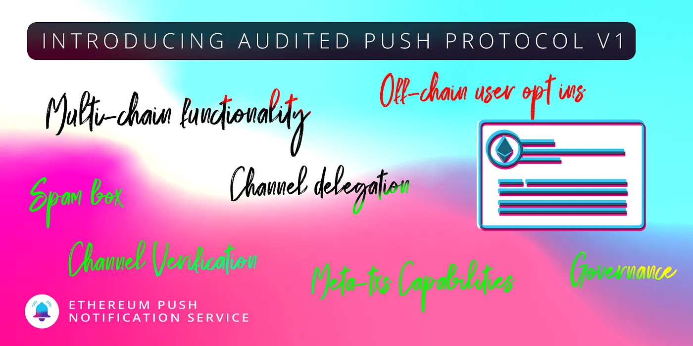

import { ImageText } from '@site/src/css/SharedStyling';

<!--truncate-->

Since its inception, EPNS has been on its mission to build the most effective and reliable communication layer on Web3 to allow sending platform-agnostic and decentralized notifications.

While the initial idea was to build a notification protocol on Ethereum blockchain specifically, we have always had the vision to become Blockchain agnostic. With this goal in mind, we set ourselves the task to make sure we end Q3 with our EPNS Protocol ready to support multi-chain interoperability.

### Understanding the Crucial Changes in the EPNS Protocol

#### Protocol Transformation

The EPNS Protocol has now been divided into two different smart contracts, i.e., <i>EPNS Core & EPNS Communicator.</i>

1. <b>EPNS Core Protocol</b>: The Core protocol (EPNSCore.sol), as the name might indicate, is the main smart contract as it handles some of the most crucial features like Channel creation, governance, channel state changes as well as funds and incentive mechanisms, etc.

It’s very important to note, however, that the EPNS Core smart contract will only be deployed on the Ethereum blockchain and not on any other chain.

2. <b>EPNS Communicator Protocol</b>: Unlike the EPNS Core smart contract, the Communicator Protocol (EPNSComm.sol) is designed to be deployed on multiple chains. The EPNS Communicator protocol is comparatively quite simple.

The communicator protocol includes features that allow users to subscribe to a channel, unsubscribe from a channel as well as the imperative one, i.e., sending notifications. As the communicator protocol can be deployed on various chains, it allows us to trigger notifications on multiple chains and not just the Ethereum blockchain.

#### User Incentives Transformation

With Protocol V1, we move towards blockchain agnostic behavior, the architecture also means that users preferences and notifications validation falls on the network (Push Nodes) as opposed to Ethereum smart contract.

With this new horizon, we understood that our staking (by service) — lending (by protocol)— interest (to users) will be complicated (if not improbable) to design for multi-chain. With this in mind, we are pivoting the earning to Push Token holders, the [token already had time weight](https://etherscan.io/token/0xf418588522d5dd018b425e472991e52ebbeeeeee#readContract) built into it when we launched it in April 2021, we will be utilizing this to calculate the interest and distribute to Push holders.

<blockquote>Note: This feature still required some work as per the <a href="https://twitter.com/ChainSafeth/status/1452640644397248520">audit done by Chainsafe</a>, we will be introducing this feature soon via update once we iron out the clinks.</blockquote>

With that being said, we still are keeping the weight calculation formula on EPNS Communication contracts and will be exploring incentives for the users on different chains as we launch on them.

Alright, it’s time to dive deeper and understand the significant details about both of these smart contracts. Let’s begin with the EPNS Core first.

### EPNS Core Protocol

#### a. Channel Creation on EPNS Core Protocol

The creation of channels as well as storing all the imperative details about a channel is <b>handled only by the EPNS Core protocol on the Ethereum blockchain.</b>

Before we proceed to understand how exactly channels are created in the EPNS Core, it's quite important to understand the 4 different states of channels in the protocol.

Every channel in the protocol might have any one of the following states at a given time:

1. Inactive State: The Inactive state simply means that a particular address has not been activated as a channel yet, on the EPNS Core protocol.
2. Activated State: Once a channel is created for a particular Ethereum address, it is marked as Activated. Activated channels are capable of sending notifications as well as using all other channel-related features available in the protocol.
3. Deactivated State: Every active channel has the power to deactivate itself in the protocol and stop providing its services to the users. Deactivation of a particular channel can only be done by the Channel owner.

Channel deactivation is not a permanent action as the channel owner can choose to reactivate their channel at any time and can go back from Deactivated to Active state, more on this later. 4. Blocked State: Every Activated or Deactivated channel can be sent to a blocked state. Blocking a particular channel is a permanent action as once blocked, a channel cannot reactivate itself on the EPNS Core protocol again.

<blockquote>While as per the current protocol design, only the Push channel admin can block a channel, this power will eventually be shifted to <i>On-Chain Governance.</i></blockquote>

Alright, now that we have a brief idea about all the possible states of a Channel in the protocol, let’s understand the channel creation process on EPNS Core.

Keeping in mind the fact that the EPNS Core resides only on the Ethereum blockchain, it’s important to note that every channel must be created on Ethereum itself.

The entire channel creation process in the protocol can be well understood by breaking it down into 4 main steps:

1. <b>Checkpoints</b>: Before the channel creation process is initiated, the channel address must go through some crucial checkpoints to ensure that it is valid. For instance, some of the significant factors to check are:
   a. A channel must not be in an active state before the channel creation process starts.
   b. Channel addresses that are already in a blocked state should never be allowed to create channels again.
   c. The amount of DAI being deposited for channel creation must be above the minimum threshold, etc.
2. <b>Deposit of Channel Creation Fee</b>: Creating a channel on EPNS Core requires a channel creation fee of at least 50 DAI. In order to create a channel, the channel owner must deposit a sum of at least 50 DAI or more.

The amount of DAI transferred by a channel owner while creating their channel is directly deposited on Aave’s lending pool in order to generate interests in aDAI. 3. <b>Storing imperative Channel data</b>: Once the deposited amount is handled properly, the significant details like channel’s pool contribution, state, weight, the channel creation block number as well as the total number of channels in the protocol, etc, are updated and stored on-chain. 4. <b>Subscribing to important channels</b>: As per the current architecture of the protocol, the new channel being created must subscribe to 3 important channels right at the time of its creation:
a. EPNS Alerter Channel
b. Push Channel Admin
c. Channel owner must subscribe to its own channel as well.
Once all the above-mentioned steps are completed successfully, the channel’s state is activated and it's all set to start sending notifications 🔔.

#### b. Channel State Cycles

As discussed previously, a channel can have 4 states in the protocol, i.e., inactive, activated, deactivated, and blocked. Now that we already have a better understanding of the activated state of a channel, let’s understand the deactivation, reactivation, and blocking of a channel.

1. <b>Channel Deactivation</b>: A channel that is currently in an active state can choose to deactivate itself using the deactivateChannel() function of the protocol. It’s important to note that a channel can only be deactivated by the channel owner.

When a channel is deactivated, a small amount of 10 DAI is deducted as channel deactivation fees. However, the remaining DAI amount, initially deposited at the time of Channel creation, is refunded back to the channel owner in the form of PUSH tokens.

As previously mentioned, the deactivation of a channel is not a permanent action as the channel owner can choose to reactivate their channel at any time. Moreover, it's interesting to note that the channel deactivation fees are added back to the channel’s pool contribution account, once it's reactivated. Let’s understand more about this in the reactivate channel section. 2. <b>Channel Reactivation</b>: Any deactivated channel can always be reactivated at any time by calling the reactivateChannel() function of the EPNS Core protocol. Reactivation of a channel can be done by the channel owner only. The reactivateChannel() function basically changes the state of the channel from a deactivated to an activated state.

It’s important to note that while reactivating their channel, the channel owner must deposit a sum of at least 50 DAI or more to complete the reactivation process.

Alright, now it's time to understand the entire working mechanism of <b>channel activation, deactivation, and reactivation fees.</b>

<blockquote>
1. You Create a new Channel:
-> Minimum Channel Creation fees = 50 DAI
-> 50 DAI is deposited to create a new channel.
-> Channel’s Pool contribution in Core protocol is 50 DAI

2. You Deactivate your Channel.
   -> Channel Deactivation Fees = 10 DAI
   -> 10 DAI is deducted, and 40 DAI is refunded back to you
   -> Channel’s Pool contribution in Core protocol now is 10 DAI

3. You Reactivate your Channel.
-> Minimum reactivation fees = 50 DAI
-> You deposit 50 DAI, for channel reactivation.
-> Your Channel’s Pool contribution in Core protocol now is 60 DAI
(Reactivation Fee(50) + Previous Deactivation Fee(10))
</blockquote>

3. <b>Blocking a Channel</b>: As the name implies, blocking a channel changes the channel state from Active to Blocked state.

Since blocking a channel is a permanent action, once blocked a channel can never go back to the activated state again. A channel can be blocked whenever the blockChannel() function in the protocol is triggered. This function can only be activated by the Push channel admin as of now and no other channel owners can trigger this function.

Once a channel is blocked, it is no more a part of the protocol, and therefore, the total count of channels in the protocol decreases as well.

Most importantly, unlike the channel deactivation process in the protocol, blocking a channel doesn’t refund any amount back to the owner of that channel.

#### c. Channel Verification Feature

EPNS Core contract also includes a new Channel Verification feature which allows Channels to have a verification tag.

The verification tag of a Channel has its own significance. While on one hand, a verified channel enhances the user’s reliability on the channel and its notifications, it also gets a comparatively better position on the User interface.

Understanding the Channel Verification procedure
Channels in the EPNS Core protocol can have either a Primary or a Secondary verification tag.

a. <b>Primary Verification tag</b>: Channels that have directly been verified by the Push Channel Admin are the ones that have a primary verification tag.
All Primary Verified channels have the power to verify other unverified channels.

b. <b>Secondary Verification tag</b>: Channels that have been verified by other Primary Verified channels and not directly by the Push Channel Admin, have a secondary verification tag.

<b>Revocation of the Verification Tag</b>

The protocol also allows revocation of the verification tag of any specific channel in specific circumstances. Any channel can be unverified either by the Channel’s actual verifier or Push Channel Admin.

a. <b>Unverifying a Primary verified channel</b>: The verification tag of a primary verified channel can only be revoked by the Push channel admin.
However, an imperative part to note here is the fact that once a specific target channel with a primary verification tag is unverified, the secondary verification tag of all those channels that were verified by this target channel will be revoked as well.
For instance:

<blockquote>
1. Push Channel Admin verifies Channel A — Primary Verification

2. Channel A verifies Channel B, C & D — Secondary Verification

3. Push channel admin revokes the verification of Channel A

4. Channel B, C, & D are unverfied as well
</blockquote>

A quick look at the infographics below will help understand the verification procedure in the core smart contract effectively.

b. <b>Unverifying a Secondary verified channel</b>: A channel with a secondary verification tag can be unverified either by the actual verifier of the channel or by the Push channel admin itself. As channels with secondary verification tags cannot verify other channels, their revocation of the verification tag has no impact on any other Channel’s verification tag.

Now that we have quite a better understanding of the EPNS Core protocol, let’s start with EPNS Communicator

### EPNS Communicator Protocol

#### a. Sending notifications

Well, it can undoubtedly be stated that sendNotification() is one of the most imperative functions of the EPNS Communicator protocol. While the older EPNS protocol had a simpler sendNotification function, EPNS Communicator has expanded the boundaries for this feature.

Unlike the previous version of the protocol, sending the notification is now not just for the owner of the channels themselves, but there is more to it.
Let’s understand this clearly.

As per the current architecture of the Communicator protocol, there can be 4 main actors who can send notifications:

1. <b>Channel Owners</b>: It goes without saying, that the owners of a particular channel can definitely send notifications to their subscribers.

2. <b>EPNS Alerter</b>: These are the notifications that come from the Push channel admin and are mostly targeted at every user.

3. <b>Delegatee Notification Senders</b>: This is a new feature that allows any address to send notifications on behalf of a channel, to its subscribers. However, the notification must be allowed by the channel to do so. More on this later.

4. <b>Sending notification to yourself</b>: Yes, the EPNS Communicator allows any address to send notifications to themselves 😃. It’s important to note, however, that the address sends the notification to themselves only. In other words, any address can trigger a notification provided that the recipient of the notification is the caller himself/herself.

#### Understanding Delegated Notifications

In very simpler terms, delegated notifications is a feature that allows channel owners to delegate their power of sending notifications to any wallet address or multiple addresses of their choice.

This mechanism of sending delegated notifications is quite effective in providing value-added services to the channels. It also ensures the availability of mechanisms that can be used by EPNS or any other third-party infrastructure to send on-chain notifications on the channel’s behalf.

In order to enable the channel owner to validate a particular address to send notifications on the channel’s behalf, there are 2 specific functions called <i>addDelegate() & removeDelagate()</i> in the Communicator protocol itself.

The channel owner can trigger the above-mentioned functions to either allow or remove an address as a valid notification sender. However, once allowed, the specific address can send a notification to the subscribers on behalf of the channel.

#### b. Meta Transactions

It can undeniably be stated that paying gas fees for every transaction on the Ethereum blockchain is still one of the most daunting tasks. If you don’t always have some ETH ready in your wallet, it might be comparatively difficult for you to interact with the protocols on the ethereum blockchain as you need to pay the gas fees.

Well, interaction with the EPNS Communicator protocol requires gas as well but don’t worry, we have got you covered.

EPNS Communicator protocol supports meta transactions or, in other words, gasless transactions. In simpler terms, the protocol allows you to interact with its functions without actually paying any gas fee.

All you really need to do is simply sign the transaction that you want to put on the blockchain with your keys. This action doesn’t really require any gas fees as you aren’t actually interacting with the protocol on-chain but just signing a transaction.

The signed transaction will then be submitted on the blockchain by the operator by paying some gas fees. Once the transaction is submitted on the blockchain, the communicator protocol verifies your signature to ensure it’s a valid signed transaction and executes the required function on your behalf.

The protocol currently allows meta transactions for the following functions:

- subscribe()
- unsubscribe()
- sendNotification()

#### c. Subscribing to a Channel

The subscribe() function in the protocol allows users to subscribe to any channel that is in an activated state.

While the subscribe function can be called by any address, the caller must pass a valid channel address, that they want to subscribe to, as an input for this function.

Once the subscribe() function is called it performs the following actions:

1. <b>Checkpoints</b>:
   -> Once the function is called, the push nodes verify whether or not the channel address passed as an input is a valid channel in an active state.

-> If the channel is a valid one, the communicator contract then ensures that the caller (subscriber) of the function must not already be subscribed to the channel. If the user is already a subscriber of the channel, the transaction gets reverted.

2. <b>User Activation</b>: The subscribe() function also includes an imperative procedure wherein a completely new user that is trying to subscribe to any specific channel for the first time, gets activated and added to the protocol first. At this step, the total user count in that particular Communicator contract is increased as well.

3. <b>Subscribed to the Channel</b>: Once the checkpoints are passed successfully, the user is added as a valid subscriber of the given channel address
4. <b>User information storage</b>: As the final step of this function, all the relevant and crucial information about the user is stored in the protocol. At this step, the subscribed_Count of the user, i.e., the total number of channels a single user is subscribed to, is also increased.

#### d. Unsubscribing a Channel

The unsubscribe() function in the protocol is quite simple, as the name already suggests.

It allows users to unsubscribe from a specific channel, provided that the caller of the function was already subscribed to that channel before. The unsubscribe() function updates the user’s state in the protocol by removing it as a subscriber for the given channel and decreasing the total subscribed_Count of the user.
