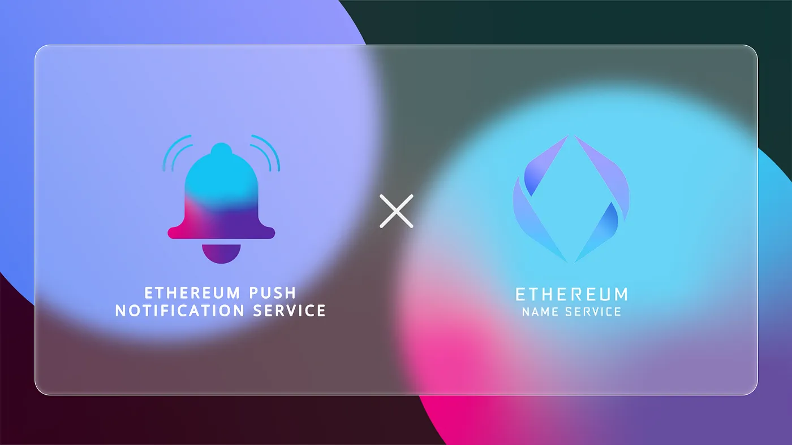

import { ImageText } from '@site/src/css/SharedStyling';

<!--truncate-->

A domain name will be the heartbeat of an organization on the interconnected Web3, yet most businesses rely on a domain name system (DNS) that depends on centralized registry operators at risk of DNS server failures, hacking, and government censorship. ENS as a decentralized domain name system on Ethereum creates business resiliency by lowering the risk of domain name failure, cyber exploits, and censorship. EPNS is pleased to announce the launch of a pilot program to provide decentralized push notifications to ENS domain name owners so they can maintain a reliable and always on Web 3 presence.

### Securing Decentralized Domain Names With Push Notifications

The Ethereum Name Service is an open and distributed naming system on the Ethereum blockchain and the most widely used integrated blockchain naming standard, with over 400k names registered. Website names ending in .eth are mapped to Ethereum addresses, as well as cryptocurrency addresses, content hashes, and metadata. ENS domain name owners benefit by obtaining a decentralized website identity and one meaningful name in place of long addresses for wallets to store cryptocurrencies, tokens, and NFTs.

ENS serves a similar function as the Internet Domain Name Service but uses a decentralized in place of a centralized architecture. In the case of a decentralized DNS, the registrars of the top-level domains like eth are smart contracts. Once assigned a dot-separated hierarchical name, the domain name owner also has control of the subdomains.

Anyone can register an ENS domain name or import DNS names. Second level DNS suffixes such as .com or .org also can be used on ENS. ENS domain names can be easily requisitioned and managed through the ENS Manager App or its large ecosystem of wallets, browsers, and other apps. Managing ENS services via messages, however, involves messages from multiple platforms since no central messaging service exists. One essential element is missing, decentralized push notifications. Domain name users are highly dependent on notification services to notify them when their domains will soon expire so they can take action and avoid losing them.

Because domain names are often renewed on an annual basis, lacking a decentralized push notification service, until now, means important notifications may be distributed to multiple places, such as email or a Telegram account. Consequently, the risk of missing a renewal date and the domain name expiring is high. A push notification service would allow you to receive all renewal notices and take timely action on important notifications while still protecting data privacy as ENS users interact with internal and external data sources.

# The EPNS Solution

The EPNS decentralized push notification service sends timely notifications through a single source of communication, the investor’s wallet. All notifications go directly to the user’s wallet where they can take immediate action. EPNS is the first native, on-chain notification solution to stream all crucial time-sensitive information to a user’s wallet. The partnership benefits to ENS users include:

- EPNS will send all data notifications directly to ENS user wallets.
- The EPNS and ENS teams will adapt the highly customizable EPNS protocol to meet the various push notification needs of decentralized domain name owners.
- EPNS channels and users can customize their notification settings for different data notification requirements.

# How EPNS Will Support ENS

Under this pilot program, EPNS is building a dedicated channel for ENS (see our [litepaper](https://whitepaper.epns.io) for definitions of channels, services, and more). ENS users can subscribe to the ENS channel to receive customized notifications to their wallets. Through collaboration with the ENS team, we will gain insight into the push notification needs of users of domain name services and what they want from the EPNS protocol.

Decentralized notifications will provide real-time data to one wallet so all users can act in a timely manner. Users can easily register and renew ENS decentralized names for websites, wallets, and other apps on a timely basis. Users can be secure in knowing that the IP and branding of assets like usernames, stores, and avatars are registered, secure, and censorship-resistant while safely operating within the private, secure ecosystem of ENS, without having to deal with integration pains across many different protocols.

Looking forward, we foresee many new EPNS notification channels being introduced for ENS in particular, and the decentralized domain services market in general, such as push notifs for domain name auctions. Push notifications will be essential to enable future ENS users to protect their usernames, and thus IP and digital brand identity. Thus, we view decentralized push notifications as an important service that will accelerate the mass adoption of decentralized business models. Since ENS is at the forefront of creating decentralized domain identities within the Ethereum ecosystem, we expect our partnership to yield many new useful notification services and features for the domain name service market.

The long-term goal of the pilot program is to develop a notification system for future versions of ENS. Web3 username owners — who can easily integrate the EPNS protocol into a wallet — will expect push notifications to be an integral service. Going forward, we also expect to work closely with ENS users to create new messaging solutions to meet their evolving push notification needs.

We are pleased to be partnering with ENS and anticipate EPNS push notifications becoming an indispensable tool in the Web 3 ecosystem.

# About ENS

The [Ethereum Name Service (ENS)](https://ens.domains/) is an open source blockchain-based naming protocol. Started at the Ethereum Foundation in early 2017, ENS spun off with a separate organization in 2018. ENS development is managed by the Singaporean non-profit True Names LTD and is a public good, a basic piece of Internet infrastructure that belongs to the community. We welcome all feedback and contributions!
