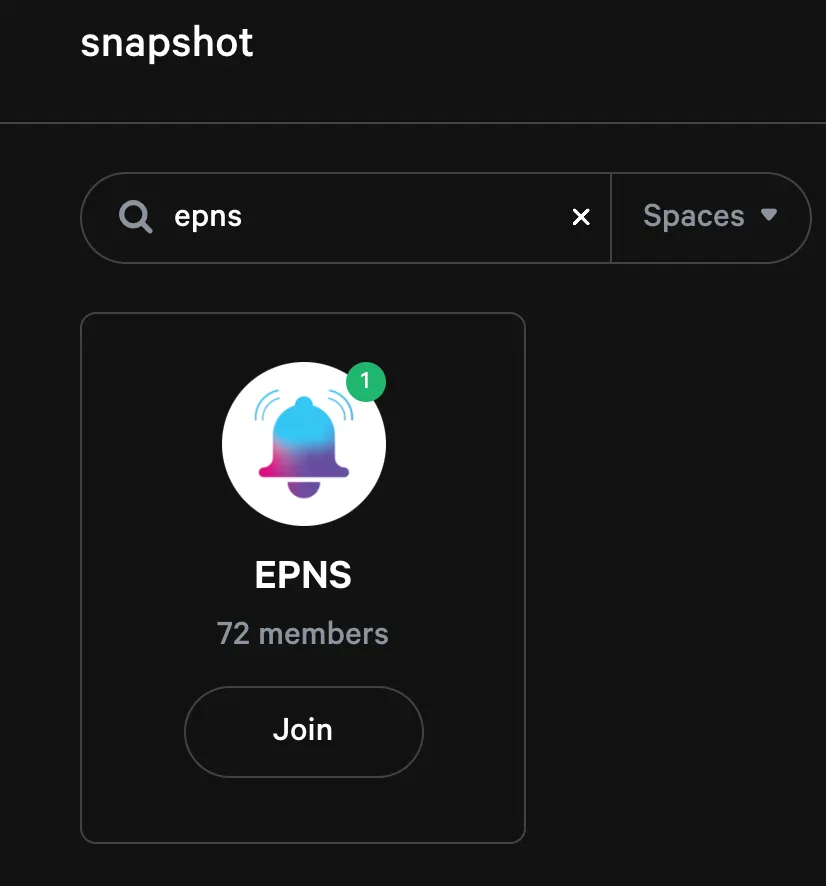
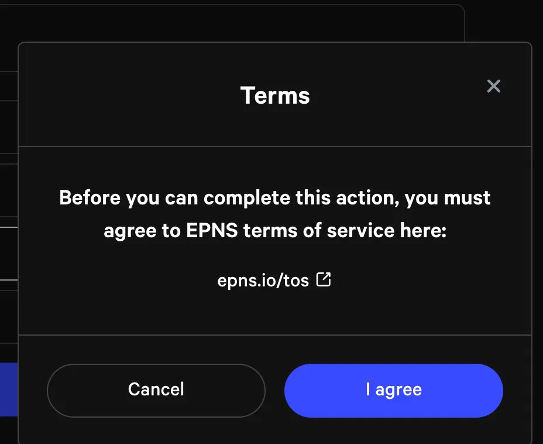

import { ImageText } from '@site/src/css/SharedStyling';

<!--truncate-->

<ImageText>EPNS SNAPSHOT VOTING</ImageText>

# **EPNS Governance:**

We human being is social animal who enjoys communicating and exchanging ideas, each one having unique ideas and opinion that mostly leads to chaos. It’s a bit difficult to come up with a solution, in short, we need a democratized way of voting or a leader to take account of this.

So, we at EPNS have our own Governance mechanism to put proposals, vote, and be a part of the community. If you wanna learn more about the proposal lifecycle, rules & roles of EPNS Governance, refer to the article [**here**](https://medium.com/ethereum-push-notification-service/epns-governance-goes-live-lets-push-for-progressive-decentralized-governance-7448b58b89b4). Also, have a look at the overview of the first EPNS Proposal which got approved on Snapshot [**here**](https://medium.com/ethereum-push-notification-service/epns-governance-goes-live-lets-push-for-progressive-decentralized-governance-7448b58b89b4).

In the first iteration of EPNS Governance, Snapshot voting is the final phase of a proposal in which the community could signal their interests on each proposal using delegated $PUSH votes. If you want to know more about how you can vote on Snapshot, follow the instructions below.

# How to vote on EPNS Governance proposals:

Step 1 — Navigate to [https://snapshot.org/#/?q=epns](https://snapshot.org/#/?q=epns)

Step 2 — Click Join on the EPNS space.

Step 3 — Connect with your desired wallet

Step 4 — Sign with the account you want to vote with.

Step 5 — Select the active proposal to vote or closed one to view details

Step 6 — Browse through the proposal and see the options available to cast a vote.

Step 7 — Click on the option you want to opt and agree to terms after going through it.

Step 8 — Confirm your vote by clicking on it and you can also see your voting power.

Step 9 — Just SIgn the transaction with the account to complete the process.

Step 10 — Hurrahhhh !!! You have successfully voted.

