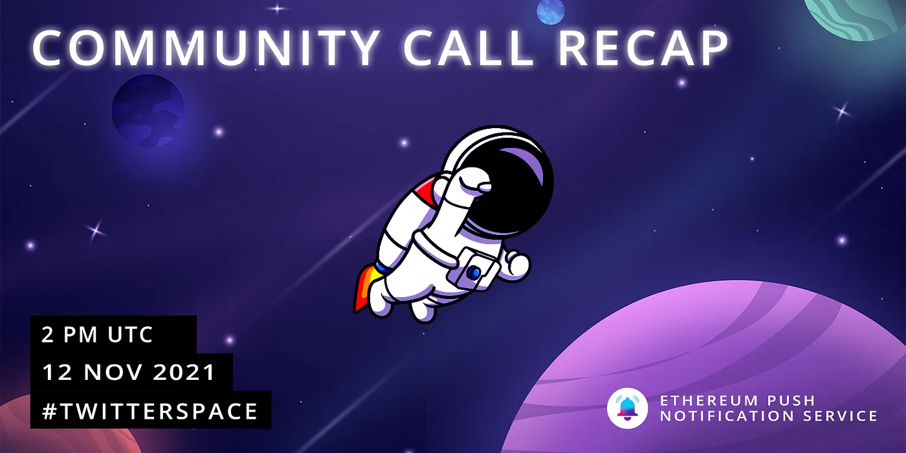

import { ImageText } from '@site/src/css/SharedStyling';

<!--truncate-->

The EPNS community held its first ever Community Call today. In this call we briefly touched on what has been the EPNS journey from the “A-ha!” moment till today and went straight into business to talk about our roadmap, Governance, and what’s to come. Below is a brief overview of the topics covered.

- **Harsh** and **Richa** gave a hyper-fast 2min overview of how EPNS started, and where we are today. Followed by the most important milestones achieved so far.
- **Governance**: we discussed what the end goal is with the EPNS Slow Decentralization Governance.  
  \- Where are we today?  
  \- Where do we want to be in the mid & long term?  
  \- How can the community get involved and take an active participation in the direction of the protocol?
- **Roadmap**: discussed all achievements accomplished so far, and what’s coming in the remainder of the year and next year.  
  \- A big part of the conversation was focused on the importance of the protocol to truly become a cross-chain solution. How we have been working on this, and what are the upcoming plans.  
  \- It was also discussed the role that the PUSH Nodes will play in the entire EPNS ecosystem.
- **Harsh** and **Richa** announced that our Community Calls will continue being a weekly meeting where the community will have the opportunity to make questions, and stay up-to-date with all EPNS happenings.

# Community Q&A

We had a great participation from the community asking very interesting questions and giving us food for thought. Below are some of the questions asked.

1.  **As an EPNS community member how can I contribute to EPNS?**

There are multiple ways in which a person can contribute and be an active participant with EPNS.

- If you are a developer: you can find areas of improvement and submit them to us. With EPNS Protocol being open source, you can also submit your own code improvements to be taken into consideration for future releases. We are soon announcing our Grants Program aiming to create incentives for this type of contributions.
- [Participate through Governance](https://medium.com/ethereum-push-notification-service/epns-governance-goes-live-lets-push-for-progressive-decentralized-governance-7448b58b89b4): we have different roles in which a person can get involved in the EPNS Governance, and take a very active role in the direction of the protocol

**2\. If someone tries to copy or compete with EPNS, how can you prevent it?**  
One of our biggest strengths is us — the community! We have been working hard towards developing very solid collaborations with the most important protocols in the space, ensuring that our protocol is the very best and ready to meet the most demanding expectations.

**3\. With the high gas prices on Ethereum recently, how does EPNS ensure the protocol can continue to be used without incurring high fees?  
**The great news is — we already did something about it!  
We added off-chain capabilities that allow services to drop their notifications to the PUSH nodes directly without having to do any on-chain transaction.

**4\. What’s the strategy towards moving to other networks like Solana?  
**Just recently during the Solana Breakpoint Conference — Harsh had the opportunity to demo the capabilities of EPNS running on top of Solana. While our main focus will continue to be on Ethereum for now, we are planning to move to many other chains starting with Polygon, Solana, Optimism, and more.

# Community Suggestions and Feedback

We also had very valuable suggestions and feedback coming from our community members.

- Create video tutorials on how to use product (protocol) for first time users
- How can EPNS community members get involved in the project — grants, ambassadors program (upcoming)

This was a great kick-off for our Community Calls, and we really appreciate you joining us! With so many things in the making and so much great news coming even before the end of year, you don’t want to miss our upcoming Community Calls.

Thanks for joining, thanks for being #Rockstars! ✌️

— The EPNS team
