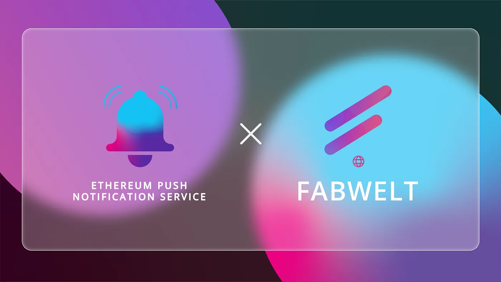

import { ImageText } from '@site/src/css/SharedStyling';

<!--truncate-->

The growing mainstream adoption for NFTs and its potential has made the crypto-world go crazy. Although NFTs was popularized by digital and generative art, there is another industry that is building in the shadows and has the potential to become the next big thing with respect to NFTs — [Blockchain and Crypto gaming.](https://medium.com/ethereum-push-notification-service/blockchain-game-mode-on-engage-users-using-epns-3b0cee9980dc)

Although blockchain gaming as we know it was already a popular idea way back in 2017, it is making a comeback with the recent craze in NFTs. Today, blockchain gaming is sought to be one of the killer use cases for NFTs other than collectibles.

Fabwelt is a revolutionary concept which brings the world of NFTs and Gaming together. Fabwelt introduces NFT integration to gameplay as a utility. Imagine a game world that can be modified and changed by its players as they see fit for their game strategy to come out as a winner. With their first two games (ARSENAL — a First Person Shooter & FanWelt — a Fantasy Gaming Experience) on the horizon Fabwelt is looking to disrupt the global gaming industry and prove that Blockchain and NFT gaming can be fun and scalable.

With respect to this, EPNS is glad to announce our pilot program with Fabwelt to decentralize their communication layer for their users/gamers. During our pilot program we will be:

- **Creating a channel for Fabwelt** that will allow them to communicate with their users about tournament timelines such as the _Start_ and _End_ of tournaments, and major announcements such as _winner declaration, giveaways, etc._
- **Creating a channel for their Marketplace** which will notify users about _new in-game NFT drops, listings, and ‘Almost Out of Stock’ alerts_
- **Creating a channel for in-game invitations** during gameplay, or user-to-user and organizer-to-user invites to join a game room.

We are glad to be integrating with Fabwelt and explore EPNS’s utilities within the gaming sector.

# **About Fabwelt**

Fabwelt is a revolutionary concept that brings the worlds of blockchain, NFTs, and gaming together. We leverage blockchain technology to build an advanced gaming platform and bring the future to gamers in terms of utilities, incentives, and rewards.

Fabwelt will introduce a wide range of capabilities on the Polygon network such as the use of NFTs as in-game utilities, Play to Earn games, novel fantasy gaming integration, staking, NFT market, and a unique platform for up-and-coming artists.

Learn more about Fabwelt by visiting our website fabwelt.com or ask questions on our community channels like Discord or Telegram. Follow us on Twitter for the latest news.

[Website](https://www.fabwelt.com/) |[Whitepaper](https://www.fabwelt.com/public/Fabwelt-whitepaper.pdf) | [Telegram](https://t.me/FabweltToken) | [Discord](https://discord.com/invite/Q3cetjFRTG) | [LinkedIn](https://www.linkedin.com/company/fabwelttoken) |[Twitter](https://twitter.com/FabweltToken) | [GitHub](https://github.com/Fabwelt)
