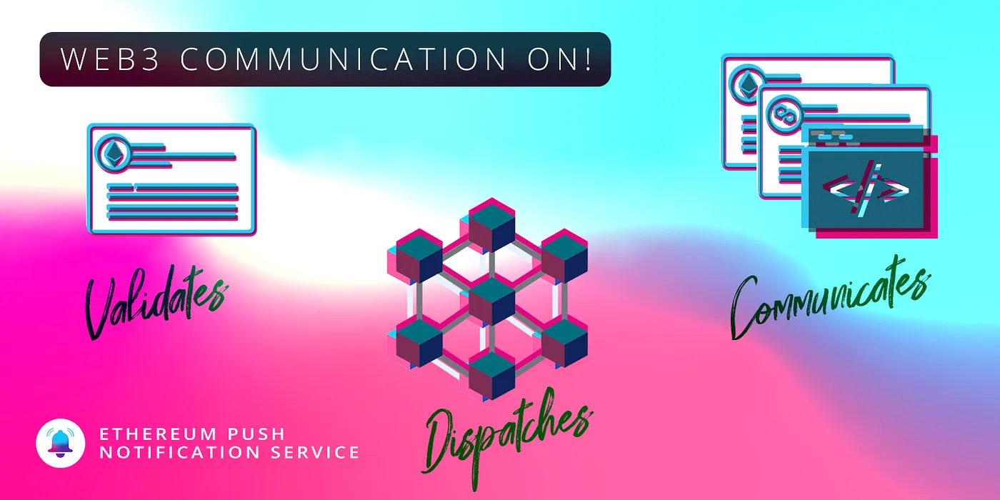
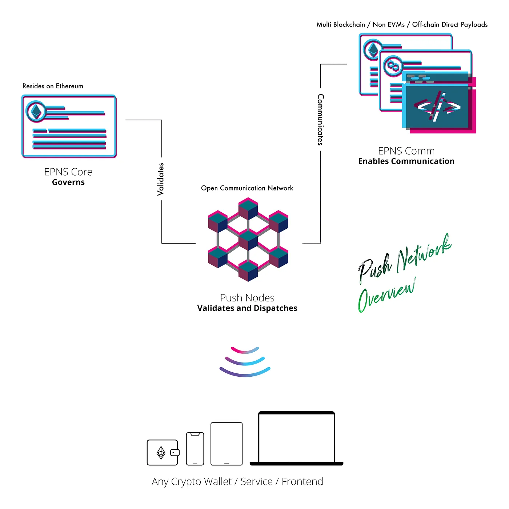
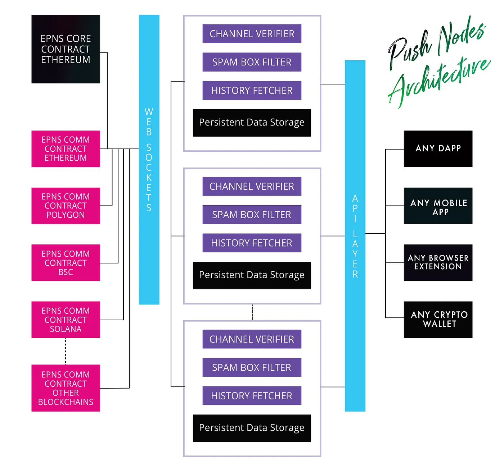

import { ImageText } from '@site/src/css/SharedStyling';

<!--truncate-->

In our [2021 Roadmap](https://medium.com/ethereum-push-notification-service/epns-roadmap-2021-c4ededc57a12), we promised to launch the alpha of Push Nodes, which will enable communication across Ethereum and its emerging L2s.

We are ecstatic to share that the Push Nodes communication system has evolved beyond our initial roadmap, and is now on its way to support multi-chain, including EVM and non-EVM compatible chains!

Ready to learn how? Let’s get started 💪 🔔

### EPNS Protocol Overview / Recap

We recently released an article with an [overview of the entire EPNS Protocol](https://medium.com/ethereum-push-notification-service/roadmap-q3-audited-epns-push-protocol-v1-is-here-f4560dfe550c). To summarize, the EPNS Protocol is a group of smart contracts that enables 1) validation and governance through EPNS Core and 2) communication through EPNS Communicator smart contracts and SDKs.

Understanding the two components of the EPNS Protocol is critical, as Push Nodes interact with them to enable decentralized communication — aka the missing piece of Web3. We will briefly describe them below, but recommend reading [the full article](https://medium.com/ethereum-push-notification-service/roadmap-q3-audited-epns-push-protocol-v1-is-here-f4560dfe550c).

#### EPNS Core (Governance Smart Contract)

Before anyone can send a notification, they must first be activated on EPNS Core as a channel. It is important to note that the EPNS Core resides only on the Ethereum blockchain. EPNS Core handles a majority of governance and channel related task including:

- Channel Creation
- Channel Modification
- Channel Blocking / Deletion
- Verified Channels
- Fees Management among token holders, etc

#### EPNS Communicator

EPNS Communicator, as the name suggests, is the layer where actual communication happens. The Communicator Protocol is comparatively much simpler & handles tasks including:

- Opt-in for notifications
- Sending Notifs
- Delegating responsibilities of Notifs to other wallets
- Verifying multichain channel creation, etc

<blockquote><i>Note: the EPNS Communicator resides on multiple blockchains, both EVM and non-EVM compatible. In addition to being available as smart contracts, the EPNS Communicator SDK enables sending notification payloads directly to Push Nodes as well as enabling off-chain transactions.</i></blockquote>

The EPNS Communicator ensures that on-chain and off-chain notifications alike can make it to your wallet address regardless of what a services chooses to send them from. In other words, notifications make it to you whether they come from the logic of a smart contract, dapp, or backend.

With the brief intro out of the way, it’s time to dive deep into Push Nodes and how they make everything possible ❤️!

### Push Nodes Overview

Multichain, huh! So if the contracts are deployed on multiple chains and governance happens on Ethereum how does everything work together 🤔! Well Frens, the answer to that lies in Push Nodes!!!

Push Nodes are the central piece of the network that enables the blockchain of Web3 notifications to work. In essence, they are validators that can be run by anyone in the future with staking and slashing. Push Nodes have three crucial tasks:

- <b>Listening</b>: Push Nodes listens to EPNS Communicator smart contracts on every blockchain. Besides that, they also enable off-chain or direct communication via API calls either from a backend or a dApp. This on-chain and off-chain communication listening enables EPNS to support just about any Web3 service… ie: smart contracts, dApps, backends or direct payloads!!
- <b>Validating and Governing</b>: The communication which is driven by the EPNS Communicator layers require validation (Checking if the channel exists, is not spamming, is cross-chain verified, etc) which happens via the EPNS Core layer which contains functions to enable governance and to verify the existence of the channel.
- <b>Admitting to Network / Dispatching</b>: Lastly, the Push Nodes admit these notifications that are tied to wallet address in the network which can then be tapped into by any crypto frontend / wallet to display them. The dispatch functionality is also present in these nodes to allow bridging of Web3 notifications to be displayed in Web2 apps in case the wallet / frontend / software wants to enable that instead of handling direct socket connection.

<blockquote><i>Push Nodes along with the functionality outlined above are already working in a test environment. We plan to decentralize push nodes after mainnet.</i></blockquote>

#### Push Nodes Architecture Deep Dive

Let’s briefly look at some of the key functionalities of the Push Nodes and how the multichain construction of payload and dispatching works.

#### History Fetcher (Syncing / Indexing)

Syncing the previous history of EPNS Core and EPNS Communicator is one of the crucial feature of this module. It ensures replication of data which is one of the core feature of push nodes apart from ensuring quick validation as it indexes EPNS Core data including channels.

#### Web Sockets (Receiving)

The main job of Push Nodes is to enable wss sockets on both the receiving side, ie: EPNS Comm smart contracts (on-chain) and direct payloads coming from backend / dapp (off-chain) side as a way to listen and update the state of the persistent data storage. The web socket connection and the router that enables routes ensures this functionality.

#### Validation and Admittance (Validators)

The received payloads whether direct or from EPNS Communicator smart contracts always trigger multiple validation phases which are outlined below:

- Validating Payload Authenticity: The push nodes check any incoming payload for the channel address (or delegator address) to ensure that the payloads are authentic and will drop any payloads that doesn’t fit the scenario.
- Extrapolating payload and recipients: The next step which happens is the extrapolation of data that fetches the actual payload from the identity following which will include looking at where the payload is stored (at the time of writing, supports IPFS and smart contract bytes), expanding on the recipient list (entire channel, subset or single), etc to get the list of recipients as well as the actual payload.
- Mapping to recipients inbox / spambox: The next step in the validation requires mapping these payloads of individual recipients to either their inbox or spambox based on the users opt-in that has already been recorded either via the history fetcher or via the EPNS Comm smart contracts or via direct opt-in on the push nodes itself.

#### Dispatching via Web Sockets (Dispatching)

On the opposite side, the web sockets connection ensures that any crypto frontend / wallet can listen directly to the push nodes and use it to display the notifications / communications meant for the user wallet address.

#### Dispatching via Web3 to Web2 bridge (Dispatching)

An optional functionality that runs locally and will not be synced across push nodes is the ability to transmit these notifications from Web3 to Web2 apps / extensions. For example: sending the notifications to a mobile app on iOS / Android.

The way this bridge works is having a local functionality of mapping wallets addresses to device ids of a particular third party app along with the centralized credentials of the app push certificates. If this module is active then that push node not only syncs and validates the data but is also responsible for pushing the notifications out to web2 apps or extension.

#### Road Forward

All these features and other crucial data outlined above are present and working which is how you guys are getting the web3 notifications we all wanted 😃 (though running in a controlled environment).

In brief, the plan from here is to create a cluster of nodes that will communicate with each other and keep the data in sync and create decentralization around this layer as well.

<blockquote><i>
We will be creating a rewards (via staking) and penalizing (via slashing) game theory around it which will ensure active participation and true decentralization of these nodes as we move further into syncing and readying our push nodes to be open for users to freely run on.
</i></blockquote>
