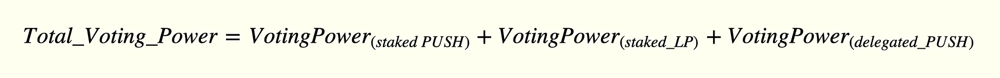

import { ImageText } from '@site/src/css/SharedStyling';

<!--truncate-->

In the third quarter of 2021, EPNS launched Progressive Decentralized Governance to offer its community members the power to drive the project in the right direction and help it achieve its vision of becoming a de-facto communication protocol on Web3.

At present, EPNS uses the IPFS-based no-fee governance tool Snapshot for the community to signal its interest in the proposals up for voting. You can find our guide on how to vote on Snapshot here: [EPNS Snapshot Voting: A step-by-step guide](https://medium.com/ethereum-push-notification-service/epns-snapshot-voting-a-step-by-step-guide-832e44243e2a).

Up until now, it was only possible for someone to vote on proposals using Snapshot if they had delegated PUSH votes. But we have good news!

Bringing Voting for all PUSH Patrons
====================================

With the latest update to EPNS Snapshot Space, it is now possible for community members to vote on proposals and participate in the governance decisions of EPNS even if they have:

*   **Staked PUSH tokens on** [**incentives.epns.io**](http://incentives.epns.io)
*   **Staked PUSH/ETH LP tokens on** [**incentives.epns.io**](http://incentives.epns.io), or
*   **Delegated PUSH Votes**

Now that all PUSH holders and stakers can vote, take this chance to vote on the latest [proposal to choose this week’s ROCKSTAR](https://snapshot.org/#/epns.eth/proposal/0xee6809168a52ac203770958eb83de3c0fd90cd5fe1a4fcf54d902b1a10ffbfc0). Cast your vote NOW!!

Calculate Your Voting Power on Snapshot
---------------------------------------

Your voting power on Snapshot is calculated as follows:

1\. Voting Power from Staked PUSH Tokens:
-----------------------------------------

If you have staked PUSH tokens on [incentives.epns.io](http://incentives.epns.io), then

2\. Voting Power from Staked PUSH/ETH LP Tokens:
------------------------------------------------

If you have staked PUSH/ETH LP tokens on [incentives.epns.io](http://incentives.epns.io), then

**LP-to-PUSH Conversion Formulae:**

3\. Voting Power from Delegated PUSH Votes:
-------------------------------------------

If you have PUSH votes delegated by the community (or by you), then

Head over to [incentives.epns.io](http://incentives.epns.io) under the PUSH Governance tab to check/delegate your voting power.

Quick Governance Links
======================

**Snapshot Voting guide-** [https://medium.com/ethereum-push-notification-service/epns-snapshot-voting-a-step-by-step-guide-832e44243e2a](https://medium.com/ethereum-push-notification-service/epns-snapshot-voting-a-step-by-step-guide-832e44243e2a)

**Governance Forum-** [gov.epns.io](https://gov.epns.io/)

**Official EPNS Snapshot Space-** [https://snapshot.org/#/epns.eth](https://snapshot.org/#/epns.eth)