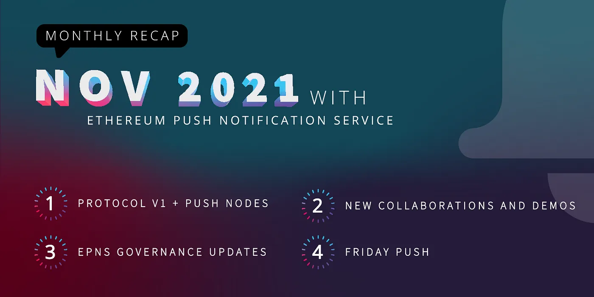
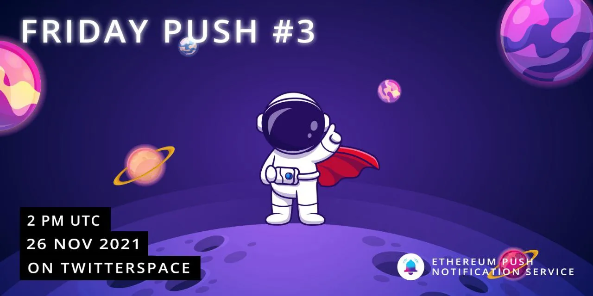

import { ImageText } from '@site/src/css/SharedStyling';

<!--truncate-->

**Development**🏗️️

We started the month strong with the big announcement of the successful [Audit of the EPNS Push Protocol V1!](https://twitter.com/epnsproject/status/1455605451198906370?s=20)💥. This marks one of the most important milestones in the 2021 roadmap, as it enables & ensures EPNS is ready to support cross-chain interoperability.

Just a couple weeks later, we came up with a follow up on a Q3 Roadmap item that goes hand by hand with the EPNS Protocol v1— we turned **_Web3 Communication ON_**! with our [**Push Nodes P2P**](https://twitter.com/epnsproject/status/1463556448919568387?s=20)  🌐

Another important set of activities took place this month to ensure we keep our protocol up-to-date to meet the greatest standards:

*   Spam Box 📥 functionality progressing well. More updates soon 👀
*   The Showrunners framework is now fully validated against our Audited Protocol v1 contract 📦
*   The Showrunners Framework (Staging) is now fully functional with off-chain features. Users can now opt-in/opt-out by just signing a transaction with their wallets, and also **notifications** are being sent through off-chain transactions!
*   The entire Staging environment is now fully connected against Kovan! We are currently in the last phase of testing and validation. The MobileApp and PUSH Nodes were successfully migrated to Kovan as well.

We decided to use this important task, and confirm our migration scripts are rock solid. The Testnet migration was a success and now we are one step closer to Mainnet launch!

Another really important event this month was our participation in the Solana Breakpoint event. Why? We took it as a challenge and as an opportunity to put EPNS cross-chain compatibility to test by running EPNS on Solana. Test passed!✅ ([Check it out here](https://twitter.com/epnsproject/status/1461016539176390659?s=20))

**Collaborations** 📺
=====================

This month we are thrilled to announce the addition of three new frens to the EPNS fam 👋🏽:

*   [**Timeswap**](https://twitter.com/epnsproject/status/1455535310713012229?s=20): to create a hassle-free experience for lenders and borrowers.
*   [**Fabwelt**](https://twitter.com/epnsproject/status/1461334807024050187?s=20): to bring Push notifications to crypto gaming.
*   [**IoTex**](https://twitter.com/epnsproject/status/1458845936373821442?s=20): to help Connect the Physical and Digital Worlds of the Internet of Trusted Things

Additionally, lots of progress has been made in many of the channels we are currently working on in preparation to release them LIVE right after our Mainnet launch. And to give a sneak peek to the community 🕵 ️of whats coming we started publishing demo videos of our work with them. Make sure to check out the 2 we have published so far for [**MakerDAO**](https://twitter.com/epnsproject/status/1463209115988094980?s=20) and [**Proof of Humanity**](https://twitter.com/epnsproject/status/1463920174256455680?s=20)!

**Governance**
==============

Governance is getting more traction each passing month 💪. More and more members of the community have joined participating in electing the #ROCKSTAR winner of the week. And we are observing more activity in the [General Discussion](https://gov.epns.io/c/general-discussions/18) section on our Gov forum. Make sure to check them out!

Now, Governance is about to turn even more interesting — as we are very close to starting our Grants Program. If you are someone looking to contribute to the EPNS ecosystem, stay tuned for more updates!

And to finalize with great news, it is now possible for community members to vote on proposals via Snapshot and participate in the governance decisions of EPNS even if they have staked on our yield farms on [incentives.epns.io](http://incentives.epns.io/). To find out how the voting power is calculated on Snapshot refer to the article- [EPNS Enables Snapshot Voting for PUSH and PUSH/ETH LP Stakers!](https://medium.com/ethereum-push-notification-service/epns-enables-snapshot-voting-for-push-and-push-eth-lp-stakers-186beb16986e)

**Now that all PUSH holders and stakers can vote**, take this chance to vote on the latest [**proposal to choose this week’s ROCKSTAR**](https://snapshot.org/#/epns.eth/proposal/0xee6809168a52ac203770958eb83de3c0fd90cd5fe1a4fcf54d902b1a10ffbfc0). Cast your vote NOW!!

EPNS Community news & incentives🎪
==================================

Lots to talk about this month, but lets start with something really exciting!

EPNS Friday Push 😎
-------------------

Our weekly call with the community where we recap all the happenings of the week, and we enable a candid space for discussion between the team and the community. **_Happens every Friday at 2PM UTC_**.

Get your questions prepared, and make sure to join us and participate. You don’t want to miss it!

**Contests** 🎡
---------------

Many contests ran thought-out this month for the community to learn and participate:

*   EPNS & EasyFi [collaboration AMAs](https://twitter.com/epnsproject/status/1456632481524830215?t=h2ossLqS0o48kqS82RDNCw&s=19)!🙋
*   [EPNS x EasyFi Meme Contest](https://twitter.com/epnsproject/status/1458095311566655496?s=20)!! 🎨
*   [@NFT\_NYC POAP Treasure hunt](https://twitter.com/benlakoff/status/1453784715358441487?s=20) 🖼️.
*   [Celebrate this Diwali with EPNS](https://twitter.com/epnsproject/status/1455369424207187969?s=20) 🪔— share with us an image of your Diwali celebration 🙏🏽
*   AMA with [CoinDCX (along with Price Prediction Contest)](https://twitter.com/epnsproject/status/1461259847479881728?s=20)

This month we also shared great news with the community thanks to our collaboration with Shopping.io! With an[⚡️ OFFER ⚡️ for Nov 30](https://twitter.com/epnsproject/status/1461034698801434626?s=20)!! Get up to 50% + additional 2% discount on your purchase using [$PUSH](https://twitter.com/search?q=%24PUSH&src=cashtag_click) on Shopping.io.

Rockstars of EPNS🎸
-------------------

We can’t end the month without thanking everyone for your great participation in involvement in all community activities and efforts. You are all Rockstars!

> _Want to participate and win $ROCKSTAR, start over here:_ [_https://medium.com/ethereum-push-notification-service/kicking-off-the-epns-nft-community-drops-6a5c49808cf_](https://medium.com/ethereum-push-notification-service/kicking-off-the-epns-nft-community-drops-6a5c49808cf)

EPNS in the news 📺
===================

Awesome news for EPNS this month:

*   Check out the awesome [EPNS Demo from Harsh during Solana Breakpoint](https://twitter.com/epnsproject/status/1461016539176390659?s=20)
*   EPNS participating in [DCentral Miami Conference](https://twitter.com/epnsproject/status/1463517951739383817?s=20) with a booth 🏰 and swags 👕. Pass by, say hi!, and get some swag!
*   Got featured in the latest episode of [#AShowAboutCrypto](https://twitter.com/CoinSwitchKuber/status/1456210173580623874?s=20) 🎙️Rohan Joshi and Harsh discussed about metaverse & much more in detail!😎
*   Got added to [@LightspeedIndia’s India & SEA Crypto Market Map](https://twitter.com/epnsproject/status/1459141439867301889?s=20)🤩,
*   EPNS was featured in this [article released by Business Standard](https://twitter.com/epnsproject/status/1459491312328228870?s=20) ✨

Wait ✋
======

_Are you looking for opportunities with EPNS?_  
We are looking for talented candidates to join our awesome team on both [technical](https://twitter.com/epnsproject/status/1457671906631421954?s=20) and [non technical](https://twitter.com/epnsproject/status/1458479573784567813?s=20) roles. Check them out and ask questions through our social channels. Hope to hear from you soon!

Getting to this point has taken really hard work, commitment, and dedication, and it’s the support of the community that keep us going!

Keep PUSHing! 💪🏼

The EPNS team

