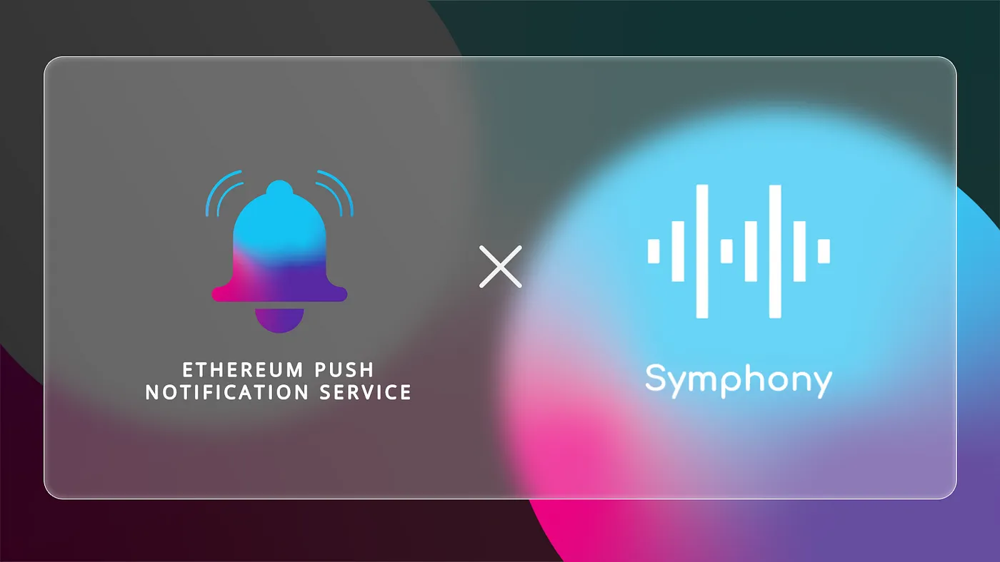

import { ImageText } from '@site/src/css/SharedStyling';

<!--truncate-->

Post its illustrious summer of 2020, DeFi established itself as one of the major industries of the world. The sheer number of opportunities now available in DeFi, for investors, entrepreneurs, and arbitrageurs are mind-boggling. DeFi’s trusty yield farming and staking are still working wonders bringing an influx of new users into DeFi every day.

Along with this, cryptocurrency-based derivatives have also been picking up steam recently. Options and futures are now among the most popular financial products on crypto exchanges. Now, even limit orders are being introduced to DeFi with the emergent Symphony Finance and we’re pleased to be working with the protocol in their journey of becoming DeFi’s go-to trading protocol.

### How Symphony Finance Can Benefit from EPNS

Symphony Finance has built one of DeFi’s first yield optimized limit protocols called “YOLO”. It aims to maximize the total returns users can reap by combining limit orders with yield farming. For the uninitiated, limit orders are financial products that allow the owner to set their own limit price to either buy or sell an asset. If the limit price is reached, the order is executed.

In this context, Symphony Finance’s YOLO allows users to create limit orders for digital assets by depositing the sold asset. The asset is then deposited by the protocol on yield farming protocols like AAVE, Mstable, and Yearn. This way, the underlying asset generates yield continuously for the user. If the limit price is reached the limit order is automatically executed and the user receives the asset along with all the generated yield.

Apart from yield generation YOLO has other great features like “Liquidity Aggregation”, which benefits the users by filling their limit orders at the best price. YOLO also guarantees the orders get executed once the prices are there in the market by eliminating the need for “Takers”. In the context of YOLO, the integrated DEXes act as Takers. Stop loss is another feature that YOLO provides although this feature is not available in many orderbook DEXes in DeFi today.

For all these processes in Symphony Finance to run smoothly, the protocol needs a means of direct communication with its users, and what better than EPNS to make this happen.

What Does the Collaboration Entail
==================================

Through our collaboration with Symphony Finance, we aim to facilitate decentralized push notifications for investors, traders, and users of the protocol. These decentralized notifications can become a reliable means for the protocol to communicate with its users.

Users can subscribe to the official Symphony Finance channel on the EPNS and opt to receive notifications. Whenever the users’ orders are executed on Symphony, users are immediately intimated. This eliminates the need for them to manually check on their limit order status, reducing friction between the protocol and users.

As Symphony Finance strives to create futuristic financial products for DeFi users, we’re pleased to join them on this journey and hope to become an integral part of their operations.
