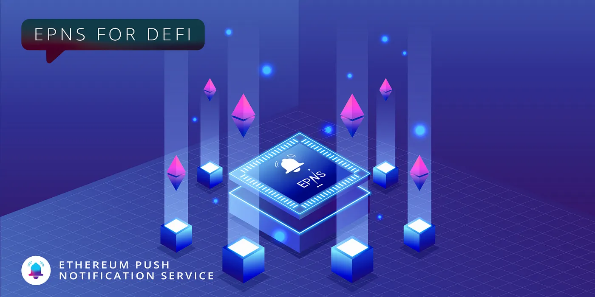

import { ImageText } from '@site/src/css/SharedStyling';

<!--truncate-->

Ask anyone what’s the most happening industry these days and they’ll tell you decentralized finance (DeFi) without batting an eye. This new industry is now home to a plethora of dApps, decentralized protocols, businesses, and rapid technological developments. But despite such momentous success, user participation and engagement rates in DeFi are still at the lower end.

DeFi protocols have managed to garner significant attention from users but they lack the mechanism that keeps users coming back to the protocol to engage with it. EPNS has been working towards building this mechanism ever since its inception and decentralized push notifications are now a part of DeFi.

Here’s taking a quick look at why the DeFi industry is in dire need of a communication layer and how users and protocols can use EPNS to interact within the DeFi space.

The Need for EPNS
=================

As a part of one of the most rapidly evolving industries in the world, users of DeFi have to keep up with quite a lot of things. The ever-changing token prices, constantly updating protocols, new product launches, and investment opportunities to name a few.

But because of the lack of reliable means of communication within DeFi, users are required to manually go about finding this information and keeping themselves updated. This is quite a hectic task especially since most of us are spoiled by push notifications delivering this information to us in the Web2 space. Some of the critical communication that needs to happen are:

*   Near Liquidation Alert (Borrowers & Liquidators)
*   Staking Rewards Available to Claim (Stakers)
*   Staking Rewards About to Expire (Stakers)
*   Price Alerts (Traders)
*   Stablecoin Peg Slippage (Arbitragers)
*   Low Gas Cost (Devs, ETH Power Users)
*   Rebalances (Token Set Users)
*   Index Selection/Weighting Changes (Index Users)
*   Token/Contract Migrations (Protocol Users)
*   Governance Updates, Token Launches
*   New Collateral Types on Money Markets
*   New Liquidity Mining Incentives
*   Yield Farming APY alerts
*   Escrow Periods Ending / Tokens Coming Unlocked

The possibilities are endless and one of the main goals of EPNS is to reduce this communication gap in DeFi and help retain the good user experience Web2 has established. Let’s look at a subset of above use cases and how they bring the UX on par with Web2.0 with EPNS.

Loan Liquidations
=================

On DeFi lending platforms, borrowers are at risk of liquidation of collateral if the price of the collateralized asset falls below a certain threshold. The lack of a reliable communication channel means that borrowers have to manually keep track of the price fluctuations and more often than not, liquidation occurs unexpectedly. So, by integrating EPNS into their protocol, lending protocols can promptly inform users when their collateral nears liquidation. Along with this, they can also get notified when their loan approaches the end of term.

Governance Updates
==================

Governance is another aspect where EPNS can prove to be invaluable. To ensure proper decentralization, DeFi protocols require all community members to participate in the governance process. But most users miss out on this simply because they aren’t aware of the new governance proposals that have been created. By incorporating EPNS, DeFi protocols would be able to inform their users whenever new governance proposals are created and voting begins. The result of the voting and the dates of implementation of new updates can also be informed to the community members with ease.

Additionally, stakers can be informed when the rewards are available to claim or about to expire.

Token Launches and Pricing
==========================

With the number of traders and investors in DeFi growing exponentially, the need for a mechanism that keeps them updated about the various opportunities is quite evident. In this regard, the integration of EPNS into decentralized exchanges and trading platforms could be a welcome windfall. Through EPNS, investors and traders can get notified whenever there are new token launches or when the prices of assets fluctuate.

Arbitrageurs in DeFi can also hugely benefit from EPNS, getting notified every time there are pricing differences in the market that they can profit from. Stablecoin peg slippage for instance.

Farm Launches and Updates
=========================

Not just trading and investing but yield farming in DeFi has become quite popular in the past couple of years. Here too, the integration of EPNS can have a significant impact.. Every time a new farming opportunity emerges, investors can promptly get notified about the same. Along with this, escrow ending, APY alerts, and new mining incentives can create an overall better farming experience for users.

Layer-2 Updates
===============

Of course, L2 protocols are also poised to benefit from a communication layer built for DeFi. The protocols can keep users updated about things like governance updates, low gas costs periods, deployment on other chains, and contract migrations.

General Updates
===============

Lastly, NFT marketplaces, Metaverse projects, and GameFi protocols could also use EPNS Gaming projects could send out notifications every time a new battle starts, or when users have successfully completed missions. This ensures that user participation and engagement is retained at all times and improve the user-experiences

Long story short, EPNS makes it possible for the DeFi industry to have a communication layer that reduces friction and drives user participation.

Upholding Decentralization
==========================

Users are the center of all operations in the DeFi space. In fact, the very purpose of DeFi is to give power back into the hands of users. While this sounds very impressive, the implementation of true decentralization has been a challenge in DeFi. This is because of the lack of a communications layer. Users are still kept in the dark about various happenings in the DeFi space until they check manually. This causes them to miss out on several investment and governance opportunities, reducing user participation and threatening decentralization.

However, EPNS ensures that DeFi’s core principles of decentralization are upheld by constantly keeping users informed. In doing so, it creates a level of trust and transparency within the industry and improves their user experience significantly.

Stay in touch! [Website](https://epns.io/) | [Twitter](https://twitter.com/epnsproject) | [Telegram](https://t.me/epnsproject) | [Medium](https://medium.com/ethereum-push-notification-service) | [Whitepaper](https://whitepaper.epns.io/) | [Litepaper](https://medium.com/ethereum-push-notification-service/ethereum-push-notification-service-litepaper-e7ca0a662862)
