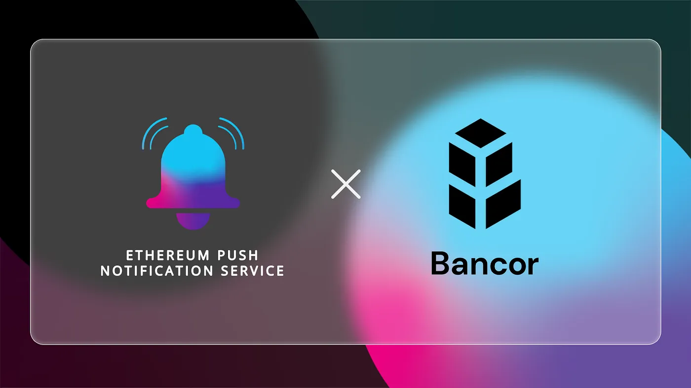

import { ImageText } from '@site/src/css/SharedStyling';

<!--truncate-->

Crypto exchanges, both centralized and decentralized, are an integral part of the industry and have greatly contributed to its growth. However, the current model for trading cryptocurrencies on these exchanges has its own problems. For starters, the token has to be listed on the exchange and has to cross a certain trading volume to achieve liquidity. This creates a scenario where several small-cap cryptocurrencies have no liquidity.

To circumvent this problem, came Bancor Network in 2017. And we at EPNS are pleased to announce our integration with Bancor Network to provide push notifications for users.

### How Bancor Network Could Benefit from EPNS

The Bancor Network is a blockchain-agnostic decentralized finance protocol that allows users to trade tokens without the need for an order book. It essentially consists of open-source liquidity pools that serve as an endpoint for automated market making. Bancor’s smart contracts manage all these liquidity pools and execute the conversion of tokens on-chain to remove the need for order books.

One of the main aims of this platform is to eliminate the need for middlemen by facilitating automatic token trades across blockchains. But, in doing so, it also aims to provide liquidity to tokens by incentivizing users for creating and providing liquidity to pools of these coins. Each liquidity pool on this network consists of a trading pair and a reserve of BNT tokens. BNT tokens are the native tokens of the Bancor network and are used as intermediate currency while trading tokens. Liquidity providers (LP) can deposit assets into the pool to begin earning yield.

The best part is that users can provide just a single token and maintain single-token exposure. For reference, most popular protocols require LPs to provide liquidity for both tokens in the trading pair. Bancor’s single token approach significantly reduces the entry barriers to DeFi and also removes the risk of impermanent loss. When LPs provide liquidity they receive special pool tokens that are linked to smart contracts containing reserves of other ERC-20 tokens.

While Bancor network has had remarkable success with its vision so far, the lack of a proper communication channel between users and the network creates friction. For instance, users have to manually check for new token listings, liquidity mining updates, and governance proposals. In the long run, this could reduce user participation.

This is why we’ve integrated with Bancor Network to create a reliable communication channel for the protocol and its users.

What Does the Integration Entail?
=================================

Through this integration, we aim to equip users of Bancor with decentralized push notifications. Bancor Network will now have an official channel on EPNS that users can subscribe to. By subscribing, users get notified whenever:

*   liquidity mining begins or approaches closure
*   there are any fee changes on the platform
*   there are new governance proposals on Snapshot
*   new tokens are listed on the platform

This ensures that users are always kept informed about the latest happenings in the protocol and can improve their participation significantly.

As Bancor Network continues to provide DeFi with revolutionary financial products, we’re pleased to integrate with the protocol on their journey and hope to become an integral part of the protocol.

About Bancor Protocol
=====================

[Bancor](https://bancor.network/) is the only decentralized staking protocol that allows you to earn money with single-token exposure and full protection from impermanent loss. Launched in 2017, Bancor was the first DeFi protocol. Today, it generates millions in fees per month for depositors, offering up to 60% APR on tokens like ETH, WBTC, LINK, MATIC, AAVE & more. Bancor is owned by its community as a decentralized autonomous organization (Bancor DAO). More resources:

*   Trade, stake and earn on [bancor.network](http://app.bancor.network)
*   [How to Provide Liquidity on Bancor](https://blog.bancor.network/how-to-stake-liquidity-earn-fees-on-bancor-bff8369274a1)
*   Learn more: [Bancor Safe Staking](https://earn.bancor.network/safe-staking/) & [Impermanent Loss](https://earn.bancor.network/impermanent-loss/)
*   [Getting Started](https://docs.bancor.network/getting-started/resources) & [FAQs](https://docs.bancor.network/faqs)