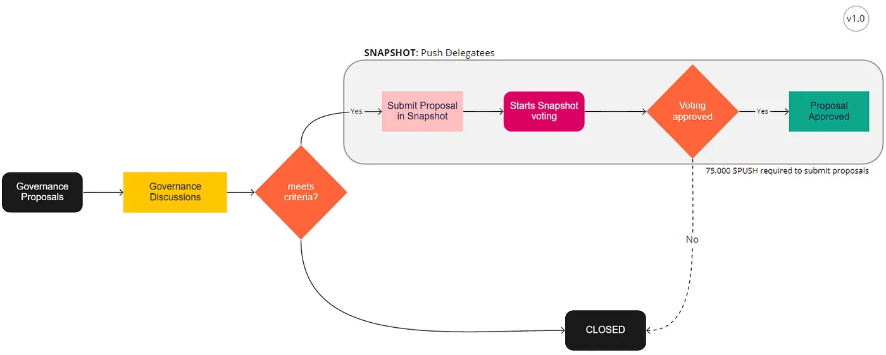

import { ImageText } from '@site/src/css/SharedStyling';

<!--truncate-->

This democratic (small-d) process within web3 environments is similar to every other governing body you’re familiar with in life. Good governance is about stewarding the interests of their people (citizens, hodlers, etc.) and allocating common assets for the greater good.

> Taking care of the poor, addressing global issues, going to the Moon — _😑_ those are great goals for _🏛_ states, but we get to deliver #**notifications**_🔔🔕_ to web3! (Plus the moon business, we’re doing that too _🚀🌕_)

# Why Grants?

As outlined in our Phase 0 announcement in September (read [here](https://medium.com/ethereum-push-notification-service/epns-governance-goes-live-lets-push-for-progressive-decentralized-governance-7448b58b89b4)) we promised the community a grants program for protocol contributors of all types to access community funds. There are tons of great ideas floating around the different EPNS channels looking for an outlet to present and gain support for the various initiatives. This will now be available to all web3 friends 🤝 looking to contribute 👨‍💻 to the advancement of the EPNS notification🔔🔕 vision & mission!

**What is a “grant” exactly?** They vary greatly.. everything from YouTube promotion opportunities, protocol analytics/research, education/tutorial offers, and lots of other creative ways people want to contribute to EPNS. The time, talent, and resources these folks dedicate have a beneficial effect on the project as a whole. The grant funding will go directly to compensating those very efforts in return.

# Push Grants Proposal Details

The proposal went live **today** (link [here](https://gov.epns.io/t/draft-proposal-push-grants/396?u=blakeburrito_epns)) and the community can now debate the specifics the EPNS Governance Team (or **EPNSgov**) has proposed. That process will last at least 5 days, then once any revisions are completed we’ll submit it to a formal Push Improvement Proposal (the inaugural “PIP-01”)

All delegated $PUSH holders will then have the opportunity to vote for it on Snapshot. This **feedback, edit, vote** process takes a little over 2 weeks (relevant image below). If all goes well that means we can start accepting proposals by the end of January! 🤗🥳

Push Governance Proposal journey

# What’s Next for EPNSgov?

This new access for contributors to the Push Grants Program (or **PGP**), the incentivized proposals program (or **IPP — 💙** those acronyms) and focus on making it **easy & free** for all $PUSH holders, stakers, and yield farmers alike to participate in all of it.. these have been the primary focuses of this early phase EPNSgov Team for some time. In the coming weeks we’ll be able to report that we’ve delivered all as promised in Governance Phase 0.

We’re very excited to deliver these programs and believe it will bring about new talented people and opportunities for EPNS to take advantage of like never before.

> Just like those traditional 🏛 small-d democracies need their voters to turn out, we need $PUSH holders to utilize their 🗳 **voting power** 💪

**1 $PUSH** = **1 🗳vote**, _only if_ address has done **one of the following:**

- Delegated $PUSH tokens to themselves, or a Delegatee here
- Staked $PUSH to our single asset Yield Farm (**\>23% APR**) here
- Staked UNI-V2 PUSH/ETH (Uniswap LP here) in our Yield Farm (**\>80% APR**) here

🚨**_WAY_ BETTER OPTION ALERT**🚨 Stake in Yield Farms!!

✅ Staking Rewards > ❌ Staking Rewards — More $**PUSH** = more **better**

Governance Phase 1.0 will be taking shape as this governance ship sails in the coming months. We’ll patch up the holes we find, navigate through the waves as they come, and adjust the course accordingly together. With our eyes on the decentralized promised land of web3 notifications🔔🔕 for all.
