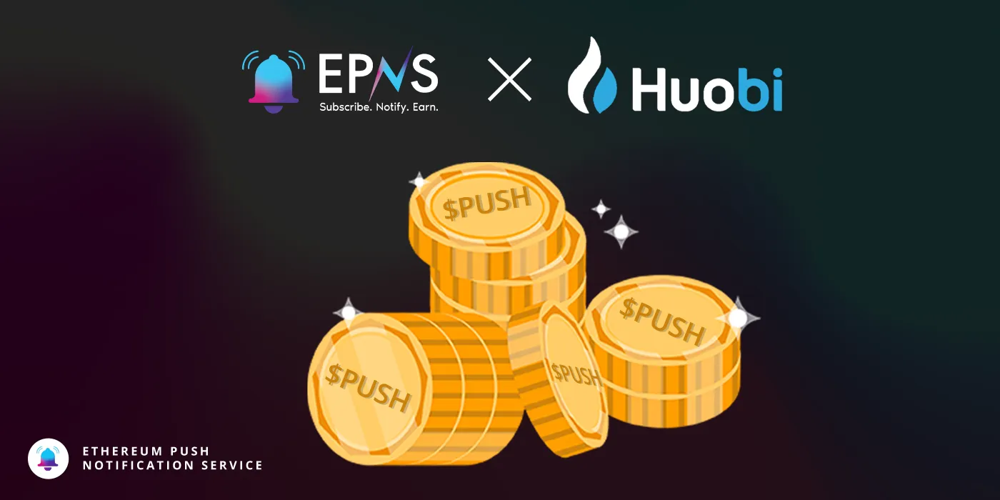

import { ImageText } from '@site/src/css/SharedStyling';

<!--truncate-->

Centralized exchanges have played a pivotal role in the growth and recognition of cryptocurrencies and blockchain technology around the world. CEXes offer users easy onboarding to crypto concepts, simple UI to start buying tokens, and the most user-friendly ways to on- and off-board into Web3 applications.

One such exchange is Huobi Global. With a market cap of over $1.6 billion, this China-based CeFi platform has provided an easy on-ramp for millions of people across the globe to jump into the crypto revolution. Now, with Huobi’s integration of EPNS decentralized push notifications, the platform is spreading its wings into the DeFi world as well.

### The Communication Benefits and Drawbacks of CEXes

1.  CEXes like Huobi are constantly listing new tokens, issuing communications about existing tokens, launching new incentives, announcing interest-earning capabilities, and more.
2.  The only method of communication CEXes have are the channels that most companies have, like Twitter, Telegram, Discord, blogs, and email.
3.  Though this has worked for many years, it’s not the _optimal method_ of communication. Huobi (and other centralized exchanges) stand to benefit from a decentralized communication method where they can send notifications directly to the growing number of Web3.
4.  The future of crypto we should acknowledge is even more seamless relationships between centralized and decentralized ecosystems, where people feel empowered to move between them as they see fit, without barriers or silos in their way.
5.  EPNS offers this decentralized communication opportunity to Huobi, opening up not only a brand new era for Huobi to interact with Web3, but also for Web3 users to respond more effectively to actions taken by one of the world’s leading exchanges.

# EPNS x Huobi

1.  The flagship collaboration between Huobi and EPNS will launch a token notification channel. Subscribers to this channel will be notified whenever a critical action occurs regarding a token on Huobi Exchange. At launch, this includes when a new token is listed or when a token sale is occurring or upcoming.
2.  As many of us know, the ability and foresight to invest in a token prior to its listing on a centralized exchange can yield higher returns. A decentralized communication channel that connects to these types of announcements from Huobi will enable Web3 users to more immediately respond to listings of tokens — a much better UX than hoping to stumble across a tweet or actively searching for announcements.
3.  On the other side of the coin, Huobi is opening itself up to communication with the entirety of Web3, which is a vast and rapidly growing ecosystem. By pioneering the relationship between centralized and decentralized communities, Huobi will be able early on to capture the audiences that are seeking to know what CEXes are doing in order to influence their own actions.

# Uniting the Two Branches of the Crypto Industry

Huobi began its journey as a crypto exchange back in 2013 when the concept of digital assets was still quite new to people. Today, Huobi facilitates the trading of a plethora of cryptocurrencies and is known to list tokens with promising potential very early on. Along with this, Huobi also offers Spot and Derivatives trading for its users.

However, because Huobi Global is a centralized crypto exchange, the users of DeFi have been missing out on the opportunities this platform provides. Huobi Global has always had the knack for identifying promising tokens and listing them on its platform way before others. This causes DeFi users to miss out on potential investment opportunities that could be life-changing.

This is precisely why Huobi Global opted to integrate EPNS push notifications. Users of DeFi will now have a window into the world of CeFi with this integration. Every time a promising new token is listed on the platform, DeFi users are intimated of the same through decentralized push notifications. This allows them to stay relevant in the world of investments and take a share of the profit pie.

# Collaborating for Collective Progress

The feud between decentralized finance and traditional finance is not new to anyone in the world. But even with the world of decentralization, there is an ongoing battle between CeFi and DeFi. While both of these have advantages and disadvantages of their own, it is important for both branches of the crypto industry to unite for collective progress. In this regard, Huobi’s integration of EPNS could be the first step forward. By creating a reliable communication platform between a CeFi platform and DeFi users, EPNS facilitates the easy flow of information to unite CeFi and DeFi.
