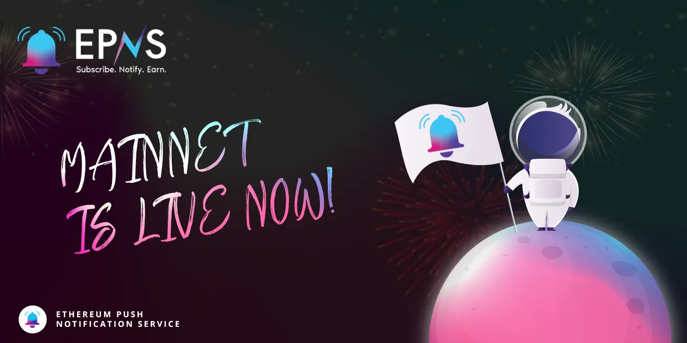

import { ImageText } from '@site/src/css/SharedStyling';

<!--truncate-->

**As of today, January 11, at 4 PM UTC, the Ethereum Push Notification Service is live on Ethereum’s mainnet!**

This is an exciting moment for EPNS, and we know you’re itching to get started. So we’ll just spend one sentence saying THANK YOU to the EPNS community for all your support over the last two years. 💖 Ok, let’s dive in:

**EPNS is Live: What This Means & How to Start**

EPNS can now be accessed through [app.epns.io](http://app.epns.io) on the Ethereum blockchain. The protocol can be used by two broad audiences: **channels** and **subscribers.**

**Channels** are dapps, users, and businesses that want to send notifications to others. These notifications can be sent manually, or they can be built to respond automatically to on-chain or off-chain information. For example, a media company can push out alerts for breaking news when a story is released. Or, a DeFi project can allow users to automatically receive notifications when their loans are closing in on liquidation.

_How to get started as a channel?_ Head to [app.epns.io](http://app.epns.io) and ‘Create Your Channel’. Follow the guided steps to set up your channel, create notifications, and publish your channel to mainnet. Then, watch the subscribers roll in. If you need support, head to [How to EPNS](https://www.notion.so/epns/How-to-EPNS-853afe64839b4cdd8c63209342a783d0) for more information.

**Subscribers** are those who wish to receive notifications from others. Subscribers can browse the live channels on EPNS through the app, and opt-in to receive notifications from any of them. Notifications are then delivered to the subscriber’s ‘inbox’. Channels are live now on the EPNS app ([iOS](https://apps.apple.com/app/ethereum-push-service-epns/id1528614910)/[Android](https://play.google.com/store/apps/details?id=io.epns.epns)), with more channels to be launched in the days and weeks to come.

_How to get started as a subscriber?_ Head to [app.epns.io](http://app.epns.io) and click on ‘Channels’. You can browse the list of all published channels, each with a description of which notification(s) you’ll receive if you subscribe. You may opt-in to receive notifications from any of them, and opt-out at any time.

\*_Note: the EPNS protocol has been under development for 1+ year, and completed a_ [_ChainSafe audit_](https://epns.io/EPNS-Protocol-Audit2021.pdf) _in October 2021. However, the mainnet is still a new product milestone. Always DYOR, and anticipate bugs and UI improvements. Learn how to report any bugs in our_ [_Discord_](https://discord.gg/YVPB99F9W5)_._

**What’s Next for EPNS**

Mainnet launch is just the beginning for EPNS. Stay tuned for more channel releases in the days and weeks to come — and ask your favorite dapps to create channels of their own! We’ll post more information about the post-mainnet roadmap for EPNS soon, but expect incentives, governance, multi-chain support, and more!

Follow us to stay up to date: [Twitter](https://twitter.com/epnsproject), [Discord](https://discord.gg/YVPB99F9W5), [Telegram](https://t.me/epnsproject).
