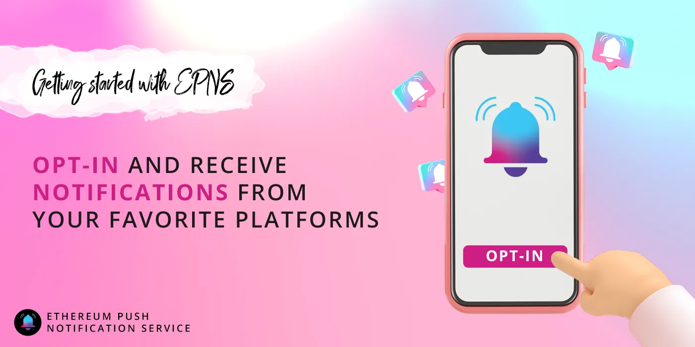

import { ImageText } from '@site/src/css/SharedStyling';

<!--truncate-->

_Decentralized, Web3 communication is here. A guide to getting started with EPNS._

The EPNS mainnet launched on January 11! We’re thankful to the community for building with us over the last years, and we’re excited for this next phase of decentralized, Web3 communication.

So, now that EPNS is launched — what should you do? Check out the guide below to figure out how to get started, whether you want to send or receive notifications.

Channel or Subscriber — Who Are You?
====================================

Users of EPNS are classified into two groups: **channels** and **subscribers.**

**Channels** are users who send out notifications. **Subscribers** are those who elect to receive notifications from certain channels. Businesses, dapps, and even individuals can all be channels; they can program notifications to be sent in response to on-chain information, and/or send notifications manually for off-chain activities. Subscribers opt-in to receive notifications from any of these channels. All of this happens through the [app.epns.io](http://app.epns.io) site.

Channels: How to Start Sending Notifications
============================================

To start sending out notifications, businesses, DEXs, and other protocols in DeFi need to create a dedicated channel. They can choose to create one of the three types of channels — open, closed, and mutual. An open channel is open for anyone to subscribe and start receiving notifications. If the channel creator wants a specific user to subscribe to their channel, they can pay a small fee to the subscriber and add them indirectly. The subscriber is of course free to opt-out of this subscription.

A closed channel, on the other hand, is not universally open. Only users of the channel creator’s choice get added to this channel. The mutual channel sits in between both these channels. Users can request to subscribe and the channel creator can either accept or reject their proposal.

The process of creating a channel on EPNS is quite simple and usually a one-time setup.

*   Users who want to create a channel are recommended to do it either from the EPNS dApp or the EPNS JS library. But apart from this, channels can also be created using custom JS libraries.
*   To begin, users are required to visit [http://staging-app.epns.io/](http://staging-app.epns.io/)
*   They are then prompted to connect to their crypto wallet, either Metamask, Ledger, or Portis.
*   Once this is done, they can click on “create your channel” and upload the channel logo.
*   To activate the channel, users are required to stake DAI tokens to contribute to the interest generating staking pool on AAVE. 50 DAI is the minimum stake fees and the more DAI that is staked, the more interest can be generated by a channel. Which inturn is used to incentivize subscribers.
*   Once the DAI is staked, users can give their channel a name, a description, and click on “setup channel” to activate it.

How Subscribers Can Receive Notifications
=========================================

Now that the channels are created, users can start subscribing to them.

EPNS provides a mobile application and a dApp to ensure that users receive notifications on time. The mobile app uses EPNS Infra to convert decentralized notifications into their centralized format that can be received on ios and Android devices. Unlike the boring web 2.0 notifications that only consist of text, EPNS notifications can consist of images, videos, and links. This takes the whole notification game to the next level, making it interesting for users to interact with.

The dApp brings notifications from web browsers and decentralized carriers. The combination of the dApp and app allows users to stay up to date with all the happenings of the market irrespective of the device they use. To subscribe to a channel,

*   Users can visit [https://app.epns.io/](https://app.epns.io/)
*   Once on the website, they connect their crypto wallet to begin the process.
*   EPNS has a dedicated channels page that houses all the created channels and users can access this page by clicking on “channels”.
*   Users can them browse the page for channels of their choice and click “subscribe” to start getting notifications from that particular channel.

In the next phase of the protocol, EPNS aims to launch incentivized notifications for users. The DAI used to create a channel is staked in a staking pool on AAVE and the interest generated is redistributed to all the subscribers of the channel. This means that users get rewarded for choosing to interact with the protocols.

What Does it Mean for the DeFi Ecosystem?
=========================================

Incentivized push notifications could do wonders for the DeFi ecosystem. The DeFi and Web 3.0 space today are quite fragmented, to say the least. There is no means for businesses and users to communicate with each other or among themselves. But EPNS is about to change that for good. We have created a reliable, robust communications layer that is poised to bring all the players of web 3.0 onto a single platform. Businesses can effectively reach their target consumers without waiting for them to reach out. With this, the existing communication gap disappears, driving user engagement and collaboration. This in turn can transform the course of the DeFi ecosystem for the better.

_Note: the EPNS protocol has been under development for over a year, and completed a_ [_ChainSafe audit_](https://epns.io/EPNS-Protocol-Audit2021.pdf) _in April 2021. However, the mainnet is still a new product milestone. Always DYOR, and anticipate bugs and UI improvements. Learn how to report any bugs in our_ [_Discord_](https://discord.gg/YVPB99F9W5)_._

Stay in touch! [Website](https://epns.io/) | [Twitter](https://twitter.com/epnsproject) | [Telegram](https://t.me/epnsproject) | [Medium](https://medium.com/ethereum-push-notification-service) | [Whitepaper](https://whitepaper.epns.io/) | [Litepaper](https://medium.com/ethereum-push-notification-service/ethereum-push-notification-service-litepaper-e7ca0a662862)
