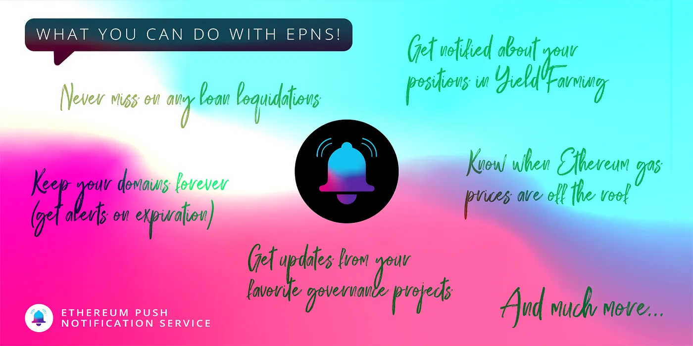

import { ImageText } from '@site/src/css/SharedStyling';

<!--truncate-->

We’re pretty excited that the [EPNS mainnet has launched](https://medium.com/ethereum-push-notification-service/the-epns-mainnet-is-here-470faec0c01). But behind all the celebration, we know you may be asking: “So what now? How do I actually start using EPNS today?” Well, we have a lot more updates in our roadmap, but here’s a look of precisely how you can use EPNS starting this very moment, whether you’re a crypto investor, DeFi degen, developer, journalist, or just a curious cat.

All the fun happens at [app.epns.io](http://app.epns.io). There, under ‘Channels’, you’ll find a list of all the live channels and descriptions of what kinds of notifications you’ll receive if you opt-in. So let’s dive in:

# EPNS for DeFi 💰

Right now, you can subscribe to receive notifications from the top DeFi projects in the space. Notifications are sent for either liquidation dangers or governance updates.

The **MakerDAO** channel sends notifications whenever there are new governance proposals.

The **Crypto Volatility Index (CVI)** channel sends out notifications about market volatility to protect LPs from impermanent loss.

The **Bancor** channel notifies users when liquidity mining campaigns begin or near closure, and notifies subscribers about new governance proposals.

The **Oasis** channel notifies subscribers when their vaults are reaching a high risk of liquidation.

The **Mover** channel notifies you about your yield harvested on the platform.

# EPNS for Domains and Governance 🖥

Never miss an update from some of the leading protocols in Web3 offering critical consumer applications and infrastructure.

The **ENS** channel notifies users when their domains are about to expire. No more needing to set manual calendar reminders!

The **Snapshot** channel notifies you when governance proposals are made from the projects you follow on Snapshot.

# EPNS for Traders and Investors 📈

All the information you need to trade and invest intelligently, delivered to an EPNS inbox near you.

The **ETH Tracker** and **BTC Tracker** channels notify subscribers every 6 hours of the token prices.

The **ETH Gas Tracker** channel tells users when ETH gas prices hit new highs, letting you more intelligently place those trades.

# EPNS for Media and News 🗞

We’re proud to have partnered with **CoinDesk** to launch the first media channel on EPNS. Users will be notified whenever a news story goes live.

And there you have it! And yet, that’s only the beginning. Expect a lot more channels and notifications to go live in the days, weeks, and months to come. Let’s #PUSH it!

_\*Note: the EPNS protocol has been under development for 1+ year, and completed a_ [_ChainSafe audit_](https://epns.io/EPNS-Protocol-Audit2021.pdf) _in October 2021. However, the mainnet is still a new product milestone. Always DYOR, and anticipate bugs and UI improvements. Learn how to report any bugs in our_ [_Discord_](https://discord.gg/YVPB99F9W5)_._

Follow us to stay up to date: [Twitter](https://twitter.com/epnsproject), [Discord](https://discord.gg/YVPB99F9W5), [Telegram](https://t.me/epnsproject).
