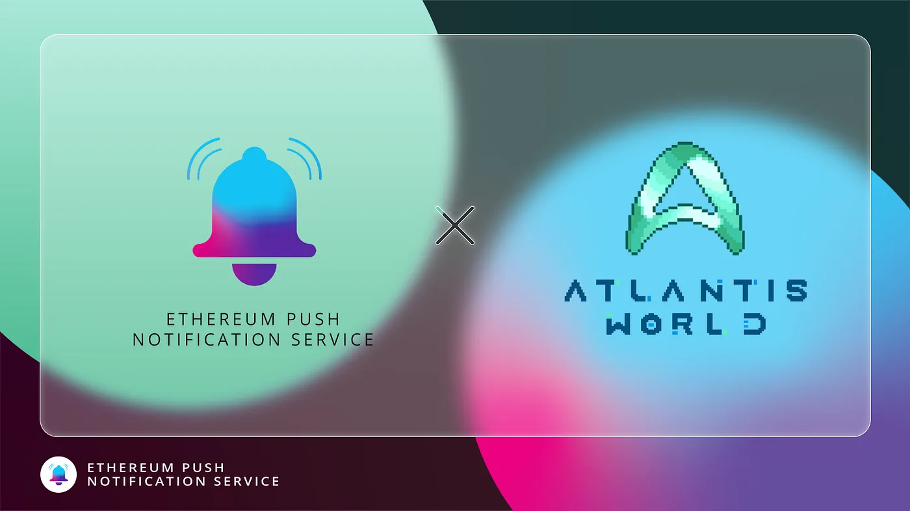

import { ImageText } from '@site/src/css/SharedStyling';

<!--truncate-->

The impending dawn of the Metaverse is creating waves of excitement among people across the globe. With promises of fully immersive virtual worlds where everything is possible, the Metaverse is poised to bring significant changes to our world.

In this context, Atlantis World is a social metaverse project that aims to build immersive experiences for the world of DeFi in an effort to improve user experiences and make the industry more appealing. We’re pleased to announce our collaboration with this emergent project through which we hope to build a communication layer for the Metaverse.

### How Atlantis World Could Benefit from EPNS

As mentioned before, Atlantis world is a futuristic project fabricating a new social metaverse for Web3. This brand new project believes that the DeFi industry in its present state lacks that immersive user experiences to appeal to the majority of the population. But, by building immersive virtual worlds and gamifying DeFi’s core concepts, the industry as a whole could progress to an exciting new dimension. This is exactly what Altantis World aims to achieve.

The project is building an immersive social metaverse with a full-fledged virtual economy integrated into it. The project features virtual banks where liquidity can be unlocked and used within the metaverse to buy, sell, trade, and transfer digital assets. With a clever integration of cryptocurrencies and NFTs into virtual gaming worlds, Atlantis world aims to take staking, yield farming, and trading in DeFi to a whole new level that is appealing to the masses.

Moreover, when compared to other metaverse projects that require sophisticated hardware to enter the metaverse, Atlantis world is built to run on any device or web browser across the world. The project calls this a “lightweight 2D metaverse” that is more practical and feasible to an average person.

On this journey of creating immersive user experiences, the role of push notifications is invaluable. It is through push notifications that users can stay updated with the happenings of the Metaverse and promptly engage with protocols. And through our collaboration with Atlantis World, we aim to make this possible.

# What Does the Collaboration Entail

By teaming up with Atlantis World, we at EPNS are working towards building an ultimate communication layer for the social metaverse that is about to unfold. The utilities of such a communication layer are practically endless. It creates a two-way interaction channel and allows users to actively engage with the metaverse.

Atlantis World will have an official channel on EPNS that users can subscribe to, to receive push notifications that help them keep a track of digital assets and progress on the Metaverse. As the project continues to grow and evolve, EPNS will explore the best possible ways in which notifications can be integrated into the metaverse to keep users at the center of the action.

We’re enthralled to be partnering with Atlantis World on their journey to transform DeFi and hope to be an integral part of their operations.

**About Atlantis World**

Atlantis World is building the Web3 social metaverse. The project connects DeFi with Web3 (NFTs, DeFi + DAOs) and gaming inside of a lightweight virtual world that’s accessible to everybody, to make the industry more appealing.

Atlantis World curates a fully-fledged crypto economy of the metaverse starting with game experiences that plug into Web3 applications. Users can even visit digital banks and unlock billions of dollars in liquidity for anything from savings accounts to borrowing, or freely exchange money and trade anything from financial instruments to NFT wearables and other digital goods/collectibles such as land.

| [Website](https://atlantis.world/) | [Twitter](https://twitter.com/atlantis0x) | [Telegram](https://t.me/atlwrld) | [Discord](https://discord.gg/atlantisworld)
