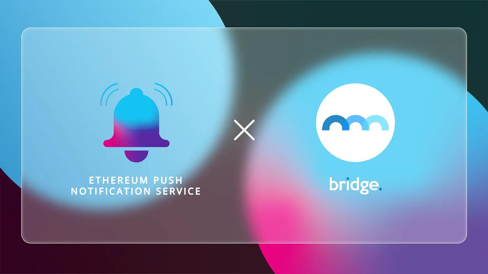

import { ImageText } from '@site/src/css/SharedStyling';

<!--truncate-->

The decentralized finance (DeFi) industry has grown spectacularly over the past couple of years, both in value and in numbers. Offering transparency, decentralization, a new layer of privacy, and global accessibility to users, the industry soared to heights never seen before. However, these very distinguishing features of DeFi made the industry an easy target for hackers and defaulters who encashed it heavily. The industry lost more than $2.8B (according to Chainanalysis) to hackers and accounted for a good portion of all hacks globally.

This problem needed to be fixed and quickly, before users started to lose trust in the technology. As a savior for DeFi came Bridge Mutual, the DeFi protocol offering unmatched safety and security for users. We at EPNS are pleased to announce our Collaboration with Bridge Mutual through which we aim to create a reliable communication channel for the protocol and its users.

### How Bridge Mutual Can Benefit from EPNS

Bridge Mutual is a decentralized coverage platform for DeFi that enables users to safeguard their assets and investments. Users of the platform can buy covers akin to insurance for their crypto assets to compensate for any hacks, thefts, or exploits. This allows them to safely navigate the DeFi space with the assurance that their investments are safe.

Apart from buying coverage, users of this platform can also provide coverage by staking stablecoins in dedicated pools. This allows them to earn a yield on their stake in a high-risk/high-reward scenario. Stakers earn their rewards in the form of stablecoins or BMI tokens.

However, the lack of a proper communication medium between users and the protocol creates friction, and users have to manually check if their premiums have expired or when new claims are made. This could cause users to miss out on deadlines and risk losing coverage. Through our partnership with Bridge Mutual, we aim to address this very issue.

What Does the Collaboration Entail
==================================

EPNS and Bridge Mutual will be working in collaboration to build a reliable communication medium for users of the platform. Bridge Mutual will have a dedicated channel on EPNS that users of the platform could subscribe to. Users can opt to receive whenever

*   A new insurance claim is made on the platform.
*   Their coverage premium expires.
*   The withdrawal request matures for coverage pool passes and BMI staking passes and users have 48 hours to withdraw the request.

As Bridge Mutual works towards making DeFi a safe space for users and investors, we’re pleased to be partnering with them on this journey and hope to become an integral part of their operation.

**About Bridge Mutual**

Bridge Mutual, a decentralized coverage platform, is on a mission to become a #1 crypto-armorer of the Decentralized Finance and equip everyone with protection against universal crypto threats. We are a fully decentralized, p2p/p2b discretionary risk coverage platform covering smart contracts, stablecoins, centralized exchanges. Our platform allows users to provide coverage, decide on policy payouts, share profit, and get compensated for adjudicating claims. Users can get protection and provide one in exchange for yield. We focus on great product design, pro-community business objectives and synergy with other web3 innovations.

[Website](https://www.bridgemutual.io/) | [Telegram](https://t.me/bridge_mutual) | [Medium](https://bridgemutual.medium.com/) | [Twitter](https://twitter.com/bridge_mutual) | [CoinGecko](https://www.coingecko.com/en/coins/bridge-mutual) | [Youtube](https://www.youtube.com/c/BridgeMutual) | [Gate.io](https://www.gate.io/en/trade/BMI_USDT) | [Bitfinex](https://trading.bitfinex.com/t/BMI:USD) | [Discord](https://discord.com/invite/bmi)
