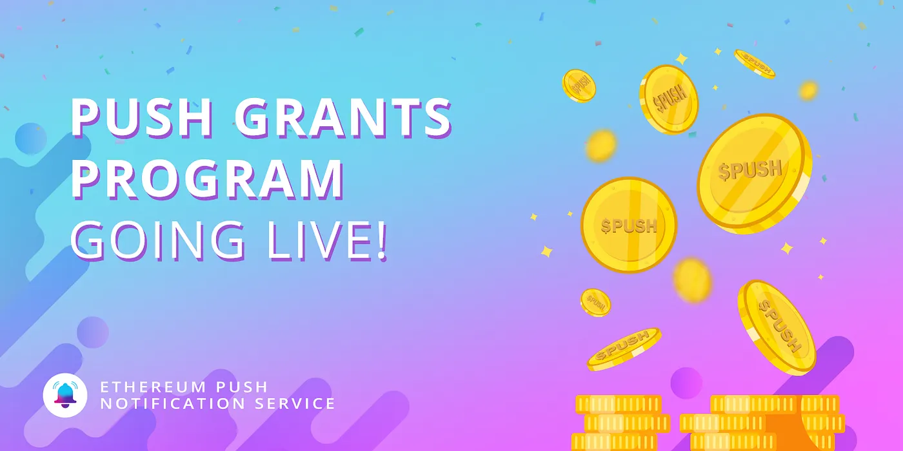
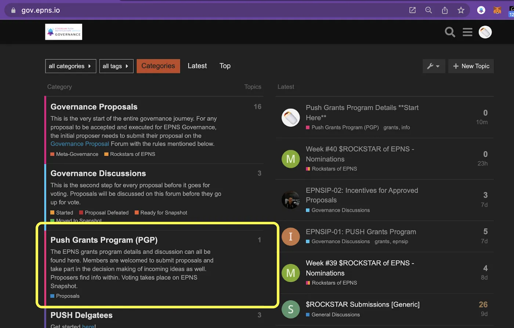
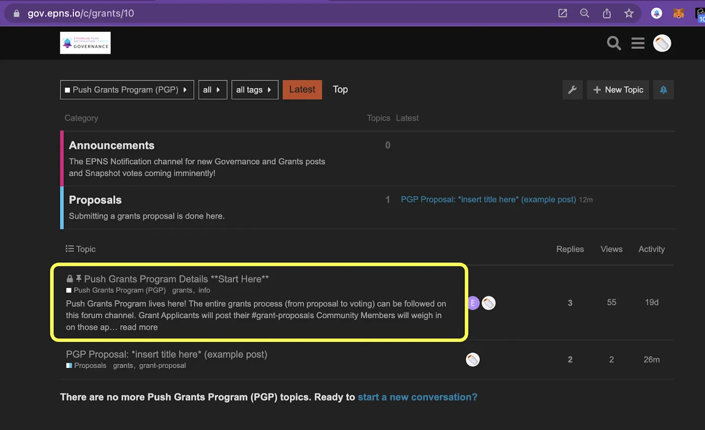
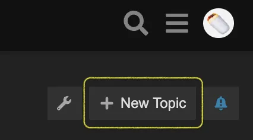
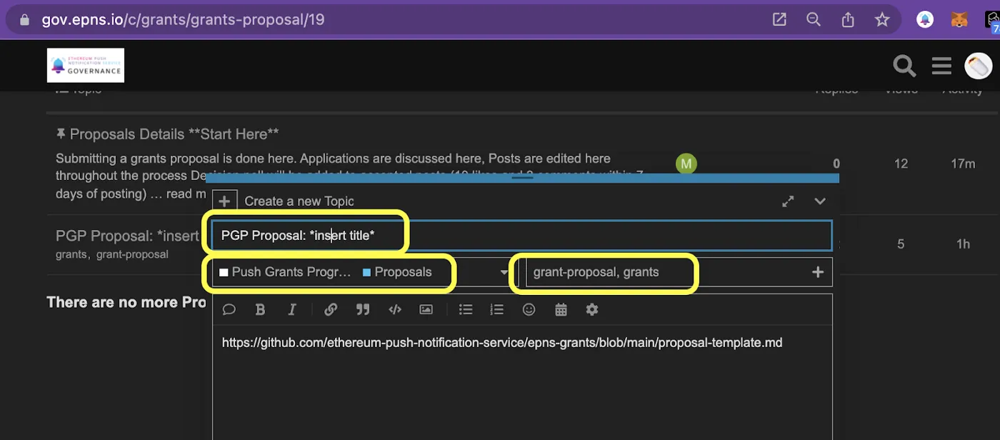

import { ImageText } from '@site/src/css/SharedStyling';

<!--truncate-->

With the overwhelming turnout and support received for [**PIP-01: Push Grants Program**](https://snapshot.org/#/epns.eth/proposal/0xfdb92444974c9ab607d96e7a4a1ad71299e47a755955951ae5ce8b86aa9a1400) (12% of $PUSH circulating supply taking part in the vote, 3X amount needed for quorum!), PGP is now approved to run for two quarters with a total budget of 1,000,000 $USD. It’s time to share the grant process with the community and let the applications flow!

Below we’ll give an introductory step-by-step overview of how to navigate the Push Grants Program. PGP proposal submission, consideration, and decision to take to formal votes - all happen on the [EPNS Governance Forum](https://gov.epns.io/). All the relevant info you’ll need can be found there too. Specifically, in this post, we’ll explore the highlights of the governance forums, a walkthrough on how to create a new proposal, and the requirements needed along the pathway to a Snapshot vote.

**Where?**
----------

👉gov.epns.io👈 is the overall home of EPNS governance. The [**Push Grants Program(PGP) category**](https://gov.epns.io/c/grants/10) is where you’ll find the grants discourse.

Highlighted page: [https://gov.epns.io/c/grants/10](https://gov.epns.io/c/grants/10)

The \*\*Start Here\*\* post will give you the steps needed to understand how to post and interact with proposals, as well as details on support requirements needed to be accepted.

Highlighted page: [https://gov.epns.io/t/push-grants-program-pgp-details-start-here/41/4](https://gov.epns.io/t/push-grants-program-pgp-details-start-here/41/4)

⚠️There will be a similar \*\*start here\*\* post pinned at the top of each new category page (Announcements, Proposals, etc.) with directions & information to help understand the content found there.

How to submit a grant proposal
==============================

Above we saw gov.epns.io and found the PGP page, in there the [Proposals](https://gov.epns.io/c/grants/grants-proposal/19) page is listed. That is where applications for grant funding will be posted and discussed. Here’s how that works.

On [gov.epns.io](https://gov.epns.io/) click the “+ New Topic” button.

In the new topic window, fill the following 3 fields according to the screenshot below.

*   Title formatted as pictured (PGP Proposal: \*insert title\*)
*   Below the title, choose the Push Grants Program — Proposals category
*   #tag the two terms pictured in the bottom right field

Doing those 3 things will outline the proposal structure, for users will need to draft their proposals following the [**proposal template**](https://github.com/push-protocol/push-website/epns-grants/blob/main/proposal-template.md).

**An application is accepted only when it gets approved on Snapshot.**

The requirements for proposals to advance to a Snapshot vote, and the process thereof will be:

*   Proposal lives for at least 7 days on the forum.
*   Proposal post receives 10 likes and 3 comments (in favor) within those 7 days or more.
*   A poll will be added within 3 days by the EPNS governance team (EPNSgov) for/against moving to Snapshot vote.
*   A poll must get at least 10 votes in total and will be moved along with For/Against majority.
*   **FOR**: Proposal gets advanced to Snapshot within 3 days with voting open for another 7 days.
*   **AGAINST**: Proposers are notified and encouraged to reapply after digesting feedback received.
*   Once the proposal lands on Snapshot, 4% of circulating $PUSH supply participating with a positive result is the passing bar.

What’s next for PGP?
--------------------

The #EPNSgov team has been working hard to deliver this initiative to the EPNS community and Push Governance users. Our part in this process is all about giving the tools over to the users and trying to respond to that feedback. This new grants channel is just the type of avenue we needed to open up in order to spark the type of discourse we’re trying to attract.

Moving forward, there are several #EPNSgov projects in the works and we’ll be steadily announcing those across the EPNS network. Come visit us during [office hours](https://twitter.com/epnsproject/status/1485250968656781316?s=20) on [EPNS Discord](https://medium.com/push-protocol/discord.gg/YVPB99F9W5)!

Check out [PIP-02: Incentives proposal](https://snapshot.org/#/epns.eth/proposal/0x1c928002d6cb8d563ff79dc06f1f28a5963f0ed81460765d937a7ad08a779215) which passed today as well!
