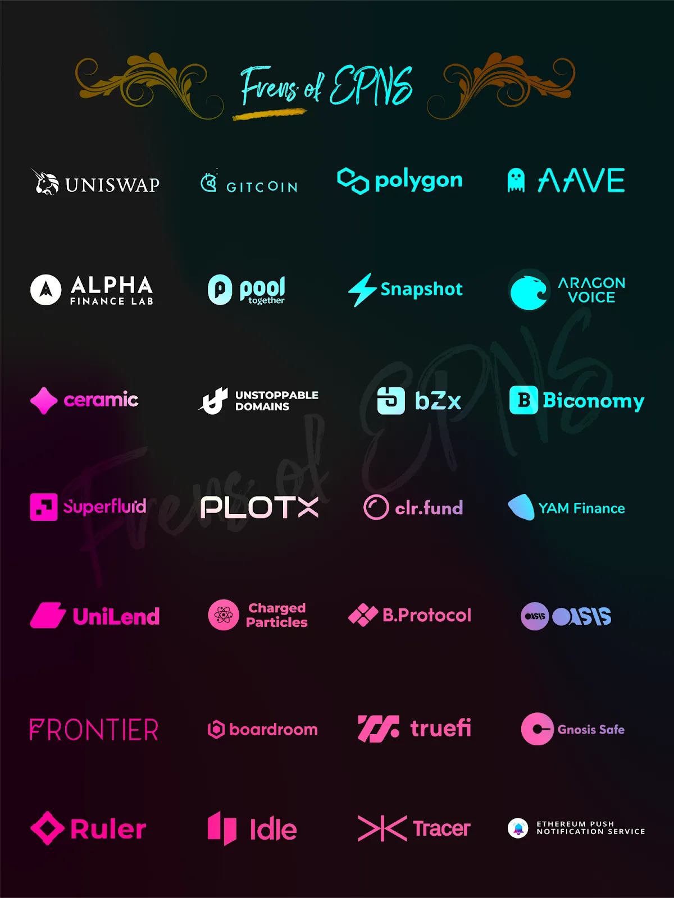

import { ImageText } from '@site/src/css/SharedStyling';

<!--truncate-->

Hello Awesome PUSH community, an amazing AMA took place on the EPNS Discord server and we would like to introduce to you the AMA session where our guest was the one and only Kaito from Coffee times. The AMA took place on the 21st of January.

In this AMA Recap, we will try to summarise the most interesting points for you.

**Kaito:** _Hi @Harsh and @Richa_

**Kaito :** 事前に頂いた質問を最初に投稿していきます！EPNS創業者&チームメンバーから答えがあったらDeepL使って日本語に翻訳していきます。

途中でも質問があれば、投稿してください！英語に翻訳していきます。

_( I will post the questions I received in advance first! If there is an answer from the EPNS founder & team members, we will translate it into Japanese using DeepL._

_If you have any questions along the way, please post! I will translate it into English)_

**Richa:** こんにちは 友達 🙂 👋

_(Hello friends 🙂 👋)_

**Richa:** _hello hello_

_kindly excuse me if my google translation is bad 😄_

**Kaito:** _haha perfect_

_let’s get started!_

**Kaito :** 清算の通知などに利用される際に、プッシュ通知の遅延が起こるようなことはありませんか？

_(Will there be a delay in push notifications when they are used for things like liquidation notifications?)_

**Harsh:** _hello @Kaito and hey everyone_

**Harsh :** 良い質問です! 遅延は起きません。これらはオフチェーンのロジックフックで、オンチェーンのデータに依存しますが、リアルタイムのデータではありません。ローンリクイデーションのロジックは、ヘルスレシオがレンジの10％前後になるとトリガーされます。実際には、ほとんどすべての通知において大幅な遅延は発生しません。少なくとも、システムのさらなる拡張に向けて、エンジニアはこの点を確認しようとしています。

_(Wowza, nice question! No, delay in push notification will not occur for near loan liquidation, these are off-chain logic hooks that rely on on-chain data but not real-time data. The loan liquidation logic is triggered when the Health ratio falls around 10% of the range. In fact, no significant delay would be there are almost any notifications, at least, that’s what the engineers are trying to ensure as we work towards expanding the system more!)_

**Kaito :** 今後の野望について。Push Notificationからのサービス展開はとてもユーザーのニーズに基づいたいい起点だと感じました。同時に、通知のデータを把握できることで、より大きなビジネスにも繋がるチャンスがあるのではと感じており、ファンダーチームがどのようにその野望をもっているのか投資家として是非聞いてみたいです。

_(What are your future ambitions? As an investor, I’d like to hear how the funder plans and ambition, because notifications would lead to a bigger business opportunity I believe)_

**Richa:** _I can take this one_

**Richa :** EPNSには大きな計画があります。イーサリアムでのメインネット立ち上げを成功させたばかりですが（素晴らしいコミュニティに感謝します）、現在はプロトコルのマルチチェーン化に注力しています。これは、他のブロックチェーンネットワーク上の新進のエコシステムも、すぐにEPNSをその運営に統合し、ユーザーに通知を送ることができるようになることを意味します。EPNSの次のフェーズでは、ユーザーの参加やPUSHノードなどにインセンティブを与える報酬メカニズムを展開する準備をしています。

私たちは、自分たちを通知プロトコルに限定していません。近い将来、Web3の本格的な通信プロトコルとなり、W2W（ウォレット間）通信などを可能にすることを想定しています。投資家の皆様はもちろん、ユーザーの皆様にもEPNSには大きな期待を寄せていただいています。

もうすぐ発表される2022年のロードマップをお楽しみに❤️

_(We have big plans for EPNS in this. We’ve just had a successful mainnet launch on Ethereum (thank you to our awesome community) and are now focused on making the protocol multichain. This means that very soon budding ecosystems on other blockchain networks will For the next phase of EPNS, we’re also all set to roll out our reward mechanism to incentivize users for their participation, PUSH Nodes, and more._

_We’re not restricting ourselves to be a notification protocol. In the near future, we envision becoming a full-fledged communication protocol for Web3, enabling W2W (wallet-to-wallet) communication and much more. We believe investors and even users have quite a lot to look forward to with EPNS._

_Look out for the 2022 roadmap coming out soon ❤️)_

**Kaito :** 2022年もハッカソンを行う予定はありますか？  
_(Do you plan to organize a hackathon in 2022?)_

**Richa** **:** もしETHDenverに参加される方がいらっしゃいましたら、DMをお送りください。私たちも参加しますし、ぜひオフラインでお会いしたいです😍

また、開発者の皆さんには、ハッカソンを待つ必要はありません。EPNSプロトコルに貢献する開発者を支援するために、PUSH助成金プログラムを数週間後に予定しています。ガバナンスは、開発者やチームを表彰することでエコシステムを構築・成長させるために、第一弾の助成金として$1Mドルを提案されています。

EPNSガバナンスチームは、このイニシアチブの管理とサポートに責任を負っており、開発者はEPNSプロトコルへの貢献を開始する絶好の機会を手にしていると信じています。

[https://gov.epns.io/t/epnsip-01-push-grants-program/417](https://gov.epns.io/t/epnsip-01-push-grants-program/417)

_(We have big plans to participate (speakers, workshop, sponsoring) upcoming hackathons, if anyone is coming to ETHDenver please send a DM, we’d be there and would love to meet IRL 😍_

_On that note, we would like to remind developers that there is no need to wait for a hackathon. We have the PUSH Grants Program coming in the following weeks to empower developers for their contributions to the EPNS protocols. The governance has requested 1Million USD for the first wave of grant funds to build and grow the ecosystem by awarding developers, teams._

_The EPNS governance team is responsible for managing and supporting this initiative and we believe developers have an excellent opportunity at hand to start contributing to the EPNS protocol._

[_https://gov.epns.io/t/epnsip-01-push-grants-program/417_](https://gov.epns.io/t/epnsip-01-push-grants-program/417)_)_

**Kaito:** 競合のサービスはありますか？

_(Do you have any competitors/services?)_

**Harsh :** 私たちが作ったWeb3の新しいプリミティブで、まだライバルはいません。そのアイデアは、Ethereumから始まり、L2、そして最終的にはWeb3エコシステム全体のコミュニケーションプリミティブを構築することです。このプリミティブを使って、あらゆるdApp、スマートコントラクト、バックエンドサービスが、オープンでマルチチェーン、プラットフォームにとらわれない方法で、ウォレットアドレスに結びついたコミュニケーション（オフチェーン／オンチェーンの通知を含む）を送信することができます。もちろん、最初であるということは、製品面でもホワイトペーパーでも、あるいはその両方でも、直接の競合相手がまだ存在しないことを意味しますが、この分野が盛り上がりを見せ、いくつかのプロジェクトがこの分野に参入しようとしていることは喜ばしいことです

_(I can take this._

_This is a new primitive of Web 3 which we created so no competitors yet. The idea was to build out a communication primitive for Web3 starting with Ethereum, then L2s, and finally the entire web3 eco-system using which any dApp, smart contract, or backend services can send communication (starting with off-chain / on-chain notifs) that are tied to wallet addresses in an open, multi-chain and platform-agnostic fashion. Of course, being the first means that direct competitors don’t exist yet either on the product side of things or whitepaper or both but we are happy to see that the space is heating up and few projects are now trying to also enter into the space_**_.)_**

**Kaito :** どのチャンネルを購読したほうが良いかの指標になるレビュー機能をつける予定はありますか？

_( Do you have any plans to add a review feature that will give us an indication of which channels we should subscribe to? )_

**Richa :** はい! プラットフォーム上のチャネルを検証し、悪意のあるチャネルからユーザーを保護するための複数のメカニズムをすでに備えています。EPNSプッシュノードは、チャンネルが発信するすべての通知を検証します。通知の関連性をチェックし、チャンネルが当初約束したものを提供することを保証します。さらに、公式プロトコルが所有するチャンネルには、検証済みのEPNSタグが付与されます。これは、InstagramやTwitterのブルーティックのようなもので、ユーザーがどのアカウントを信頼すべきかを知るのに役立ちます。ENS、dydx、Snapshotなどのチャンネルは、すでにこの方法で検証されています。

さらに、チャンネルの行動に基づいてスパムスコアが割り当てられ、ポジティブな行動とネガティブな行動の両方で更新されます。このスコアにより、購読者が本物のチャンネルを見分けて購読することができ、悪質な行為者を排除できると考えています。また、常に関連性を保っているチャンネルには、このプロトコルによってインセンティブが与えられます。

app.epns.io で「Verified by EPNS」と青いマークをチェックして、分散型通知を探求して楽しんでください!

_(Yes! We already have multiple mechanisms in place to verify channels on the platform and protect users from maliciously acting ones. EPNS Push Nodes take up the heavy lifting and verify all the notifications sent out by channels. ensure that the channels deliver what they originally promised. Moreover, we have a verified EPNS tag that is given to channels owned by official protocols. This is akin to Instagram or Twitter blue ticks, helping users know which accounts to trust. Channels like ENS, dydx, and Snapshot have already been verified by this method._

_Additionally, spam score is assigned to channels based on their behavior and is updated for both positive and negative actions. We believe this score will help subscribers spot the genuine channels and subscribe to them, leaving out malicious actors. Channels that maintain relevancy at all times. are also incentivized by the protocol._

_Check out the “Verified by EPNS” and a blue tick at_ [_https://app.epns.io/_](https://app.epns.io/) _to explore and enjoy decentralized notifications !!)_

**Kaito :** すでに知っているように、EPNSは最終的に、solana、polygon、Bscなどの他のチェーンに組み込まれる予定です。予想されるタイムラインはどのようなもので、開発は始まっていますか？

_( EPNS will eventually be integrated into other chains such as Solana, polygon, Bsc, etc. What is the expected timeline and has development begun?)_

**Harsh :** そうですね、初期からサポートしてくれていたPolygonを次にサポートすると発表しました。計画では、最初に我々をサポートしてくれたすべてのL2/L1に愛を返し、その後、非evmチェーンに移行することになっています:) Polygonの接続は、まもなく私たちのステージング環境/dApp（https://staging-app.epns.io/ ）で利用できるようになります。追記：SolanaリスボンハッカソンでSolanaのPoCを行いましたので、その様子をご紹介します。https://www.youtube.com/watch?v=eY9uxsJtfYQ

_(Yes, we already announced that next is Polygon as they supported us right from the start. Plan is to return back the love to all L2s / L1s that supported us first and then go to non-evm chains :). Polygon connection will soon be available on our staging environment / dApp (https://staging-app.epns.io/). Solana will come soon as well, ps: We did Solana PoC at Solana Lisbon hackathon, here’s a peak: https: // www. youtube.com/watch?v=eY9uxsJtfYQ)_

**Kaito :** EPNSの登場によりクリプトに通知機能が実装されるようになると考えているのですが、あるアプリで作成した通知を別のアプリで通知を受け取りコンストラクタを実行するといったことはできるのでしょうか？例えば、あるアプリで契約を締結している場合に他のアプリで優先的なサービスを提供するといったことが実現できるのでしょうか？

_(We believe that with the advent of EPNS, notifications will be implemented in cryptos. Can we create a notification in one app, and get another app to receive that notification and execute the constructor? For example, if a contract is signed in one app, will it be possible to provide priority service in another app?)_

**Harsh :** はい、これはオープンな通信層なので、プラットフォームやアプリに依存しません。優先サービスについては、ネットワークのプッシュノード（バリデータノード）を稼働させることで、最速の配信が可能になります。

_(Yes, this is an open communication layer and hence is platform/app agnostic. As for priority service, the best way to do that will be to run push nodes (validator nodes) of the network which will enable the fastest delivery)_

**Kaito :** 通知メカニズムの問題とそれがWeb3ユーザーに与える影響について詳しく教えてください。

_(Can you elaborate on the problem with the notification mechanism and how it affects Web3 users?)_

**Richa :** ブロックチェーン技術が成長し、利用が拡大しているにもかかわらず、サービス（dApps、サービス、スマートコントラクト）には、ユーザーとの真のコミュニケーション媒体がまだなく、twitter、telegram、メールなどの代替コミュニケーション媒体で満たされていることがあります。Web3では、ユーザーは自分の行動や重要なイベントがあったかどうかを確認するために、サービスに戻ってくる必要があります。

例

\- DEXで取引の注文があった場合、ユーザーはサービスに戻って確認する必要があります。

\- Compoundで清算がされた場合、通知を受け取る方法がありません。

\- ENSドメインの期限切れたら? 期限切れに関するツイートが少ないと目に留まらないかもしれません。

\- プロトコルに問題が発生し、ユーザーに知らせる必要がある? 残念ですが、TelegramやTwitterで連絡を取り、ニュースが彼らに届くことを願わないといけません。

ここでEthereum Push Notification Service (EPNS)の出番です 🙂 Web3のコミュニケーション層を通知から構築します

_( Despite this growth and expanding usage of blockchain tech, the services (dApps, services, smart contracts) still lack a genuine communication medium with their users, sometimes filled by alternative communication mediums like twitter, telegram or email. In Web3, users still need to come back to the service in order to check if their actions or important events. Example:_

_— Trading orders on dEx? The user needs to return back to check._

_— Loan liquidates on Compound? No way to receive an intimation._

_— ENS domain expiry? Few tweets about expiry may not catch the eye._

_— Protocol got compromised and users need to know? Too bad, reach out on Telegram, Twitter and hope the news reaches them._

_This is where Ethereum Push Notification Service (EPNS) comes in 🙂 Building the communication layer for Web3 starting with notifications )_

**Kaito :** EPNSは、Web 3.0アプリとそのユーザーの間の媒体としてどのように機能しますか？

_(How does EPNS act as a medium between a Web 3.0 app and its users?)_

**Harsh :** Web3アプリは、プロトコル（EPNSCoreスマートコントラクト）上にチャネルを作成し、Web3ユーザー（ウォレットアドレス）は、私たちのプッシュノード（バリデータノード）によってインデックス化されたEPNSCommマルチチェインスマートコントラクトにオプトインすることができます。サービスはその後、ipfs（または将来的には他の記憶媒体）にアップロードされる署名済みのペイロードを送信することができます。このペイロードはその後、プッシュ・ノードによって選択され、EPNSCoreのインデックス付きデータを介して検証され、ネットワークによって承認されます。その後、任意のクリプト・フロントエンドがネットワークにアクセスし、通信を確認することができます。

_(Web3 apps create their channels on the protocol (EPNSCore smart contract) which web3 users (wallet addresses) can then opt-in (EPNSComm multichain smart contract) which is indexed by our push nodes (validator nodes). Afterward, the service can send a signed payload uploaded on ipfs (or another storage medium in the future) which can be picked by push nodes, validated via indexed data of EPNSCore, and admitted to the network. Afterward, any crypto frontends can just tap into the network and display the communication.)_

**Kaito :** PUSHのトークン保有者は、インセンティブや特典を得ることができるのでしょうか？この報酬システムについて、またその割合について教えてください。ユーザーが保有する$PUSHの量に基づくのでしょうか？

_(Do PUSH token holders get any incentives or rewards? Can you tell us how the reward system works? Will it is based on the amount of $PUSH a user holds?)_

**Harsh :** 金銭的なアドバイスではありません, DYOR 🙂 でも、そうです! このゲーム理論は、トークンの保有者が、時間とともに保有量に応じて発生する報酬のシェアを得られるように設計されています。

$PUSHには次のようなユースケースがあります（※ユースケースは現在作成中ですが、変更可能です）。

1\. プッシュノードのステーキング/スラッシング。PoSを介してプッシュノードを確保します（現在準備中）。

2\. Utility / Governance DAO。これはライブの分散型コミュニケーションレイヤーであり、微調整される設定や削除されるチャンネルが必要です。課金対象となる料金は、すべてプッシュ・トークンまたはガバナンスを必要とします。 プッシュコミュニティの割り当ては53％で、そのうち未割り当てのコミュニティ部分のプッシュトークンは、プロトコルのビジョンや方向性を決定するためにコミュニティによって統治され、エコシステムを拡大していきます。我々はすでに、フェーズ0を通して段階的に分散化を開始しています。

3\. インセンティブ。これには、成長を促進するためのインセンティブ、イールドファーミング、ステーキングが含まれていますが、マイニングや開発者へのインセンティブを積極的に利用することはまだ検討中です。

4\. 報酬の分配。報酬は、通知やチャットなどを送信するチャンネルのための報酬プールに入ります。これは、プッシュトークンを介して公正な割合で分割することができ、手数料が有効化されるたびに、トークン保有者や暗号フロントエンドが公正な分配を受けることができます（少なくとも1年先ですが、EPNSはすでに分散化しているため、トークン保有者が最終的な決定者となります）。

_(Not financial advice, DYOR 🙂 but yes! The game theory is designed to ensure token holders also get a share of the accrued rewards based on the amount held with time._

_$PUSH has these use cases, \*use cases are in the works but can be pivoted_

_1\. Push Nodes Staking / Slashing: This secures push nodes via PoS, in the works_

_2\. Utility / Governance DAO: This is a live decentralized communication layer and needs settings that will be tweaked, channels that have to be removed, few of these are available with mainnet launch and the rest are in the works and will be out. Fees that will be charged, all of which require push token or governance. Push community allocation was 53% of which the unallocated community portion of push token will be governed by the community to decide the vision/direction of the protocol / expanding ecosystem. We already started decentralizing this progressively through phase 0_

_3\. Incentives: This includes Incentives to bootstrap growth, yield farming, staking is live but active usage mining and developer incentives is still in the works_

_4\. Reward Split: The fees whenever activated will go in a fees pool, for channels sending notifs, chat, etc. This can be split in fair proportions via push tokens so that token holders, as well as crypto frontends, can receive their fair share whenever fees are activated (at least a year away according to us but since we have already decentralized, token holders are the final decision-makers) )_

**Kaito :** メッセージングサービスは、XMTP (https://xmtp.com/) や ethmail (https://ethmail.cc/)、Rarible のメッセンジャー機能 (https://rarible.com/blog/the-first-multi-chain-messenger-is-here-dm-any-wallet-on-rarible-com) などいろいろなものがあると思いますが、EPNSの特徴や優れている点があれば教えてください。また、これは完全にオフチェーンの仕様ですか？

_(There are many messaging services such as XMTP (https://xmtp.com/), ethmail (https://ethmail.cc/), Rarible’s messenger feature (https://rarible.com/blog/the-first-multi) -chain-messenger-is-here-dm-any-wallet-on-rarible-com), etc. What are the features and advantages of EPNS? Also, is EPNS a completely off-chain specification?)_

**Richa :** @Harsh | EPNS が、前の質問でこのことについて簡単に話しました。ETHGlobal Hackmoney 2020でWeb3の通信層の開発を始めたときから、遅かれ早かれ、このような状況になることはわかっていました。私たちには先行者で、ここから先に進むべきビジョンがあります。私たちは積極的にプロジェクトを獲得することに注力しており、またマルチチェーン化にも取り組んでいます。

オフチェーンとオンチェーンの両方の通知をサポートしています。

_(@Harsh | EPNS briefly spoke about this in the previous questions. We knew when we started working on the communication layer for Web3 back at ETHGlobal Hackmoney 2020 that sooner or later, attention will fall into this. We have a first-mover advantage and vision of where we are focusing aggressively capturing projects, as well as working to go multi-chain._

_We support both off-chain and on-chain notifications.)_

**Kaito :** チーム / 投資家が同時にトークンを売却した場合の供給ショックのリスクにはどのように対処するのでしょうか？

_(How do you deal with the risk of supply shocks when teams/investors sell tokens at the same time?)_

**Harsh :** 興味深い質問です。私たちのケースでは、偽の情報による供給ショックが起こらないように、すべてのトークンの割り当てを、スマートコントラクトによる権利確定で行っています。

トークンのリリーススケジュールに関しては、投資家とチームが業界最高水準のクリフと権利確定によって拘束されることを保証しています。投資家は TGE の後に 3 ヶ月のクリフ / 24 ヶ月の権利確定、チームは TGE の後に 9 ヶ月のクリフ / 48 ヶ月の権利確定となっていますが、ほとんどのチームでトークンの授与が遅れたため、ほとんどのケースで 12 ヶ月のクリフとなっています。

このような基準を設けていても、特に短期的には供給ショックのリスクは常に残っています。トークンの保有者、トレーダー、投資家、チームメンバーは、他のプロジェクトと同様に、自分の意思でトークンを行使することができます。プロジェクトの目標とビジョンが一致し、技術と成長を向上させ続ける限り、これらの問題は長期的には消えていきますが、トークンがアンロックされた場合、投資家は数年間そのトークンを保持するか、あるいはステーク、イールドファーム、エグジットを選択する可能性があることを常に想定しています。これは分散型であるため、実際にはコントロールできません（コントロールすべきでもありません）。

**_(​​_**_It’s an interesting question. We ensured that the supply shock due to false information doesn’t come in our case as we bounded all token allocation through smart contract vesting after minting._

_As for the token release schedule, we ensured that investors and team are bounded through the highest gold standards of the industry through cliffs and vesting which for investors are 3-month cliff / 24 months vesting after TGE and for the team are 9 months cliff / 48 months vesting after TGE which due to us awarding tokens late of almost all our team went to 12 months cliff for the majority of the cases._

_Even with these standards, the supply shock risk always remains especially from a short-term perspective, anyone who is a token holder, trader, investor, a team member can choose to exercise their tokens at their will just like any other project. As long as the project’s goal. and vision aligns and we keep improving tech and growth, these things fade away in the long run but always assume that if a token is unlocked then an investor might keep it for a few years or might choose to stake/yield farm or exit which being decentralized, we can’t really control (and shouldn’t as well)_

**Kaito :** Push Notification Serviceは今後何らかのウォレットに統合される可能性はありますか？ 最近はargentなど、優れたコントラクトウォレットが増えています。 そのようなウォレットではDEXやlendingプロトコルなどが統合されており、1つのアプリの中でそれらを直感的に使うことが出来ます。 Pushがそういったアプリの中に統合されればより多くのユーザーが自然にPushを使うことになると思います。

_(Is there any possibility that the Push Notification Service will be integrated into some kind of wallet in the future? Recently, there are more and more excellent contract wallets such as Argent. Such wallets have integrated DEX and lending protocols, and you can use them intuitively in one app. If Push is integrated into such apps, more and more users will naturally use Push.)_

**Harsh :** 素晴らしい質問とフィードバックですね。私たちは、ウォレットとの統合の可能性について話し合いを始めており、いくつかのウォレットと初期の段階で話し合っています。現在のサービスで通知を送信するのと同じくらい簡単にできるようにするには、まだ多くの技術文書とSDKが必要で、チームはこの点でも努力しています。

_(That’s an excellent question/feedback. We have started the journey of talking to wallets for possible integration and are in early talks with a few. Still need a lot of tech documentation and SDK to make this as easy as sending notifs is for services now and the team is getting there in this regard as well)_

**Kaito :** 「RockstarsofEPNS」は、本当にクリエイティブでユニークなコンセプトです。この素晴らしいコミュニティの発展における「EPNSのロックスター」の役割は何ですか。また、この素晴らしいアイデアはどのようにして生まれ、スムーズに実行されたのでしょうか。

_(RockstarsofEPNS “is a really creative and unique concept. What is the role of the” Rockstar of EPNS “in the development of this wonderful community? How did you come up with this great idea and how smoothly was it implemented? )_

**Richa :** EPNSの$ROCKSTARは、それぞれ 2400 PUSHを含んだ100個のユニークなカスタムメイドのNFTです。毎週、最もクリエイティブなコミュニティメンバーに1つが与えられます。EPNSのために何かクールなもの、クレイジーなもの、またはその両方をお持ちの方は、こちらのルールに従ってください： [https://medium.com/ethereum-push-notification-service/kicking-off-the-epns-nft-community-drops-6a5c49808cf](https://medium.com/ethereum-push-notification-service/kicking-off-the-epns-nft-community-drops-6a5c49808cf) そして、あなたも1つ獲得することができます 🙂 これ（上の画像）はROCKSTAR NFTのうちの１つのご紹介です😉

_($ ROCKSTAR of EPNS are 100 unique custom-created NFTs that contain 2400 $ PUSH each. One is awarded to the most creative community member every week. Have something cool, crazy, or a bit of both that you have done for EPNS? Then follow the rules here:_ [_https://medium.com/ethereum-push-notification-service/kicking-off-the-epns-nft-community-drops-6a5c49808cf_](https://medium.com/ethereum-push-notification-service/kicking-off-the-epns-nft-community-drops-6a5c49808cf) _and you can also win one :). here’s a teaser of one such ROCKSTAR NFT 😉)_
