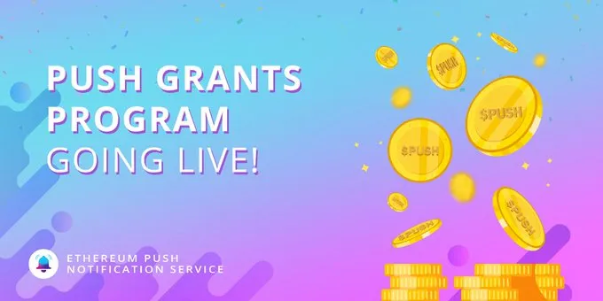

import { ImageText } from '@site/src/css/SharedStyling';

<!--truncate-->

There have been very special moments though our journey that leave a mark in our hearts, and this month the **EPNS Mainnet launch** is one of them. It was an incredible start for this year. This EPNS Monthly Blocks edition comes packed with a multitude of news in all fronts. Let’s dive into it!

# Mainnet Launch 🚀

The Launch date was set: **January 11th.** #PUSHforMainnet Mode: **ON**!  
The entire Team was laser-focused on making this release a success, and it required orchestrating several moving pieces.

Finally, after months and months of preparation at 4PM UTC on January 11th [EPNS was successfully launched on Mainnet](https://medium.com/ethereum-push-notification-service/the-epns-mainnet-is-here-470faec0c01).

After launching with 15 channels during the Mainnet launch week, we end the month with 30+ channels and over 40.000 users subscriptions to receive notifications from their favorite protocols and services.

Looking forward for a great month ahead after even more channels are launched!

# Development 🏗️

This month several tasks took place in the development front not only in preparation for Mainnet launch, but also to set a foundation for all the amazing things coming in our 2022 roadmap.

- Extensive verification & validation of every component of the EPNS ecosystem took place before the big day as dry-runs to ensure a flawless deployment: testing of migration scripts, dry-runs for deployment, stress testing, and more.
- We set ourselves the task to produce User Journey videos for every channel we were launching as a part of our mainnet launch activities. These are short videos aiming to explain users how they can subscribe and receive notification from their favorite channels.
- Introduced the off-chain notifications ⚙️ , allowing services to send notifications without any gas fees. Together with Channels visualization 📰 based on verification and subscribers is LIVE!
- Subset notifications in the works, and making good solid progress.
- EPNS on Polygon planning and development activities in progress! 🔥
- Spam Box in the browser extension 📮 dev activities started!

Additionally, we released our [**EPNS Roadmap 2022**](https://twitter.com/epnsproject/status/1485673774510796801?s=20&t=nFDC9CXOStcai9Ph2CyEzg) together with our guide for Developers on [**How to get started with EPNS (for Devs!)**](https://twitter.com/epnsproject/status/1485976070008360961?s=20&t=nFDC9CXOStcai9Ph2CyEzg)

Don’t forget to join our [Discord](https://discord.gg/S3GvkHjWvU) if you have any question or suggestion, our Dev team will gladly assist all of you BUIDLERS to implement EPNS notifications on your projects!

# Governance 🗳️

Governance started the year with awesome traction, great news, and more engagement from the community.

This month we announced two very important proposals aiming to allow for more community members to participate and bring more awareness of EPNS to the entire space.

- [**Incentives Proposal**](https://twitter.com/epnsproject/status/1479556336551563269?s=20): looking to create more meaningful participation from the community, and incentivize all proposals that make it to the finish line!
- [**Push Grants Program**](https://twitter.com/epnsproject/status/1486414934355243008?s=20&t=nFDC9CXOStcai9Ph2CyEzg): This will run for 2 quarters, and allocated a grand total of $1 Million USD for grants. The program is now **LIVE** and accepting submissions. The entire process is open through our [governance forum](https://gov.epns.io/t/push-grants-program-pgp-details-start-here/41). Join our [Discord](https://discord.com/invite/PQRdNpgJYB) if you have more questions!

# New year, even more, new Frens! 🎎

The response received after the Mainnet launch has been overwhelming. It has help us validate yet one more time the imperative need that protocols have to communicate effectively with their users.

This month we announced six more collaborations covering a wide range of use cases:

- [**dYdX Foundation**](https://twitter.com/epnsproject/status/1478366460237922305?s=20)**:** to enable a communication channel for dYdX stakeholders through which participants in dYdX protocol governance can remain updated at every step of the governance process.
- [**Bancor**](https://twitter.com/epnsproject/status/1479090893206405122?s=20)**:** to facilitate Push notifications for Bancor users and notify them about new token listings, fee changes, liquidity mining periods, and even governance proposals.
- [**Huobi Global**](https://twitter.com/epnsproject/status/1480774034576920576?s=20)**:** to allow subscribers to this channel to be notified whenever a critical action occurs regarding a token on Huobi Exchange.
- [**Atlantis World**](https://twitter.com/epnsproject/status/1481989517318193156?s=20)**:** with this channel users can subscribe to receive push notifications that help them keep a track of digital assets and progress on the Metaverse.
- [**Angle Protocol**](https://twitter.com/epnsproject/status/1485613871276511234?s=20&t=nFDC9CXOStcai9Ph2CyEzg)**:** to allow direct communication from the protocol with the Hedging Agents and keep them informed about opportunities, or in case of positions in danger.
- [**Bridge Mutual**](https://twitter.com/epnsproject/status/1486339193345568768?s=20&t=nFDC9CXOStcai9Ph2CyEzg) to facilitate users notifications about insurance claims, coverage premiums expiring, and more.

# EPNS Community incentives🎪

This has been a wonderful month loaded with opportunities for the community to participate in many activities.

Starting with our Rockstars Of EPNS!. This month we had 4 winners of the custom unique NFTs made by Indian artists along with the 2400 $PUSH.

> _Want to participate and win $ROCKSTAR, start over here:_ [_https://medium.com/ethereum-push-notification-service/kicking-off-the-epns-nft-community-drops-6a5c49808cf_](https://medium.com/ethereum-push-notification-service/kicking-off-the-epns-nft-community-drops-6a5c49808cf)

Contests 🏆:

- [**Huobi Trading contest**](https://twitter.com/HuobiGlobal/status/1481430796892205061?s=20)
- [**PUSH x WazirX Giveaway**](https://twitter.com/WazirXIndia/status/1485913834540122112?s=20&t=nFDC9CXOStcai9Ph2CyEzg)**!!**

We also started our Office Hours! Giving everyone the opportunity to join an open space for questions about all topics EPNS.

And finally, early in the year we hosted our very special [**BIG REVEAL 🥁 Twitter spaces**](https://twitter.com/epnsproject/status/1478652636245069824?s=20). (Missed it? Play the recording [**here**](https://twitter.com/i/spaces/1BdxYwDWOYMGX)**.)** Additionally we’ve had quite a good amount of AMAs where the community have had the opportunity to ask questions, and understand the impact that EPNS is having after integrating with all our Frens!

- AMAs with CVI, Proof of Humanity, KuCoin, TracerDAO, Satoshi Club, Discord AMA with Coffee times, and a Discord AMA with MakerDAO as well.

# EPNS in the news 📺

- 🎊 [**#Rockstars of Ethereum_V2 kicked off with Dmitry Buterin**](https://twitter.com/epnsproject/status/1483154786614939649?s=20) in the first episode talking about Vitalik, his childhood, and many things web3
- Check how our journey has been last year — [**Our 2021 year in review**](https://twitter.com/epnsproject/status/1478017171502473217?s=20) 💫
- EPNS got featured in:
- [**The Daily Gwei**](https://twitter.com/epnsproject/status/1481267253517897737?s=20)
- [**Economic Times newsletter**](https://twitter.com/epnsproject/status/1481552000546635785?s=20)
- [**The Defiant**](https://twitter.com/DefiantNews/status/1481716768145952771?s=20)
- Harsh spoke in the [**Binance Chain Panel discussion about web3**](https://twitter.com/epnsproject/status/1480375816592625667?s=20) **🎙** 🎉
- [**The New Stack**](https://twitter.com/epnsproject/status/1482352157416652805?s=20)
- [**Week in Ethereum News**](https://twitter.com/epnsproject/status/1482832003888259080?s=20)
- [**EthHub**](https://twitter.com/sassal0x/status/1483255326933909507?s=20)**.**
- EPNS made it in [**Breakout Startup List 2022**](https://twitter.com/epnsproject/status/1484529968998752262?s=20) 🎉
- **🎙** Our founder Harsh talked about EPNS and its use-cases during [**WazirX Live Stream**](https://twitter.com/epnsproject/status/1486667776341135362?s=20&t=nFDC9CXOStcai9Ph2CyEzg) and [**Cryptoverse Live Stream**](https://twitter.com/acryptoverse/status/1486619479844950019?s=20&t=nFDC9CXOStcai9Ph2CyEzg)🎉

Getting to this point and accomplishing such an important milestone proves yet one more time that we’ve found a great formula for success with our team, community, and collaborators.

None of this would have been possible without you all.

Let’s keep PUSHing for an awesome 2022! 💪🏼

The EPNS team
