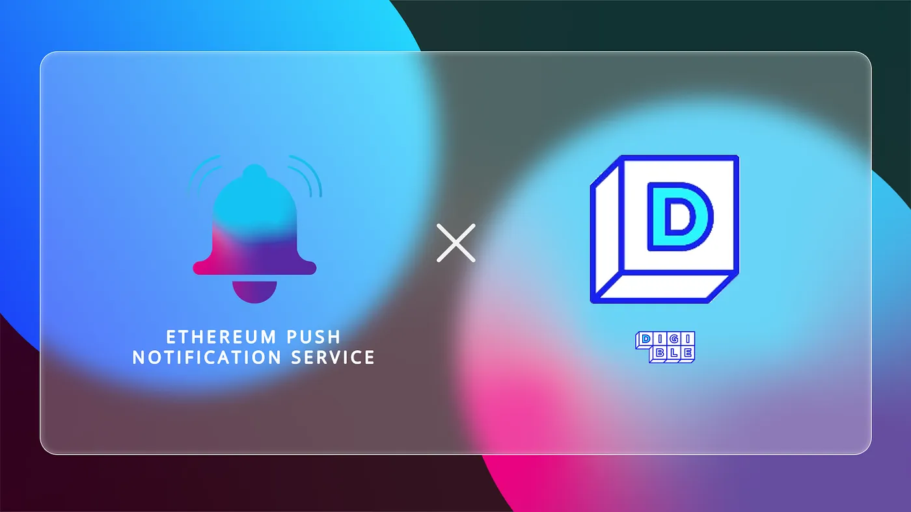

import { ImageText } from '@site/src/css/SharedStyling';

<!--truncate-->

The rise of digital assets has provided investors with a world of new opportunities to make the most of their wealth. Among these digital assets, cryptocurrencies have remained investors’ popular choice in the last decade. However, non-fungible tokens (NFTs) have recently picked up pace last year, providing investors with yet another viable investment opportunity and not to forget a ticket to the metaverse. Owing to this fact, NFTs recorded a whopping $41 billion in sales last year and experts believe that this number is set to grow exponentially.

In this regard, the emergent NFT marketplace Digible is creating an exciting and easily accessible platform for investors and collectors to enter the NFT revolution. Today, we at EPNS are enthralled to announce our pilot program collaboration with Digible through which we aim to redefine the way the platform communicates with its users.

### How Digible Can Benefit From the Partnership With EPNS

Described as the “collector’s metaverse”, Digible is an NFT marketplace that aims to combine the best of the physical and digital worlds through NFTs. It allows users to buy, sell, trade, and exchange rare physical cards that hold a reliable value. Every NFT on the platform is supported by an underlying physical asset that users can uniquely own.

Moreover, Digible also offers a set of unique services like DigiDuel, DigiSafe, and DigiGrade to its users. DigiDuel allows users to battle for rare NFTs on the platform and DigiSafe and DigiGrade help in securing and safely storing valuable NFTs.

On this note, the platform needs a reliable medium for exchanging information with its users and updating them about the status of their NFTs. EPNS aims to create this channel for Digible.

# What Does the Collaboration Entail

Through our collaboration with Digible, we aim to create a means for the platform to be able to communicate with its users to pass on updates and increase user participation. Users of Digible can subscribe to its official channel on EPNS to receive decentralized push notifications whenever

- They receive an offer on their NFTs
- Their offer for NFTs has been canceled or accepted
- They’ve won or lost an auction bid for NFTs
- Sellers receive a new bid on the NFTs
- A sealed NFT box has been opened
- A new sale is made on the platform

Digible’s unique approach to combining the physical and virtual worlds through NFTs is poised to create a unique appeal in the world of NFTs and we’re pleased to collaborate with this platform on their ambitious journey.

# **About Digible**

Digible™ is powering the collector’s metaverse for physically-backed collectibles by using blockchain technology to eliminate the friction of trading physical collectibles. Allowing for collectible investors such as hobby fanatics and private equity firms to acquire physical collectibles without having to worry about where to store them.

How it works:

Users that send items to the DigiSafe™ will receive an NFT that contains a scanned image of their physical item, and acts as a freely tradeable legal title to the physical item. If the user wishes to retrieve their physical item, they can claim it on the Digible platform. Digible will then burn the NFT and send them the physical item at their shipping expense.

Core products:

Digible™ marketplace: Cross-chain, Decentralized marketplace for trading physically-backed collectibles as NFTs.

DigiGrade™: Grading and authentication service for collectibles on the chain.

DigiSafe™: Decentralized, safe, insured storage of physical items represented by NFTs. Professional collectors and businesses with adequate insurance may apply for Digisafe status to qualify for additional revenue for storing of collectibles.

DigiGames™: Battle NFTs with each other in the form of mini-games and allows for third-party game developers to build card dueling systems and play to earn games using pure and physically-backed NFTs.

DigiWax™: Open-source protocol for sealed virtual NFT packs/boxes filled with physically-backed collectibles and digital collectibles. Secured and verified by Chainlink VRF. Breaker’s can digitally seal boxes and ensure a verifiably fair distribution of NFTs to the participants.

Digible™ believes that physically-backed collectibles will consume a large portion of the NFT market by 2023. This vision has led to us building the future of collectibles, all on the blockchain. We believe that the transparency on blockchain will lead to a safer, more accessible, and fair ecosystem for the world to access the physical collectibles and trading card markets.

| [Website](https://digible.io/) | [Medium](https://digibleio.medium.com/) | [Twitter](https://twitter.com/digibleio) |
