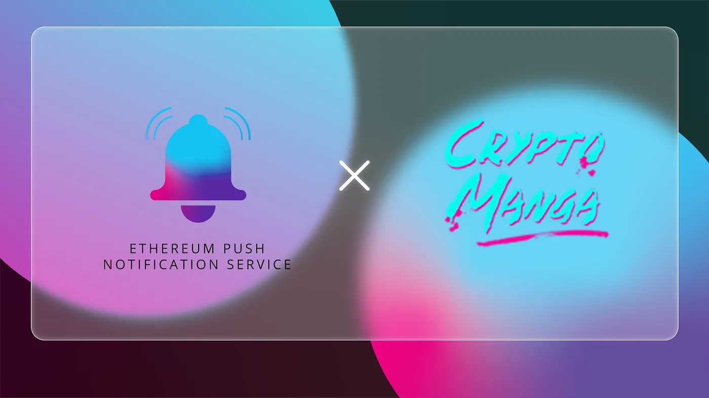

import { ImageText } from '@site/src/css/SharedStyling';

<!--truncate-->

The colossal rise of NFT-gaming in the past couple of years has led to a new dawn of the global gaming ecosystem. We now have a multitude of decentralized gaming projects that allow gamers across the globe to monetize their game-time and create multiple sources of income. Among all these projects, CryptoManga is an emergent NFT-gaming platform that is steadily climbing the popularity charts for its unmatched story-telling combined with compelling gameplay.

In this essence, we at EPNS are pleased to announce our pilot collaboration with CryptoManga to facilitate superior user experiences through decentralized push notifications for gamers.

### How CryptoManga Can Benefit From EPNS

Inspired by popular Japanese graphic novels, CryptoManga is an assortment of 5,555 unique NFTs, each representing the ownership of digital shells and identities. These identities and shells exist within the virtual Deathless City and create the opportunity for an enthralling play-to-earn gaming environment called the DarkBattle. In this virtual world, each NFT has a story of its own, represented as an NFN (non-fungible narrative) and generated using deep learning models.

CryptoManga combines the manga illustration styles of the 90s with the present-day NFTs to create an unmatched gaming experience for gamers of the future. The best part is that this gaming environment is woven into Twitter and provides a unique way for Twitteratis to engage and interact with each other. CryptoManga’s gaming mechanics combine DeFi with NFTs, allowing gamers to easily monetize their time and gameplay.

Notably, the CryptoManga ecosystem is community-driven and is dependent on the users of the platform for crucial decision-making. Users can stake the native token $MAD to participate in platform governance on the MangaDAO.

In this context, CryptoManga needs a decentralized communication medium to connect with users and ensure that they do not miss out on governance updates. And, through our partnership with them, we aim to build this medium.

# What Does the Collaboration Entail

As a pilot collaboration, CryptoManga will soon have an official channel of its own on the EPNS platform. Users can subscribe to this channel to have a direct source of communication with the CryptoManga platform. This channel will send out decentralized push notifications to all subscribed users to keep them updated with platform governance activities. Users can expect to receive notifications whenever

- New governance proposals are listed on the platform
- The status of the proposals change
- The results of the proposals are declared

As CryptoManga embarks on a journey to revolutionize the NFT-gaming space, we’re pleased to collaborate with the platform and hope to continue this alliance into the future.

# **About CryptoManga**

CryptoManga is a collection of unique 5,555 NFTs representing the ownership of digital pseudonymous shells and identities that exist within a heterotopia of the Deathless City, a post-civilization world where the power structures have become nomadic and deterritorial.

| [Website](https://cryptomanga.club/) | [Twitter](https://mobile.twitter.com/cryptomanganft) |
