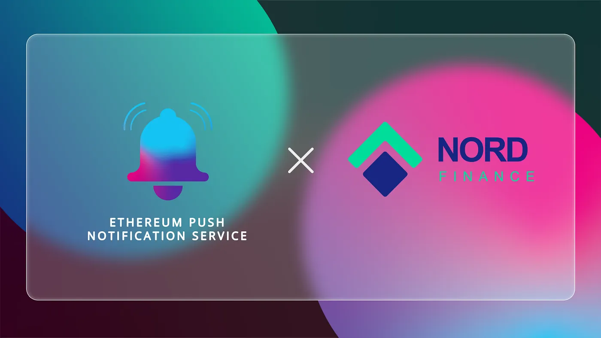

import { ImageText } from '@site/src/css/SharedStyling';

<!--truncate-->

EPNS and Nord Finance, the blockchain-agnostic DeFi ecosystem join forces in a pilot collaboration to facilitate communication between the platform and its users. As such, users of Nord Finance are poised to receive updates about their loan status and new investment opportunities through decentralized push notifications on their devices.

The DeFi industry has only grown from strength to strength since its inception in 2017. Today, it is home to some serious technological developments and rapid innovations that promise to change the course of the global financial system. However, in its current state, the industry causes a myriad of problems to its players.

For starters, the space is extremely fragmented and lacks interoperability. Individual blockchain ecosystems within DeFi have built walls so high that users housed on one chain often miss out on budding opportunities in the other. Then, for DeFi’s most popular investment strategy of yield farming, farmer saturation often reduces the yield generated and investors find themselves jumping from platform to platform in search of better yield. The price fluctuation of crypto assets leads to impermanent loss for liquidity providers and throws them in a constant dilemma of whether to HODL or provide liquidity. Lastly, the industry lacks variety in the range of investment opportunities available and leaves average, risk-averse investors, out of the picture.

Now, Nord Finance, as a DeFi platform was built to specifically solve these issues within the industry.

### DeFi for the Masses

Nord Finance is a blockchain-agnostic DeFi ecosystem that aims to create a multitude of financial opportunities for users by combining the best of traditional finance with DeFi. All of these opportunities cater to investors across the spectrum and are designed to generate the highest possible yields without impermanent loss. To achieve this, Nord Finance brings stablecoins into the picture and creates additional utility for them within the DeFi ecosystem.

Investors can use their stablecoin holdings for a wide range of opportunities from savings and fund management to collateralized loans, yield farming, and swaps on the Nord Finance platform. The interoperable nature of this platform automatically directs the liquidity to the highest yielding pools across the DeFi space to generate high APYs. This means that investors are not limited to a single platform and can bank on opportunities across the industry.

Given the innovative nature and the sheer number of possibilities on Nord Finance, users of this platform need a channel through which they can constantly keep a track of their investments and new opportunities. And this is exactly what we aim to achieve through our collaboration with Nord Finance.

“Nord Finance is just the platform that the growing DeFi industry was in need of,” says the team at EPNS. “The innovative financial products combined with the platform’s interoperability make it suitable for both beginner and veteran investors entering DeFi. In this regard, we believe that EPNS can add to the existing user experience on this platform by allowing users to stay on top of their investments, loans, and new opportunities.”

What Does the Collaboration Entail
==================================

This collaboration with Nord Finance entails building a direct communication medium between the protocol and its users. Nord Finance will have an official channel on the EPNS platform through which users can receive push notifications whenever,

*   New farming opportunities or liquidity pools are available for investors.
*   The loan repayment period approaches
*   On-boarding period for token claiming ends.

This saves users the hassle of manually checking for new updates every single time. EPNS has a mobile application, decentralized application, and a chrome extension to ensure that users do not miss out on these notifications no matter what device they’re on.

Speaking of the partnership the team at Nord Finance says, “to say that EPNS has redefined communication in DeFi would be an understatement. It is a platform that is single-handedly bringing the whole of web3 closer together. We’re extremely thrilled to have them on board and we believe that EPNS will help us better communicate with our users and improve their overall experience on the platform.”

**About Nord Finance**
======================

Nord Finance, a blockchain agnostic platform, is an advanced decentralized financial ecosystem that focuses on simplifying decentralized finance products for users by highlighting traditional finance’s key attributes. Deployed on the Ethereum Network, it integrates multi-chain interoperability, thus proposing a plethora of financial primitives, which constitute savings, advisory, loans against assets, investment/funds management, and swaps.

At Nord Finance, we are building a one-stop advanced decentralized financial ecosystem to serve the rising needs targeting novice users and professionals to meet their financial goals.

Connect with us…

*   Join our [Telegram](https://t.me/NordFinance)
*   Join our [Telegram Announcement](https://t.me/NordFinance_Ann)
*   Follow our [Twitter](https://twitter.com/Nord_Finance?s=09)
*   Visit our [Website](https://nordfinance.io/)
*   Mail us at contact@nordfinance.io
