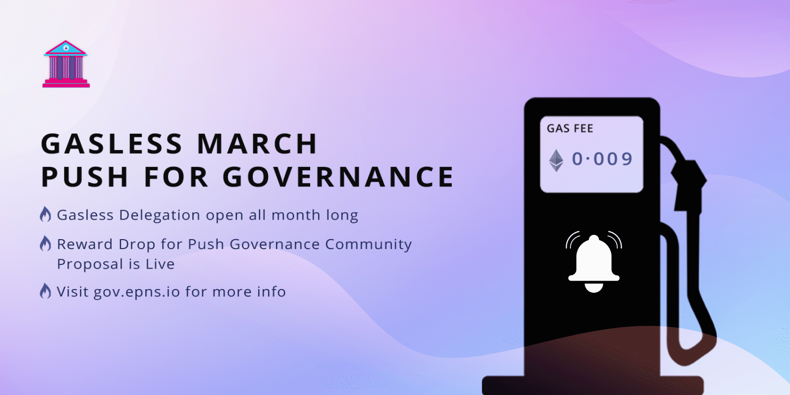
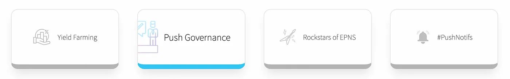
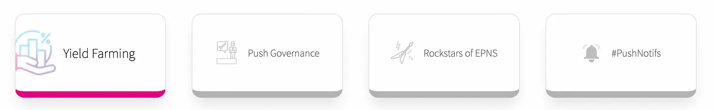
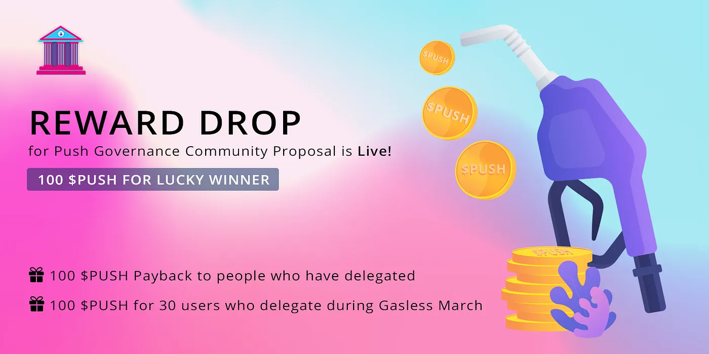

import { ImageText } from '@site/src/css/SharedStyling';

<!--truncate-->

**TL;DR Gasless March details**
-------------------------------

1.  EPNS is going to cover gas fees for PUSH holders to delegate their votes on-chain.
2.  Governance users then have immediate voting power to weigh in on the PIP (Push Improvement Proposal) for Reward Drop to Push Gov users, both existing & new.
3.  Throughout the month of March, all users who take advantage of the Gasless period to delegate their tokens in Push Governance will be eligible for a 100 $PUSH Reward Drop. A total of 30 winners will be chosen randomly among all who delegate between March 2 — March 31.

The goal of this initiative is to make voting an accessible activity to every PUSH token holder. Users currently have a few ways to activate their voting power, and many of those ways are already incentivized with users receiving $PUSH token rewards! For those who prefer to delegate their votes over staking for yield, the gas fees incurred to do so are a consideration. This initiative will mitigate that fee for a large chunk of holders for a limited time.

More **👇**

$PUSH Governance Voting Power 🔔🗳
==================================

The EPNS Community currently can take part in Push Governance by submitting a PIP (Push Improvement Proposal) or through the **Push Grants Program — now LIVE and accepting grant submissions** [**here**](https://gov.epns.io/c/grants/)**.** The formal voting for both is done on Snapshot where the [Push Voting Strategy](https://snapshot.org/#/strategy/push-voting-power) enables the following groups to vote:

*   $PUSH holders who delegate (to themselves or a Delegatee) on the [Push Governance delegation page](https://incentives.epns.io).

*   Users staking their $PUSH tokens or Uniswap LP stake tokens in either of the EPNS [Yield Farms](https://incentives.epns.io)

_We’re thankful to these folks who have already activated their votes on-chain and haven’t forgotten about them in this release (more below🪂)._

As of today, a majority of the total token holders (almost 90%) haven’t activated their tokens to vote yet. This initiative aims to remove the largest barrier to entry for our holders so their token’s utility is activated and their voting weight is enabled.

**Gasless Delegation❌⛽️ Specifics**
===================================

For a limited time, EPNS is going to cover the gas costs for a large group of these token holders who haven't delegated. This should make the ability to participate more accessible, by making it free!

The development team has been working on this behind the scenes and today opened up the [backend repo](https://github.com/push-protocol/push-website/epns-incentives-backend) to the public. This feature release allows the EPNS project team to cover the gas fees for delegators when they initiate the transaction on-chain.

> **_Who’s eligible?_**
> 
> Addresses holding at least 250 $PUSH or more.
> 
> **_For how long?_**
> 
> The program will be open initially for 30 days (Mar 2, 2022 — Mar 31, 2022)
> 
> **_Transaction limits?_**
> 
> One delegate transaction in 7 days per eligible address , gas fees cannot exceed $50 per delegation transaction

How to Delegate?
----------------

1.  Hop into [https://incentives.epns.io/](https://incentives.epns.io/) Push Governance dashboard
2.  Select the way to delegate. There are 2 ways to delegate your PUSH votes. _Gasless_ or _With Gas._ The default way is _Gasless._ If you are not eligible for Gasless Delegation, you could still select _With Gas_ option and proceed to pay for gas yourself to do the delegation.
3.  Clicking on `Delegate` button will pop Metamask.
4.  **For _Gasless_:**  
    Sign the transaction.  
    Then our backend proceeds to pay for the transaction using EIP712. Please wait for a minute or 2 for the transation to become successful.  
    **For _With Gas_:**  
    Confirm the transaction.

Delegate your PUSH votes Gaslessly or With Gas

As of today (at block **#14313131**) a total of 1,025 addresses are eligible to participate — which accounts for just over 25% of the nearly 4,000 $PUSH holders. Depending on the success of the first 30 days, the program duration and holdings eligibility may be reconsidered to include more users in this gasless offer.

Reward Drop 💰🪂 Info
=====================

PROPOSAL LIVE! [Gasless March & Governance Users Reward Drop](https://gov.epns.io/t/draft-proposal-gasless-march-and-governance-users-reward-drop/476)
------------------------------------------------------------------------------------------------------------------------------------------------------

*   Reimburse past tx fees of delegators
*   Urge LP stakers to activate their token voting power
*   30 users who delegate during the Gasless March Gas-fee-free Delegation

As mentioned earlier, about 10% of holders have already made the transactions necessary to vote in Push Governance. These addresses include the delegators and Yield Farmers earning PUSH rewards in the EPNS staking pools. To the handful of active addresses who have already paid these ETH gas fees and aren’t earning rewards, we’ve proposed a retroactive PUSH distribution to reimburse these users.

Another small subset of users included in this reward drop will be the LP stakers on Uniswap that haven’t activated their voting power. For these holders, the way to do that is to stake into our EPNS Yield Farms. The vast majority have done so, for the few that haven’t, we expect this reward drop should cover their expense to execute that transaction.

In addition to these reimbursement rewards, and to promote taking advantage of the Gasless Delegation feature even further, we’re offering the same reward drop to a lucky few of these users as well! Even users with **less than 250 $PUSH** who _didn’t qualify_ _for this gasless delegation window_ **are eligible** for this bonus drop if they delegate their tokens during the gasless offer window.

While making the delegation of PUSH voting power gasless (free) for many users over these next 30 days we wanted to give users one additional incentive to drive usage of this initiative. Make it easy, make it free, and include rewards to participate… these are the steps we’re taking to increase participation and combat voter apathy.

> **_Who’s eligible?_**
> 
> Users that delegated prior to snapshot, either to themselves or a Delegatee
> 
> Uniswap LP providers that have not activated their voting power by staking to our EPNS Yield Farms
> 
> 30 random users chosen among all those that delegate their votes over the next 30 days (Mar 2, 2022 — Mar 31, 2022)
> 
> **_Reward amount?_**
> 
> 100 $PUSH
> 
> **_How many will receive the reward drop?_**
> 
> Users delegated prior to snapshot — 26
> 
> LP Providers yet to stake to Yield Farms — 14
> 
> Random selection of 30 addresses that delegate over the month of March, gaslessly or not — 30

That’s 70 addresses that will receive rewards for past delegation/LP holders to delegate, plus 30 random users chosen among those who delegate during the Gasless March Push for a Governance time window, 70 in total.

This is a governance proposal that is currently live for community consideration.

Wrap 🎀🎁
=========

As #PUSHgov delivers this feature to users during Gasless March we hope to attract even more interested users to the Push Governance family. The whole reasoning for this campaign was to break down barriers, recognize valuable users, and incentivize users on yet another level.

This Incentivized Governance Model combined with the Progressive Governance Approach we’re taking will serve us well as we lead toward DAO-fication in a responsible and deliberative manner. At each step, we attract the kinds of users we want by being conservative and consistent with the rewards distro and the types of contribution channels we’ve opened. Thanks for taking the ride with us and as always appreciate the community’s support.

