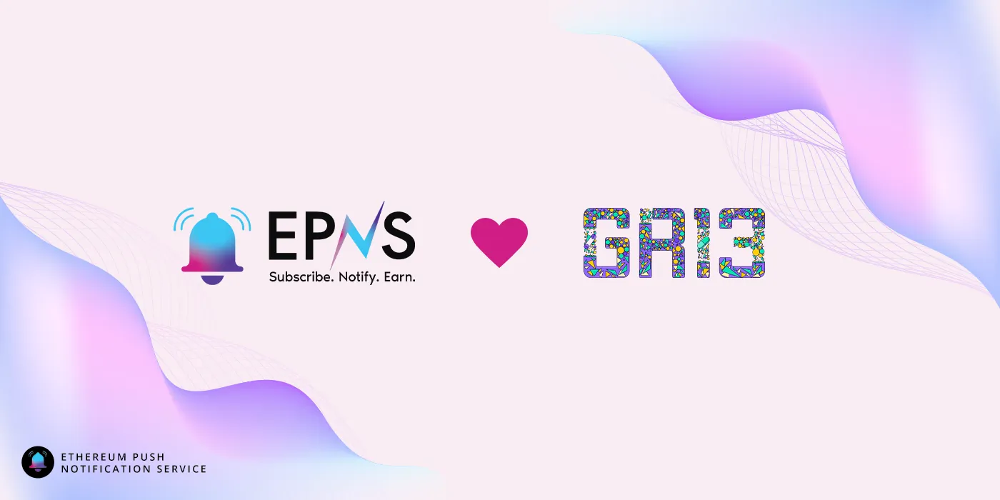

import { ImageText, VideoContainer } from '@site/src/css/SharedStyling';

<!--truncate-->

Paying it forward, with our journey from grantee to grantor 💖 💖 💖

With the latest Gitcoin Grants Round in full swing to support and facilitate the growth of digital public goods, [EPNS](http://www.epns.io) is excited to announce that we are sponsoring **$50,000** to Grants Round 13.

Gitcoin Grants is a community-funded quadratic funding grants program where people retroactively fund open-source public goods, which are then matched to a grant pool with the help of a quadratic formula. [**_Learn more about Gitcoin Grants Round 13 here._**](https://twitter.com/gitcoin/status/1499517512878223360)

_“It’s really powerful if you think about it, even a dollar donated by a community member can give a project 500 dollars or even more. So if you;re building your project right or your community right, you can receive so much value. And that’s the power of quadratic funding. ”_ [Harsh Rajat in Rockstars of Ethereum with Kevin Owocki](https://youtu.be/nClMGshU1nU?t=737)

<VideoContainer>
<iframe width="100%" style={{borderRadius: '32px'}} height="100%" src="https://www.youtube.com/embed/nClMGshU1nU" title="Kevin Owocki of Ethereum - Season 1 Ep 01" frameborder="0" allow="accelerometer; autoplay; clipboard-write; encrypted-media; gyroscope; picture-in-picture; web-share" allowfullscreen></iframe>
</VideoContainer>

Harsh Rajat w/ Kevin Owocki on how powerful the Gitcoin Grants is!

Gitcoin has always been close to EPNS, since our time in Grants Round 7, where we were the grantees and emerged as one of the **top 5** projects with **210 contributors!** The contribution and enthusiasm and support from the community, led us to successfully raise our seed round and formed partnerships with not only Gitcoin but many major Web3 protocols. Shortly after, we announced our [**partnership with Gitcoin**](https://twitter.com/epnsproject/status/1388131533735661573?s=20).

The partnership builds on the EPNS platform to allow notifications for the grant process, better connecting grantees to grantors.

This journey with Gitcoin led us to believe that we need to give back to the community that gave us so much, thus we really believed that paying it forward would be the best approach to give back to the community and decided to become the grantors of Gitcoin Grants Round **11 and 12**, where we sponsored **$50K** each round.

**The latest Gitcoin Grants Round (Grants Round 13) kicked off on March 9th and will run through till March 24th**, and we are thrilled to be sponsoring yet another round, staying true to our grantees to grantors journey with Gitcoin.

**How to apply for Gitcoin Grants?**

If you’re building an open-source project, you could consider creating a grant to get funded by the community

(P.S we would love to see you build something on EPNS 😉 ).

Grants are only eligible to receive contributions after approval from the Gitcoin team. In order to create a new grant and get it listed for the current Grants Round,

- Head to Gitcoin.co and [**create a Grant**](https://gitcoin.co/grants/new).
- Add relevant tags and information to create the Grant (Note: Ensure you have clear project title and description.
- Once your grant is approved it will be eligible to be part of the current and subsequent Gitcoin Grants Rounds.

Let’s _push_ towards driving the ambitions and goals of fellow builders in the space, and support those who are building public goods for the betterment of the internet. We believe the community that backed us during our original grant back in Round 7, helped us grow to become who we are today, and we are glad to help and push other projects to grow the same.

Let us build the future of web3 together, by paying it forward in an open and transparent way.

—

Have you contributed to your favourite projects on Gitcoin Grants? If not, what are you waiting for? Head on over to [**Gitcoin Grants**](https://gitcoin.co/grants/) and fund a grant today! 🌱🌱🌱

\_\_
