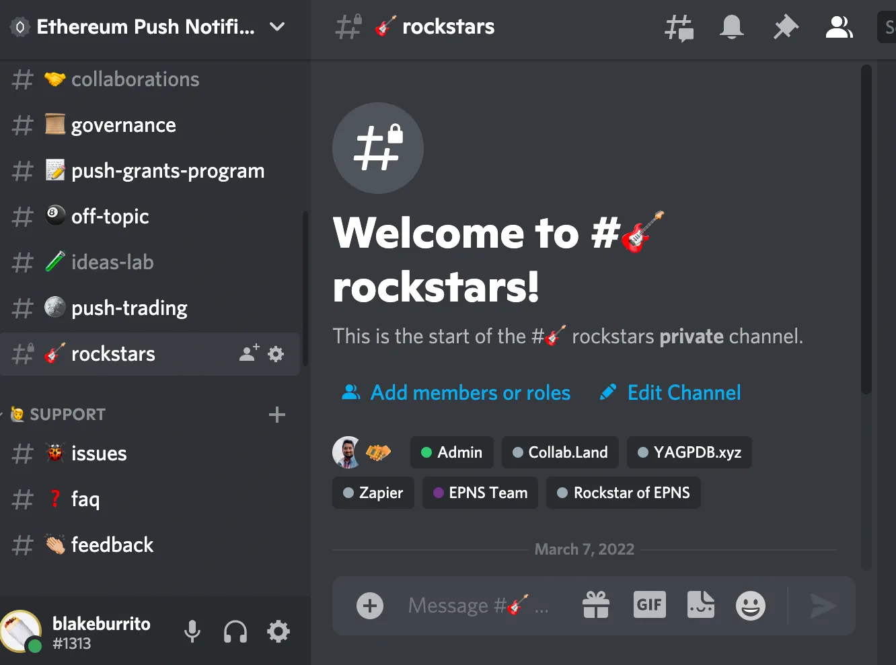

import { ImageText } from '@site/src/css/SharedStyling';

<!--truncate-->

The _Rockstars of EPNS_ program has been live for close to a year now so as we close out this first 52-week run we wanted to offer yet another perk to these valued community members who have put forth the effort to become the titular Rockstars of this community.

Program Background
==================

Rockstars of EPNS was one of our first community-focused rewards program that predated Push Governance and gave users a chance to become more closely involved in the project’s advancement. By focusing their unique talents however they saw fit, users could tag their submissions on Twitter with **#RockstarsofEPNS** for a chance to win the weekly prize and title.

Every week for the past year the Push Governance team (led by Miss Walter) chose 4 submissions weekly and then gave $PUSH holders the chance to vote on the nominees through our Snapshot voting page. The weekly prize for best submission was then entitled to 2400 $PUSH and an EPNS-inspired NFT created by our local Indian community.

To date, we have paid out ~120,000 $PUSH along with 50 unique NFTs to our Rockstar winners! More program info can be found here: [https://medium.com/ethereum-push-notification-service/kicking-off-the-epns-nft-community-drops-6a5c49808cf](https://medium.com/ethereum-push-notification-service/kicking-off-the-epns-nft-community-drops-6a5c49808cf)

Discord Token Gated Channel
===========================

To further show our appreciation to these valued community members, today we’re happy to announce a special Rockstars only Discord channel for these users. By joining our Discord and connecting their wallets using the Collabland bot in our server, users holding one of these Rockstar NFTs will gain access to the exclusive #rockstars channel.

In the #🎸rockstars channel users will be the first to learn about new initiatives and updates to the EPNS protocol — making our Rockstars privy to #alpha leaks before anyone else!

How to Join
===========

Requirement: Must hold Rockstars of EPNS NFT (contract here: [https://etherscan.io/token/0x3f8c2152b79276b78315caf66ccf951780580a8a](https://etherscan.io/token/0x3f8c2152b79276b78315caf66ccf951780580a8a))

Head to #collabland-join in the Discord server, clicks Let’s go! and follow instructions to connect your wallet address.

Once that’s complete you will get a notification showing your new role permissions and the channel will be unlocked for you.