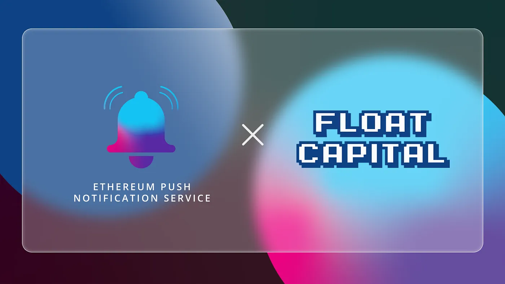

import { ImageText } from '@site/src/css/SharedStyling';

<!--truncate-->

Float Capital, DeFi’s nascent peer-to-peer, magic internet assets protocol strikes a strategic collaboration with EPNS to bring decentralized push notifications to its users. Going forward, users of Float Capital will receive updates about new market opportunities and exposure changes, directly from the protocol.

Opening the Market for Wide Range Exposure
==========================================

Float Capital is DeFi’s yield enhanced peer-to-peer magic internet asset protocol aims to make minting assets as easy as swapping tokens. It provides investors with the easiest, most efficient way of gaining exposure to a wide variety of assets and asset classes. The best part is that Float Capital does away with over-collateralization of assets and in turn avoids liquidation.

Investors on this protocol can use DAI to mint tokens for assets like cryptocurrencies, commodities, and equities, and create a position with ease. They can hold and gain exposure to a wide variety of assets while still avoiding the risk of actually holding them.

In this regard, it is pivotal for the platform to have a communication medium through which it can keep users updated about various opportunities in the market and this is where EPNS comes into play.

What Does the Collaboration Entail
==================================

Through our collaboration with Float Capital, we aim to build an official channel of communication between the users and the platform. Users will soon be able to subscribe to this channel and in doing so, they can expect to receive notifications whenever

*   There are changes in the market i.e., price changes and exposure changes
*   New markets, new features, and new updates are added to the protocol
*   There are gains or losses in investor positions

These notifications will enhance the user experience on the Float Capital platform and allow users to make the right investment decisions. We at EPNS are pleased to be on board with Float Capital and hope to be an integral part of their operations.

**About Float Capital**
=======================

Float Capital is a peer-to-peer, yield-enhanced, floating asset exposure mechanism.

Put simply, Float is the easiest and safest way for users to buy magic internet assets. Users do not need to worry about over-collateralization, or suddenly getting liquidated. The vision of Float is to provide decentralized and trustless exposure to various asset classes.

Stay in touch!| [Website](https://float.capital/?chain=137) | [Blog](https://medium.com/@Float.Capital) | [Twitter](https://twitter.com/float_capital) | [Whitepaper](https://media-float-capital.fra1.cdn.digitaloceanspaces.com/public/FLOAT_CAPITAL_whitepaper.pdf)

