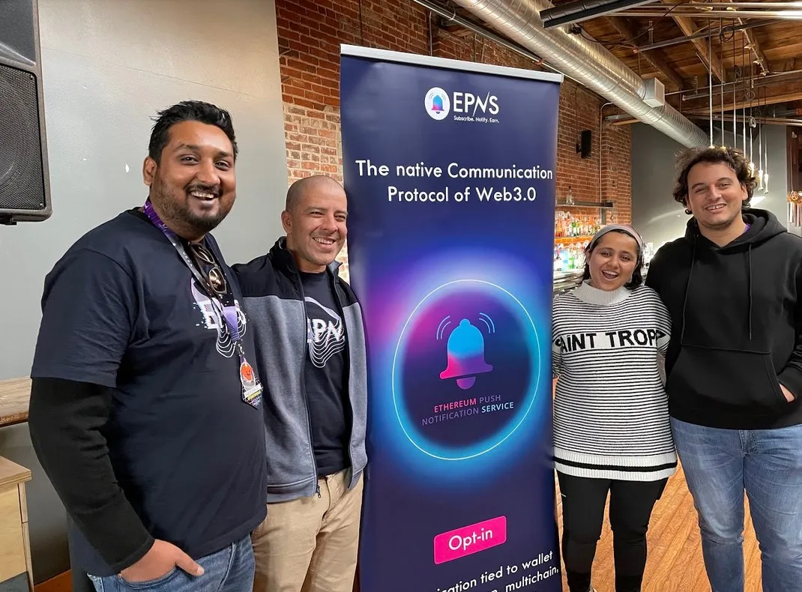
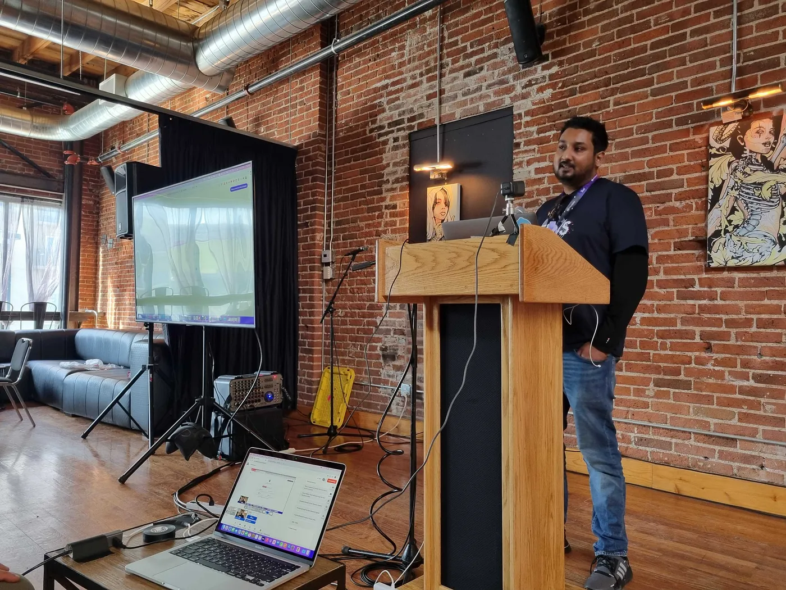
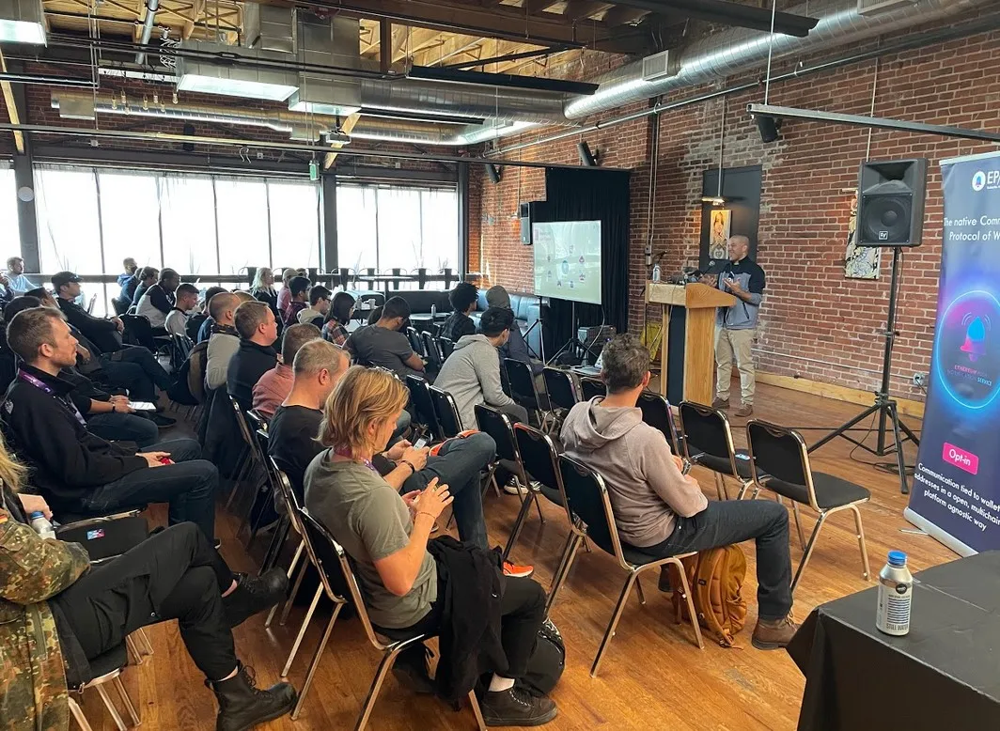
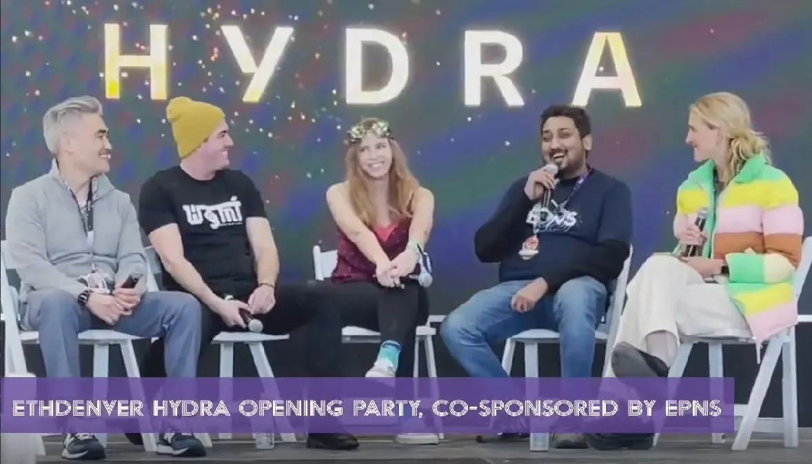
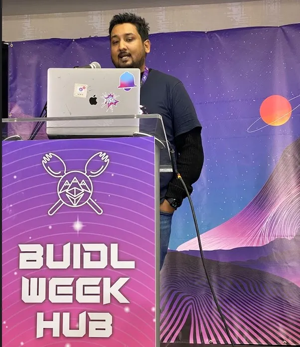
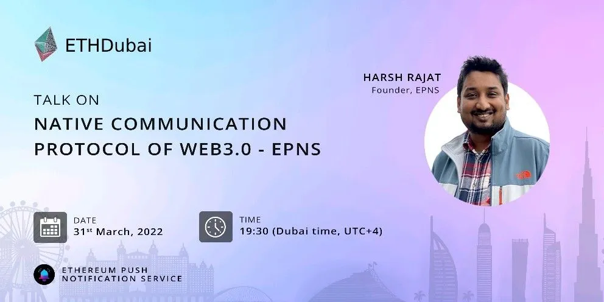

import { ImageText } from '@site/src/css/SharedStyling';

<!--truncate-->

A rewind to #ETHDenver2022!

So many folks packed their bags, wished their ‘frens’ ‘gm’ and came to meet EPNS at the annual gathering of Ethereum degens — ETHDenver!

This was one the most amazing and exciting events as we brought you Web3 Communication LIVE at ETHDenver 2022 — #PoweredbyEPNS

<iframe width="100%" height="382" style={{borderRadius: '32px'}} src="https://www.youtube.com/embed/Firk3_d46q8" title="EPNS at ETHDenver 2022" frameborder="0" allow="accelerometer; autoplay; clipboard-write; encrypted-media; gyroscope; picture-in-picture; web-share" allowfullscreen></iframe>

While the EPNS team met so many amazing folks, participated in and brought ya’ll a whole bunch of exciting events, judged BUIDL Week Workshop, and even hosted side events!

Not to mention meeting some of the best minds of the Ethereum ecosystem along with learning more about building on Web3’s only decentralized communication protocol!

The hype was real! And here’s some highlights from this **A-Awesome** event!

**Valentine’s Date!**

What better way to celebrate a match made in heaven between the web3 and the communication layer! ❤️❤️

<ImageText>Getting ready for our workshop!</ImageText>

<ImageText>Our Founder Harsh Rajat, talking about the Native Communication Protocol of Web3.0</ImageText>

<ImageText>Our BizDev & Ops Lead — Jafett Sandi giving a walk through of EPNS for users & developers!</ImageText>

On this day with our workshop **“It’s a Date: Web3 ❤️ Communication** we really rolled our sleeves and helped folks learn on how they could get started with EPNS as a developer or user, helping build channels, send notifications and explore ways of integration!

And especially for those who love to develop, we believe this workshop helped them to get started with building on EPNS’ decentralised communication protocol to bring notifications to their users. Essentially, bringing the best web3 user experience they could possibly give with their dApps.

Not to mention with all this awesomeness they won some extra awesome EPNS Merch!

<ImageText>EPNS Merch that was up for grabs!</ImageText>

**HYDRA**

<ImageText>Harsh on the kick off panel for the opening event HYDRA!</ImageText>

On **Feb 17th**, EPNS kicked off as sponsors of the ETH Denver’s Official opening event, HYDRA, at the Wings Over Rockies Air and Aviation Museum. A sight of historic military jets, engaging with the brightest minds in Web3, with insightful panels from some of the best thought leaders in the space, and then of course followed by a night of world-class live performance and art installations. This was a rollicking day and evening…

**BUIDL Week Hub**

<ImageText>Harsh judging the BUIDLathon</ImageText>

Our founder, Harsh Rajat was a judge at ETHDenver 2022 **BUIDLathons**! ETHDenver 2022 had one of the largest Buidlathons in the world, with over $1 million in bounties and prizes over $2 million in available investments. All in all, this was one of our exciting events we attended, met so many awesome people in the Ethereum ecosystem, and built new Frens too!

Can’t believe it’s been such an amazing event and it’s already been a month since it got over!

<ImageText>ETHDubai Developer Conference</ImageText>

While #ETHDenver2022 was an awesome event, and this made for a nice throwback, guess what we’re all excited for? The [@ETHDubaiConf](https://twitter.com/ETHDubaiConf), developer conference on March 30–31st, where our founder Harsh Rajat, will do a talk on Native Communication Protocol of Web3, yes you guessed it right, EPNS! :-D

Come say hello to the EPNS team if you’re there….
