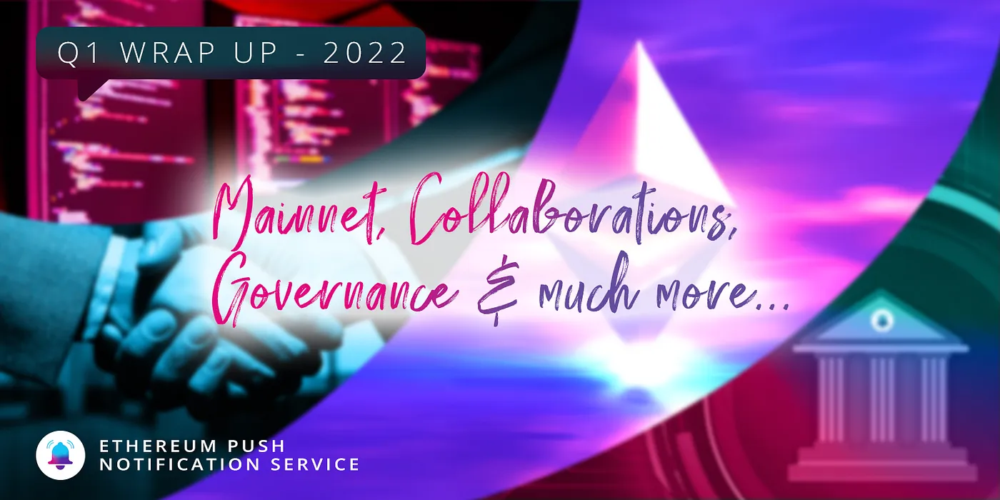
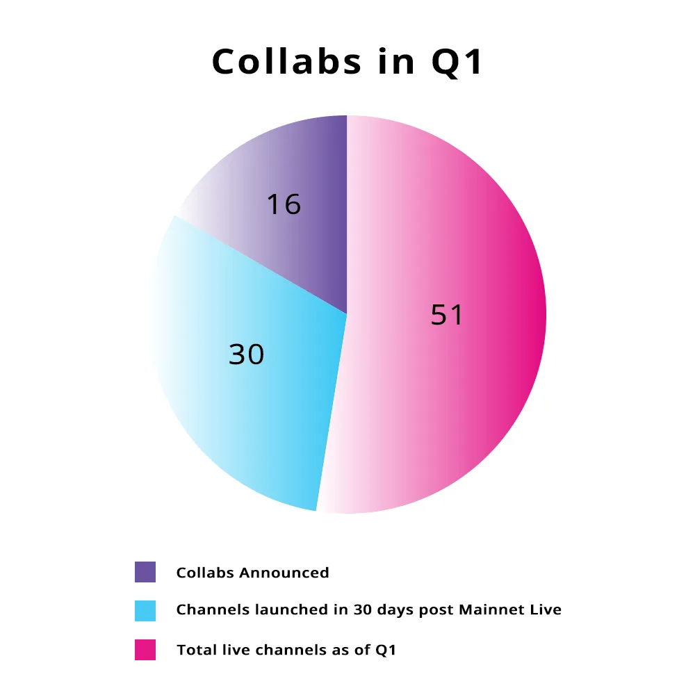
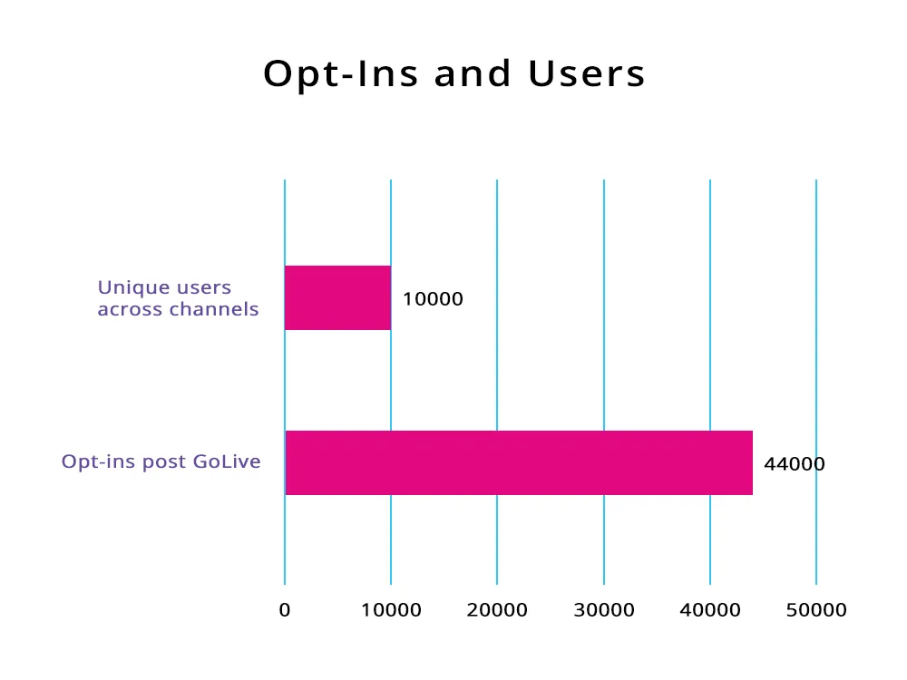
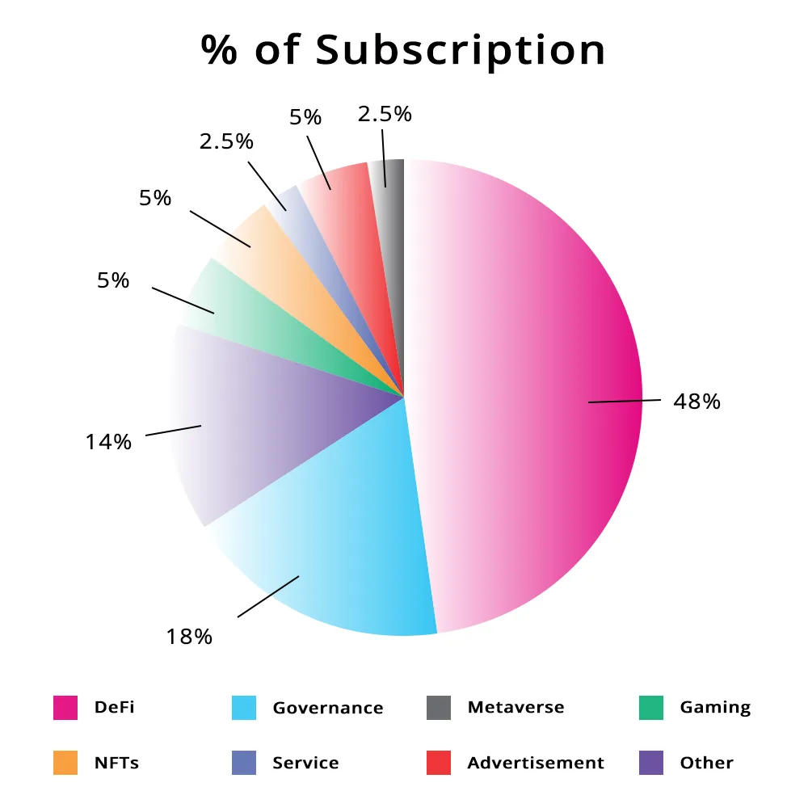
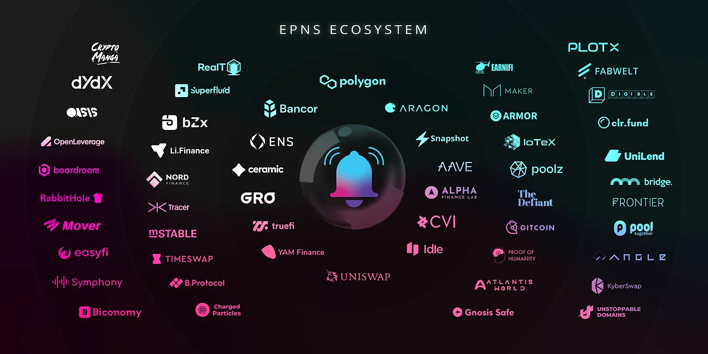

import { ImageText } from '@site/src/css/SharedStyling';

<!--truncate-->

Q1’s already done and boy has it been an amazing 3 months! We showcase what the EPNS team achieved in Q1.

It’s been a whirlwind of a kickstart to the New Year, and here’s where we showcase what we managed to achieve in Q1 2022!

Can’t believe time flies so fast. Q1 has already ended, and what we’ve been through has to be a surreal beginning to the most exciting journey we’ve had so far!

Tl;DR

These sleek infographics should give an idea of all the major updates in Q1!

<ImageText>Number of amazing collabs that happened in Q1</ImageText>

<ImageText>Total Unique Users across channels and Opt-Ins Post GoLive</ImageText>

<ImageText>Bifurcation of Subscriptions as per category!</ImageText>

### Key Achievements in Q1 for EPNS

- But of course, our Mainnet Go-Live happened on Jan 11th 2022
- 16 New collabs announced so far in this year
- 30 Channels in 30 days campaign after our Mainnet Live
- 51 Total Live Channels out of them 10 channels due to organic growth.
- 44000 Opt-Ins post go-live
- 10000+ Unique users across channels
- 4 Million Notifications sent till date

Do read further to know a summary of all that happened this exciting quarter!

### Mainnet Launch

<ImageText>The most significant milestone on Jan 11th 2022 — Mainnet Live</ImageText>

I mean the obvious major milestone for EPNS has been the super amazing Mainnet launch! Quite a big day for all of us!

January 11, at 4 PM UTC will be etched in the echelons of EPNS history and of course, wouldn’t have been possible without the awesome support of our amazing team and all of you guys, who’re part of the EPNS Fam 💖

This is the day our protocol V1 went LIVE and when we finally deployed our contracts to the Ethereum Mainnet including a gasless experience for users, and the fact that we went ready from the get go to multi-chain

And just in the first month post our mainnet launch, our team launched an exciting

30 Channels in 30 Days campaign successfully with some real good collaborations across dapps, businesses, users, who’d want to use EPNS to reach out to their users/subscribers.

As the months went by, as of date we have around <b>51 total live channels</b> and over 44,000 Opt Ins and over <b>10,000+ unique users</b> across channels and close to 4 million notifications sent across till date!

While these numbers are fantastic, we believe all this was possible because of some major updates that took place in this quarter, and the amazing folks from the EPNS team putting their heads down and grinding it out to make this possible.

Let’s take a look at all the key updates that made this growth happen.

### Development

- dApp, Browser Extension, & Mobile App successfully migrated to Ethereum Mainnet
- We Introduced gasless notifications ⚙️ to send notifs without any gas fees.
- We implemented subset notifications and launched it soon after, enabling a whole new set of combinations for notifications.
- Offchain opt-in feature implemented in frontend SDK! Allowing for an easier onboarding of users to a better user experience without leaving their favourite dApps..
- Enabled multiple testing environments for Developers!
- Channel verification 🏅 and sorting live in prod!
- Channel specific unique URL implemented in dApp
- Started working on Spam-box UI and support for ENS for the browser extension ⚙️
- User journey tutorial for dApp 🧑‍🦱 is something we started working on
- Started with the DID 💳 implementation for multi-chain support
- Monitoring dashboard for Push nodes created (Internal tooling)
- Standalone IPFS architecture for Push nodes development started ⚙️
- Notification Search and Filter feature 🔎 as we write this is in its final stages and will be launched on Staging environment soon.
- New Dapp UI 🎨 is live on staging with cool features like Dark Mode

### Governance

In a Web3 ecosystem, Healthy governance is one where the community is actively engaged and contributing to the protocol. Whether it’s by suggestions, being active on social channels, amplifying messaging and also making governance proposals. And that’s where for EPNS, the community has always been at the forefront of the protocol.

With the launch of governance, we launched an important step towards complete decentralisation and also with a mechanism to incentivize proposers who have their proposal approved on Snapshot!

Here are some key updates of what we did w.r.t Governance!

- [PUSH Grants Proposal](https://medium.com/ethereum-push-notification-service/push-grants-program-going-live-6841515f95d8) was made live and up for voting
- Our new [incentives proposal](https://gov.epns.io/t/epnsip-02-incentives-for-approved-proposals/421) was also made live and up for voting.
- We launched a new [governance proposal](https://twitter.com/epnsproject/status/1483137794843492352?s=20) with new Rockstar nominations which allowed delegates to vote for their rockstars every week!
- The first grants proposal [PGP-01](https://snapshot.org/#/epns.eth/proposal/0x33656a13311f0156a94f2ea1c44fcf7da3a99950259aad6a30d3c879285ecef3) from Thumbs Up Finance was up for voting on [Snapshot](https://snapshot.org/#/epns.eth/proposal/0x33656a13311f0156a94f2ea1c44fcf7da3a99950259aad6a30d3c879285ecef3)
- We launched [GASLESS MARCH](https://twitter.com/epnsproject/status/1499384173269700609?s=20&t=RWuIM5Dv0UW0k4oDctM8xg)— A month-long gas-free $PUSH vote delegation together with a [Reward Drop Proposal for the Push](https://twitter.com/epnsproject/status/1499384175589138432?s=20&t=RWuIM5Dv0UW0k4oDctM8xg)
- Our Official [Push Governance Channel is now live!](https://twitter.com/epnsproject/status/1504095305578737671?s=20&t=L2PtqMOa-FnVFIe1Ced0zg) Do check that out and opt-in to get governance updates 🎊 Enabled [Token-Gated](https://twitter.com/epnsproject/status/1504157215770693632?s=20&t=L2PtqMOa-FnVFIe1Ced0zg) channel for our Rockstar community.

### Collaborations

<ImageText>Our amazing collaborations</ImageText>

A project like EPNS, always grows and expands with some really amazing partners and collaborations. These are the efforts our team put together to bring about one of the best in the business to come on board and help bring push notifs to the Web3 world!

- Jan Week 2 — We collaborated with [Huobi Global](https://twitter.com/epnsproject/status/1480774034576920576?s=20) 🎊 and [Atlantis World](https://twitter.com/epnsproject/status/1481989517318193156?s=20) to bring push notifications
- Jan Week 3 — Official channels of 🔔 [dYdX](https://twitter.com/epnsproject/status/1483123194332839937?s=20) 🔔 [Ooki](https://twitter.com/epnsproject/status/1483484719367192576?s=20) 🔔 [ArmorFi](https://twitter.com/epnsproject/status/1483846724397375489?s=20) 🔔 [PodsFinance](https://twitter.com/epnsproject/status/1484213961696636929?s=20) 🔔 [Symphony(https://twitter.com/epnsproject/status/1484575978278256645?s=20)] are LIVE! 💫 📲
- Jan Week 4 — 😎 Excited to announce the collaborations with [Angle](https://twitter.com/epnsproject/status/1485613871276511234?s=20&t=nFDC9CXOStcai9Ph2CyEzg)
- Feb Week 1 — This was a huge week, we announced collabs with a bunch of Frens! Gro Protocol, Trace Network Labs, mStable to facilitate push notifications for its users 📲 Also opt-in from the Official Channels of Coindesk, MakerDAO, Mover 🔔✨ And of course, opt-in to Rekt Channel to stay up to date with the most recent hacks in the DeFi space. Last but not least, our very own ETH Tracker and BTC Tracker for ETH/BTC price variation notifications were launched.
- Feb Week 2 — Opt-in from the Official Channels of [Bancor](https://twitter.com/epnsproject/status/1490740208870256640?s=20&t=AVtZvne7VMw_3VQw_so64g), [Angle Protocol](https://twitter.com/epnsproject/status/1491458439377453059?s=20&t=AVtZvne7VMw_3VQw_so64g) were announced.
- Feb Week 3 — Our pilot collaborations with [Poolz Finance](https://twitter.com/epnsproject/status/1493276219009552384?s=20&t=UetkR1Yx0wEx9qGhlEf9Fg), [Crypto Manga](https://twitter.com/epnsproject/status/1493637670647463936?s=20&t=09iWUvMz8T0giWvvLd8G1Q), [Li.Finance](https://twitter.com/epnsproject/status/1493948442023923715?s=20&t=09iWUvMz8T0giWvvLd8G1Q) 😎 📲 and also opt-in from the Official Channels of [mStable](https://twitter.com/epnsproject/status/1493993763735470081?s=20&t=09iWUvMz8T0giWvvLd8G1Q) 🔔✨ were announced.
- Feb Week 4 — We announced our pilot collaboration with [Nord Finance](https://twitter.com/epnsproject/status/1495769580316536832?s=20&t=u7uH6L53QY8jfohoQHD6PQ)
- March Week 1 — Excited to announce our collaboration with [The Defiant](https://twitter.com/epnsproject/status/1498715887591129089?s=20&t=RWuIM5Dv0UW0k4oDctM8xg) 😎 📲 And yes, the opt-in from the Official Channel of [Aragon](https://twitter.com/epnsproject/status/1499067107715465217?s=20&t=RWuIM5Dv0UW0k4oDctM8xg) went live!
  Excited to announce our collaboration with [RealT](https://twitter.com/epnsproject/status/1501558467940982784?s=20&t=VojivKsQX6P2AvGpQp4ilg)😎 📲 And yes do check out the opt-in from the Official Channels of [Proof of Humanity](https://twitter.com/epnsproject/status/1501611224517480451?s=20&t=VojivKsQX6P2AvGpQp4ilg)
- March Week 2 — This week was the one where we announced our collaborations with [Earnifi](https://twitter.com/epnsproject/status/1503393070066274307?s=20&t=L2PtqMOa-FnVFIe1Ced0zg), [Digible](https://twitter.com/Digibleio/status/1501924317239681024?s=20&t=L2PtqMOa-FnVFIe1Ced0zg)
- March Week 3 — This was the week of our collaborations with [Flipside Crypto](https://twitter.com/epnsproject/status/1505952867219230724?s=20&t=xN0D5gOeEHelQOYQedpSqQ), [Float Capital](https://twitter.com/epnsproject/status/1504869888250490880?s=20&t=xN0D5gOeEHelQOYQedpSqQ), [Notional Finance](https://twitter.com/epnsproject/status/1506632049477955584?s=20&t=xN0D5gOeEHelQOYQedpSqQto) enable Push Notifications 😎 📲 We’ve also got around 10 channels due to organic growth. And yes we’re also observing with other protocols like MeetWithWallet making their own implementations using our back end SDK.

And guess what guys, this is just the beginning of our journey and we really felt that there’s a lot more we could do to push your very own’ Web3’s first communication layer to do a lot more for the users in the multichain world!

What’s more, we have great plans to expand a lot of our developer outreach, helping a lot more folks to participate more actively within the development ecosystem.

Hope y’all are super excited as we are for the upcoming quarter! Do stay tuned for more updates.

Let’s keep PUSHing! 💪🏼

The EPNS team

Remember: The EPNS Team members will never DM you first, we never ask you to send money, crypto, private key, or any such thing. Stay safe out there, frens!
