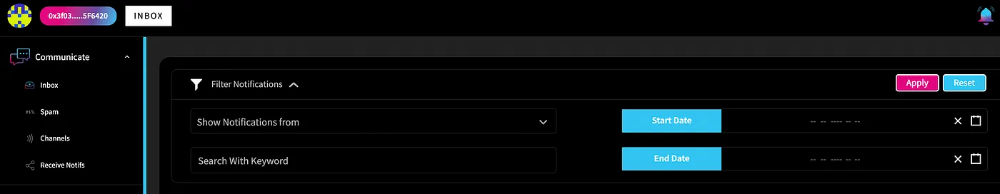
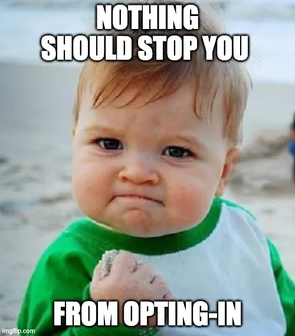
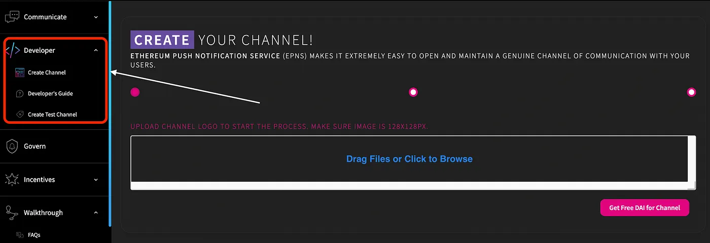

import { ImageText } from '@site/src/css/SharedStyling';

<!--truncate-->

Q1 has ended and we’ve made significant progress in our roadmap items during this first quarter of 2022!

We planned quite a few essential tasks for the QA of 2022, but, the most interesting and crucial one was the redesign of our dApp UI.

And viola!

We are really excited to announce the release of our **brand new User Interface.**

Channel Dashboard in the new user interface

After a few internal discussions and taking in some valuable community feedback, our dev team has worked real hard on redesigning the dApp interface to enhance the user experience and provide some really effective features at the same time.

Let’s dive-in, in and get a brief idea of what’s new in the dApp and explore some of its cool features.

## TLDR;

Some of the important new features in the dApp are as follows:

**a. Merge of Incentive dApps**

**b. Merge of Governance Section**

**c. Notifications Search and Filter**

**d. The Developers Section**

**d. Dynamic User journey**

**e. Olvy Integrations for announcements & releases**

**f. A specific section for the SPAM Box**

**g. The In-Demand & Beautiful DARK Mode theme 🌗**

**h. Beautified and Enhanced UX design**

While these are the features that are currently available on the main EPNS dApp, there are a couple of more really interesting ones that are in the works and will be launched eventually.

## The Merge of Governance & Incentives dApp

With our new UI, the navigation experience through our multiple other dApp is now a lot more effective.

Also, the EPNS dApp now includes the Governance section and allows a user to seamlessly navigate and _explore the EPNS governance world, check their voting power or initiate the voting delegation process to other community members, etc._

Similarly, users can now interact with the incentives dApp as well, right from the main EPNS dApp without the need to switch between multiple tabs on your browser.

## Notification Search & Filter

Notifications are important, undoubtedly. However, given the fact that the _Web3 world never sleeps 😀,_ there could be a scenario where your inbox is loaded with different notifications.

Therefore, in order to provide additional power to the users and make their lives much easier, the new user interface also comes with a notification search and filter option.

<ImageText>Notification Search and Filter</ImageText>

This feature enables the user to search for very specific notifications they would like to see.

Additionally, the UI provides the users with different kinds of filters that they can easily apply to their notifications.

- **_Notifications based on Channels:_** This allows the users to search for notifications that were sent out by a particular channel.
- **_Search by keyword:_** With this filter in place, users can directly search for any notifications based on keywords within a specific notification.
- **_Start Date_:** Notifications can be filtered out from any given start date.
- **_End Date_:** Notifications can be filtered out from any given end date

## Inbox VS Spam Box

Unlike the previous user interface, the new one has specific sections for your **inbox** and **spambox** respectively.

Most of you might already know, that the notifications from channels that a user is not subscribed to shall land in the Spam Box. This spam box shall now be a different page where all notifications from unsubscribed channels could be seen.

However, the spam box shall also include an opt-in button for every notification which technically allows the user to opt-in to a channel, even from a spam box, if they find the notifications useful or interesting.

## Developer Section

While the creation of a channel is an important step for you to set up your service and start sending notifications, it's not a mandatory step. A user who is simply interested in receiving notifications of the web3 world is only required to opt-in to his/her favorite channel and that’s it.

Therefore, in order to avoid confusion on this specific part, the new interface shall include a separate section for services and developers to set up their channels.

Moreover, the developer section, as of now, shall include 3 important parts:

- **_Main Channel Creation page_**: This shall be the main channel creation page where the users will have to deposit the required amount and pay for the gas(_the real ether 😀_). Channel creation on this page shall ensure that your channel is now created in the production environment and is live on the EPNS Core smart contract.
- **_Test Channel Creation page_**: However, in order to get a clear understanding of how the channel creation process works, the developer section of the dApp shall also include a test channel page. This shall not be connected to Ethereum mainnet but with the Kovan testnet and hence no real fees shall be involved in the process. Hence, this can be used as a test playground to understand the different steps involved in channel creation. Once the developer is confident enough, they can go ahead and create a real channel on the main page.
- **_Developer Docs_**: Documentation can be of great help to get a better understanding of any piece of software. Hence, the developer section, being comparatively more technical than all other sections of the dApp shall also include the developer documentation link.

<ImageText>Developer Section in dApp</ImageText>

## Dynamic User Journey

Navigating through a decentralized application can be tough, and we certainly understand that.

Keeping this in mind, we have included an extensive and dynamic user journey in our new dApp. Starting from basic introductions to receiving notifications on your device, this walk-through feature shall guide you through all of it.

Although our user interface is minimalist and incredibly simple to navigate, the user can choose to go through this dynamic user journey as much as they to get a better understanding of what each component of the dApp does.

This is also built, considering the fact, that not every user is a web3 expert and we wholeheartedly want to enhance the user experience of new web3 users with our simple and intuitive dApp design.

## Olvy Integrations

As an additional feature, we also included the Olvy integrations with both of our dApp, i.e., [prod](https://app.epns.io/) and [staging](http://staging-app.epns.io/).

Every new release, announcement, and important development shall now be beautifully shared via olvy and directly appear on the dApp itself.

## The Dark Mode

Last but not the least, the **Dapp** now has the incredibly beautiful dark mode as well.

_I might be slightly more inclined towards the dark theme, but, who isn’t?_

# Wrapping it Up

All in all, I’d like to say, this has been a great start to the new year!

I mean given so many developments across the incentives and governance bit, being able to search and filter notifs better and of course the remarkable display and design updates!

I think it has given an impetus to how we’ve tried to better the overall experience and of course, we’re looking to soar higher and higher from hereon!

We’re excited about Q2! What about you?
