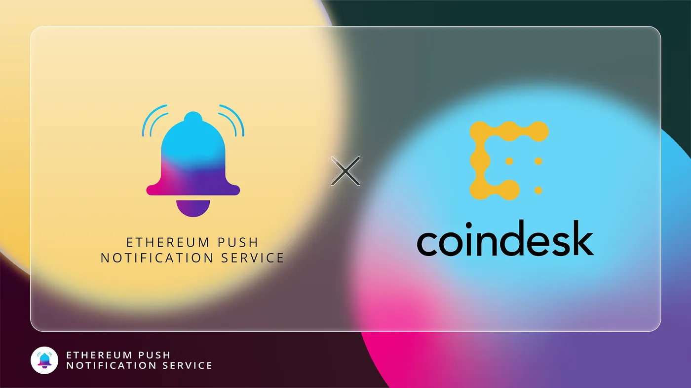

import { ImageText } from '@site/src/css/SharedStyling';

<!--truncate-->

Today, we’re excited to announce our collaboration with CoinDesk as our inaugural media partnership to launch on the EPNS protocol.

Founded in 2013, CoinDesk has played a major role in educating millions of people across the globe about digital assets and blockchain. This is why it gives us immense pleasure to announce our collaboration with CoinDesk to facilitate push notifications for its users.

How Does CoinDesk Benefit from EPNS
===================================

CoinDesk is the world’s leading media company for news and information about digital assets and the future of finance. The company focuses on building a trustworthy platform for users, investors, entrepreneurs, and traders of digital assets to stay updated with the happenings of this emerging industry. It is a gold mine of knowledge and information for anyone seeking to build futuristic financial products and cater to the growing needs of the population.

What the platform can use more of is a decentralized means of communicating with users and letting them know when new information is available. This is where EPNS push notifications come into play for CoinDesk.

What Does the Collaboration Entail
==================================

The collaboration between EPNS and CoinDesk has one aim and that is to create a reliable means of communication for the platform and users. CoinDesk will have an official notification channel that DeFi users can subscribe to. Every time a new article is published on the CoinDesk blog, users will get notified, a fool-proof way of keeping them updated about the industry. This allows them to expand their knowledge base and stay ahead of the market at all times.

As CoinDesk continues to revolutionize the crypto space by spreading knowledge and news, we’re pleased to be working with them and hope to become an integral part of the platform.

**About CoinDesk**
==================

CoinDesk is the most influential and trusted media platform for a global community engaged in the transformation of the financial system and the emerging crypto economy. It is an integrated platform for news, events, data & research for the next generation of investing and the future of money.

[Website](https://www.coindesk.com/)

