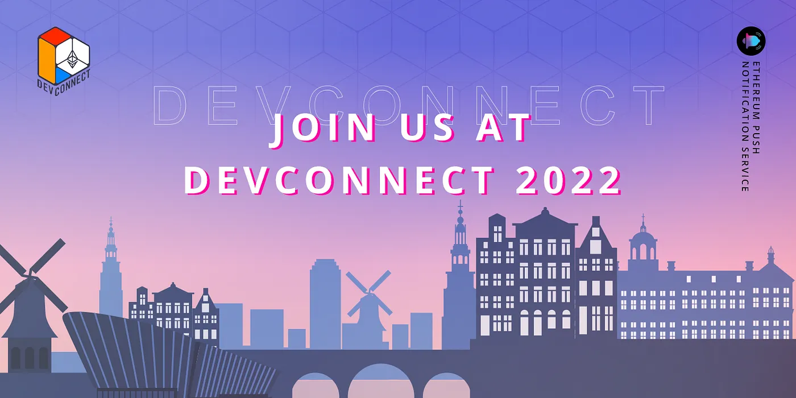
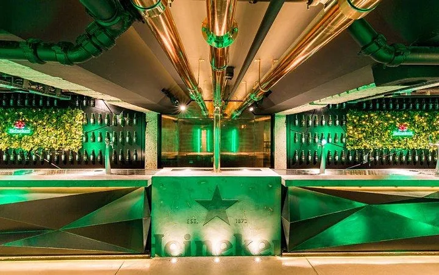
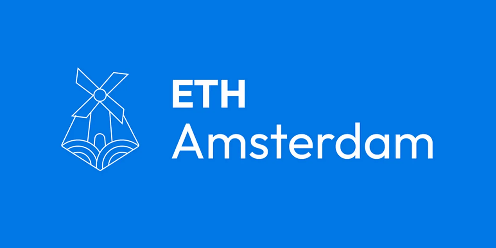
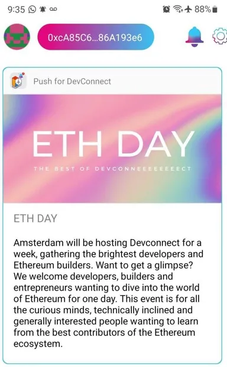

import { ImageText } from '@site/src/css/SharedStyling';

<!--truncate-->

Really excited to be here with you! We’re doing a few talks, a couple of events, & of course excited to work with all you amazing BUIDLers in one of the coolest cities in Europe!

Excited to be here in Amsterdam at #Devconnect!

April kicked off really well for all of us at **EPNS**!

It’s been an amazing last week as we announced our **Series A Funding of $10 million** to continue building out the communication infrastructure for the decentralised future.

As we do that, it’s time for us to pack our bags all over again for we can’t wait for a big splash that is about to happen at Devconnect 2022!

This week-long in-person gathering with a focus on some in-depth sessions, collaborations through our hackathon, and of course some really depth-first sessions we’re part of with our team doing a few workshops.

It is a great time for us to PUSH for #Web3Comm and also meet some of the most amazing and passionate BUIDLers, Partners and frens across the Web3 ecosystem and have a great time at the event as well!

Here’s what we’re up to at Devconnect. Excited to meet y’all

Oh and did we mention, there’s a ton of merch, and of course prizes up for grabs from the EPNS team for the hackathon!

<ImageText>Some of our cool merch for y’all!</ImageText>

**On 18th & 19th April:** [**The Daoist #GGG22**](https://www.thedaoist.co/event/ggg)

<ImageText>Jafett Sandi Talking on DAO Infrastructure Tools w/ EPNS</ImageText>

We’re really excited, and of course proud to be sponsoring the Global Governance Gathering: in their amazing event entirely dedicated to manifesting intentional coordination between DAOs.

As we Ride and DAO, at this event do drop by at the **Tobacco Theater on 19th April, 2:00 PM, Amsterdam time** where our BizDev and Operations Lead Jafett Sandi talks about the Foundational Tools of DAO Infrastructure, and how we could govern better resolve the many challenges DAOs have those can be solved to form resilient communities.

If you can’t make it there, you can watch the livestream on their [**YouTube**](https://www.youtube.com/thedaoist) & [**Twitch**](https://www.twitch.tv/thedaoist_) channels

**On 19th April: Never REKT @ Devconnect, Amsterdam Party**

<ImageText>Holler if you’re at this awesome Never REKT @ Devconnect Party!</ImageText>

While of course we’re all busy throughout the day with the workshops and the events, it’s always a great idea to let your hair down at the end of the day. If you’re going to be here then you’re in for a night of chill, party and drinks with the EPNS team and some of the OGs, our frens at Oasis.app, Balancer Labs,1inch, Arbitrum! Hosted at the famous **Heineken Experience** venue, **7.30 PM onwards**, this is the perfect place to enjoy the Dutch spring from the big balcony outside! And then there’s beers, snacks and some awesome DJs waiting for you!

**On 21st April:** [**Schelling Point**](https://schellingpoint.gitcoin.co/)

<ImageText>Harsh Rajat Speaking</ImageText>

One of our favourites, from the very beginning, Gitcoin has had a special place in our heart. From being grantees in Grants Round 7 to being grantors in subsequent years. We’re ever grateful to the support we’ve always gotten from the community and by being part of this schelling point, we intend to accelerate the narrative of Why Web3 communication matters

And is a super important piece of the crux of all things Blockchain and how it’ll evolve further!

You’ll get to tune in to that talk on the **21st April 1:50 PM** onwards at the **Grand Hotel Krasnapolsky!** Do join us there!

**From 22nd-24th April 2022 —** [**ETHAmsterdam**](https://amsterdam.ethglobal.com/)

<ImageText>Join us for our Hackathon at #ETHAmsterdam! #W3BUIDLingTogether</ImageText>

On the **23rd April, Saturday, 10:00 AM CEST,** you’ll get a chance to listen in on our rockstar **Fabio Costa’s** talk about **EPNS & How to build Web3 communication in your protocol** and of course be part of our hackathon from **22nd-24th April**

For this event, we’re super excited to work with some of the most talented Web3 individuals while you build the new frontier of Web3 and win some prizes upto **$4000** up for grabs as well!

To tell you the truth, it truly feels so good to be part of such a vibrant community of hackers and that too in one of the coolest cities in Europe! And this time you have a chance to experiment with the latest decentralised tech alongside developers, creatives from across the world!

**ETHDay — Best of Devconnect!**

One last thing! Now you can also get all the important updates and happenings @ **Devconnect**!

You can simply opt-in to ‘**Push For Devconnect’** channel on [**https://app.epns.io/**](https://app.epns.io/) via your wallet using our dApp / Mobile App on [**iPhone**](https://apps.apple.com/us/app/ethereum-push-service-epns/id1528614910) or [**Android**](https://play.google.com/store/apps/details?id=io.epns.epns&hl=en_IN&gl=US) device!

P.S If you’re a BUIDLer who wants to BUIDL the next phase of the internet then this is the perfect event for that!

Check out our [**docs**](https://docs.epns.io/) and tutorials to learn more about how to build with EPNS Make sure to **join our** [**Discord Community**](https://discord.gg/YVPB99F9W5) **too while you’re at it!** And yes, our team will be there to support you at the event too!

All the best at **ETHAmsterdam**, we look forward to seeing you there!
