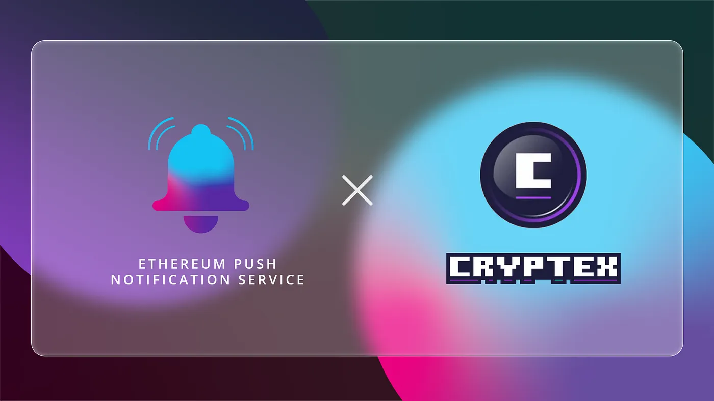

import { ImageText } from '@site/src/css/SharedStyling';

<!--truncate-->

EPNS and Cryptex Finance, the platform tokenizing the total crypto market cap, team up in a pilot collaboration to bring push notifications for users. As such, Cryptex Finance will now be able to seamlessly interact with its users and keep them updated about the governance process and other happenings on the platform.

# Tokenizing Total Crypto Market Cap

The total crypto market cap is one of the key metrics used to gauge the growth of the industry and is widely quoted by investors across the globe. In this regard, Cryptex Finance is a platform that aims to tokenize this key metric to allow investors to gain exposure to the price movements of the entire industry.

The platform introduces the world’s finance total market cap token TCAP which is a fully backed and fully collateralized asset that accurately represents the total crypto market cap at all times. Investors can mint TCAP by creating a vault and adding collateral. Then, the token can be used just like any other token for trading, providing liquidity, and earnings yield farming rewards.

The platform is secured and managed by the holders of the governance token CTX, who steer the direction and the future growth of the platform. As such, Cryptex Finance can vastly benefit from a decentralized communication mechanism that allows the platform to keep users updated about the governance process, along with the status of their vault collaterals. This is where EPNS plays a pivotal role.

# What Does the Collaboration Entail?

As a result of this pilot collaboration, Cryptex Finance will have an official channel housed on the EPNS platform that once it goes live will allow users of Cryptex to subscribe to this channel to receive notifications whenever the collateral ratios in their vaults fall low and whenever new governance proposals are created for voting. Users can also expect to receive the voting results as push notifications once they are declared. This saves them the hassle of manually checking for all these updates and improves the user experience on the platform along with the participation rates.

We’re excited to kickstart this integration with Cryptex Finance and hope to contribute to the growth of the platform.

# **About Cryptex Finance**

Cryptex Finance is an Ethereum-based protocol that lets traders, funds, and DeFi users get exposure to the total crypto market capitalization.

[Website](https://cryptex.finance/), [Blog](https://cryptex.finance/#news), [Twitter](https://twitter.com/cryptexfinance), [Telegram](https://t.me/cryptexfinance), [Discord](https://discord.com/invite/cryptex)
