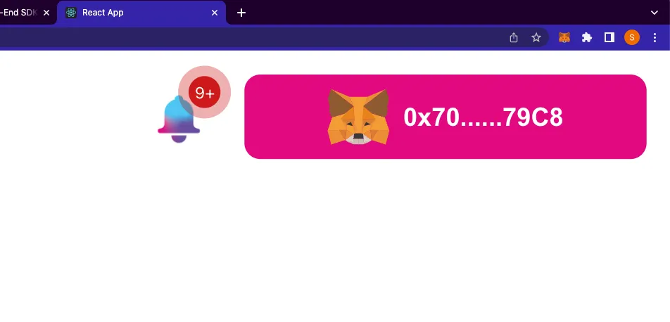

import { ImageText } from '@site/src/css/SharedStyling';

<!--truncate-->

EPNS (Ethereum Push Notification Service) is calling all developers to work with us to build on top of our protocol

**What’s Up ETHAmsterdam?**

Calling all Developers to BUIDL on EPNS Protocol!

Amsterdam! Wow! So great to be in one of the coolest cities of Europe and having to meet some of the most amazing, coolest and rockstar BUIDlers of Web3! We shared our entire plan at Devconnect in our blog [**here**](https://medium.com/ethereum-push-notification-service/devconnect-2022-epns-is-all-set-to-meet-you-e5dbd3d16e96)!

Though shortly afterward, a lot of folks reached out asking about what we would want to see built on top of EPNS protocol for the prize pool we are hosting at [**ETHAmsterdam**](https://amsterdam.ethglobal.com/) between **22nd-24th April 2022**

Well, the answer to this is whatever you… the cool dev wants to buidl is what we want! But here are some cool ideas to get your creative juice flowing! Of course, We have some cool prizes and swags for each one of you, scroll to the bottom in case you want to learn about that!

# Quick rundown of EPNS

**Ethereum Push Notification Service (EPNS)** is the world’s first decentralized communication & notification protocol for Web3. Using the protocol, any smart contract, dApp or backend can send on-chain or off-chain notifications tied to wallet addresses of a user in a multichain, open, platform agnostic way. Being an open communication middleware, notifs can be integrated and shown on any crypto wallet, mobile apps, extension or dApps.

# Ideas to Buidl. Solve. Conquer.

As the blockchain ecosystem has evolved into a composable, multi-chain network, native Web3 communication is growing more and more necessary for user experience, developer operations, investor security, protocol architecture, and a lot more.

Today’s methods of communication between and among Web3 users and companies — dominated by Twitter, Discord, and Telegram — give rise to poor UX, scams, and sub optimal communication. Among some of the most pressing issues: smart contract version releases are missed, liquidation thresholds are not warned, NFT drops are forgotten, and vulnerabilities aren’t communicated well.

The result is a fractured and siloed approach towards communication in the blockchain ecosystem, making room for an optimised, Web3-native solution. EPNS is created to fix this! This is how:

**Integrate EPNS to your dApp and improve UX for all Web3 users**

- This is probably the easiest, As EPNS is a communication layer, the best and quickest way to get this going is to integrate EPNS in your dApp via our frontend **sdk & tutorial** here
- This will not only improve the user experience for your dApp as users can now instantly see all their notifications across all their activities that they have opted in for but it also vastly improves the entire UX of the Web3 space.

**_Screen1_**_\- User is connected to their wallet and has loaded their dApp._

**_Screen2_** _— User sees the EPNS notifications if they are subscribed to any channels in a sidebar which comes on the click on the bell icon._

**Create your dApp / protocol channel and send notifs**

- So, you already integrated EPNS but like to also improve the experience for your users. Well, this is where you can jump in and create your own channel (any service that sends notifications are called channels).
- After which you can easily start sending important notifications about your project directly to the wallet address in a gasless way.
- Whether you are creating DAO, DeFi, NFT, Metaverse or anything in between, having a direct form of communication tied to user’s wallet address massively improves the experience of your dApp (and goes extremely well with the bell icon you have integrated)

Check out our [**Showrunners and Tutorials**](https://docs.epns.io/developer-zone/developer-guides/working-with-showrunners) here for more details

**Create notifications channel for anything Web3**

- A lot of projects and protocols are popular but still don’t have notifications, you can build notifications for them, not only you get prizes for it but some amazing incentives are coming for the channels that are popular (though this is a different conversation). Some ideas that you can use if you want to build out a notif channel.

**Web3Comm for DeFi**

The DeFi ecosystem is a landscape of constant innovation. We have seen an unprecedented amount of on-chain activity, prompting acute needs from users to keep on top of what is happening. EPNS is poised to accelerate the adoption of the DeFi ecosystem to meet the needs of users and dapps to keep up with rapid innovation.

This of course is one while most important we’ve made quite a headway with a bunch of partners, however if you think you are able to renovate some of this, and build your own technology and have protocols that change the DeFi space for the better, we’d definitely invite you to explore this side of things. Some of the things that EPNS can enable for DeFI protocols and their users is to solve critical DeFi problems as below..

- Near Liquidation Alert (Borrowers & Liquidators)
- Staking Rewards Available to Claim (Stakers)
- Staking Rewards About to Expire (Stakers)
- Price Alerts (Traders)
- Stablecoin Peg Slippage (Arbitrageurs)
- Low Gas Cost (Devs, ETH Power Users)
- Rebalances (Token Set Users)
- Index Selection/Weighting Changes (Index Users)
- Token/Contract Migrations (Protocol Users)
- Governance Updates, Token Launches
- New Collateral Types on Money Markets
- New Liquidity Mining Incentives
- Yield Farming APY alerts
- Escrow Periods Ending / Tokens Coming Unlocked

Besides these there are a ton of other applications that’ll most Web3 users in terms of getting communication or help on notification for that are of important notifications across the board.

Hope these ideas are some that you find exciting to build, and if you do have any queries feel free to reach out to us on Twitter @epnsproject

# **Let’s talk prizes and our $1M grant!**

For those of you who don’t know, ETHAmsterdam, then you might already know we have an exciting [**Prize Pool**](https://showcase.ethglobal.com/ethamsterdam/prizes) that’s up for grabs!

**PRIZE OVERVIEW — For ETHAmsterdam Hackathon**

- **4x $500** for the best creation of channel/ Dapp/ use Frontend SDK in their Dapp.
- **2x $1,000** for the most creative use of Backend SDK / Smart Contract in your Dapp, web3, communication layer.

But that’s not just it! Over and above this we have an exciting

**Push Grants Program approved for $1 Million!**

This you’ll also be able to partake in and it’s running all the way up until the second quarter of this year! You’ll be able to find more details of this in our blog [**here**](https://medium.com/ethereum-push-notification-service/push-grants-program-going-live-6841515f95d8)**!**

# What are some important reference links?

- [https://docs.epns.io/](https://docs.epns.io/)
- [https://medium.com/ethereum-push-notification-service/how-to-get-started-with-epns-for-devs-8fd281e94705](https://medium.com/ethereum-push-notification-service/how-to-get-started-with-epns-for-devs-8fd281e94705)
- [https://medium.com/ethereum-push-notification-service/roadmap-q3-audited-epns-push-protocol-v1-is-here-f4560dfe550c](https://medium.com/ethereum-push-notification-service/roadmap-q3-audited-epns-push-protocol-v1-is-here-f4560dfe550c)
- [https://medium.com/ethereum-push-notification-service/push-nodes-p2p-web3s-way-to-communicate-6a473577d173](https://medium.com/ethereum-push-notification-service/push-nodes-p2p-web3s-way-to-communicate-6a473577d173)

# Who do we reach out to for assistance?

During the event our team is on-ground. You Can Tweet [**@PushChain**](http://x.com/PushChain) and we’ll get you in touch with the team. You could also tweet the team directly as below.

1.  [**Jafett Sandi**](http://twitter.com/jafetsc)
2.  [**Fabio Costa**](http://twitter.com/learn4life6)
3.  [**Harsh Rajat**](http://twitter.com/harshrajat)

<ImageText>From L-R — Jaf, Fabio, Harsh</ImageText>

**All the best! We’re happy and excited as #W3BUIDLingTogether!**

[**Website**](http://epns.io/) **|** [**dApp**](https://github.com/push-protocol/embed-demo-app) **(live tutorial)|** [**RoadMap 2022**](https://medium.com/ethereum-push-notification-service/epns-roadmap-2022-2698ab153c1a) **|** [**Twitter**](http://x.com/PushChain) **|** [**Telegram**](https://t.me/epnsproject) **|** [**Discord**](https://discord.com/invite/YVPB99F9W5)

# **About EPNS**

EPNS is building the world’s first open communication layer for the Web3 ecosystem, first for Ethereum and then for L2s and other blockchains. The protocol enables any smart contracts, dApps, or traditional servers to send notifications tied to the wallet addresses of a user in a platform-agnostic fashion (i.e: notifications can be integrated and shown on any crypto wallet, mobile apps, extension, or dApps).

**Stay in touch** [**Website**](https://epns.io/)**,** [**Twitter**](https://twitter.com/epnsproject)**,** [**Telegram**](https://t.me/epnsproject)**,** [**Medium**](https://medium.com/ethereum-push-notification-service)**,** [**Whitepaper**](https://whitepaper.epns.io/)**,** [**Litepaper**](https://medium.com/ethereum-push-notification-service/ethereum-push-notification-service-litepaper-e7ca0a662862)
