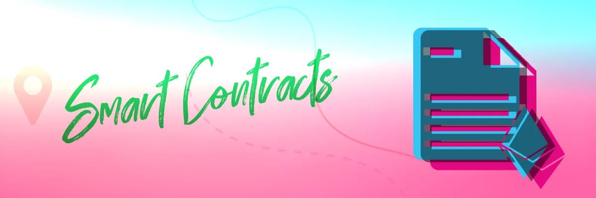

import { ImageText } from '@site/src/css/SharedStyling';

<!--truncate-->

2021 was the year of enormous things in the crypto world. We witnessed DeFi taking over the world, NFTs driving adoption and landing mainstream spots, Metaverse coming to a room near you and so many more things! And of course, the creation of EPNS Protocol, the communication layer for Web3 that will ensure all of these things (and more!) can function properly.

We had a phenomenal 2021 with building the tech that will empower the future of the internet aka Web3. Continuing with our vision of becoming the de-facto communication layer for Web3, the 2022 roadmap is designed to enable faster adoption of the EPNS protocol, becoming multi-chain, further perfecting the protocol, and enabling developers and wallets alike to integrate the protocol in the smoothest way possible.

To help us achieve our objectives, we will focus on the following product themes:

- EPNS Protocol & Smart Contracts (Send Notifications)
- Progressive Decentralized Governance
- Front-End products: dApp, Mobile App, Browser extension
- PUSH Nodes (Retrieval & Dispatch)
- Technical Documentation

TLDR;

### EPNS Protocol (Send Notifications)

2021 witnessed the creation and [successful audit](https://epns.io/EPNS-Protocol-Audit2021.pdf) of the EPNS Smart Contracts!

The main goal of the EPNS Protocol is to make sure all communication is prepared and sent in compliance with the protocol standards. This will make every notification readily available to be picked up by the PUSH Nodes in charge of dispatching.

The year 2021 witnessed quite significant modifications in the EPNS Smart contract.

As we continue to work towards our vision of becoming blockchain agnostic, we have now ensured that our protocol is capable of effectively supporting multi-chain interoperability.

In order for us to provide a communication layer across multiple chains, our protocol has now been divided into 2 major components namely EPNS Core & EPNS Comm(Communicator). As per the current architecture, the EPNSCore contract shall only be deployed to the Ethereum blockchain, the EPNSComm is designed to be used in multiple chains. Read more about the in-depth details about the contracts [here](https://medium.com/ethereum-push-notification-service/roadmap-q3-audited-epns-push-protocol-v1-is-here-f4560dfe550c).

While some of our imperative features like Channel Creation, notification sending, subscribe/unsubscribe, etc; were already designed in our smart contracts, new features are coming to the protocol this year. For instance:

- [Channel State cycles](https://medium.com/ethereum-push-notification-service/roadmap-q3-audited-epns-push-protocol-v1-is-here-f4560dfe550c): This feature allows a channel’s state to be changed in the protocol. A specific channel can either have an inactive, active, deactivated or even a blocked state. Moreover, a channel’s activities and capabilities in the protocol will also be highly dependent on the state of the channel,
- Addition or Removal of Delegate Notification senders: Yes, the whole procedure of Sending notifications to subscribers can now be delegated to any given wallet address. As per the current architecture of the protocol, a channel owner has the power to add any specific wallet address as a valid delegate for his/her channel, thus allowing the wallet to send notifications on his behalf,
- Verification of Channels through the smart contracts.
- Meta transaction for Subscribing, Unsubscribing Sending notifications, etc

Although most of the MVP features are already in place, there will be quite significant upgrades to the EPNS smart contracts in the year 2022 as well.

#### Functionality for Claiming Interests:

- One of the most significant features of our smart contracts and perhaps much-awaited one is the claim interests functionality that allows the users to claim their incentives from the contract.
- While this feature was initially planned for just the channel owners as well as subscribers in the EPNS contract, it is now being designed to distribute rewards among all $PUSH Token Holders. The incentives shall be in the form of $PUSH tokens themselves.
- This entire claim procedure shall be a part of the EPNS Core contracts and will be included very soon.

#### On-Chain Governance Mechanism:

- Since the launch of our EPNS Governance, it has been quite evident that EPNS wholeheartedly believes in the significance & power of a progressive decentralized governance system.
- While the EPNS community is actively participating in different governance frameworks like the Weekly Rockstar NFT, Grants program, etc, we shall have a similar procedure for the further development & upgrades of our smart contracts as well.
- As the EPNS Governance contracts have already qualified the entire security audit, the community shall soon be able to participate in the decision-making process for the inclusion of any new features in the contracts, upgrades of the contract to newer versions as well as the overall growth of the protocol.
- Moreover, some of the imperative functionalities of the current EPNS Core contract like blocking a channel permanently, verifying a channel, or revoking a channel’s verification shall also be handled via the on-chain governance procedure itself.

#### Wallet-to-Wallet Chat Functionality

- As per our recent announcement, one of the super interesting features that we are planning to launch this year is the Wallet to Wallet Chat feature. This functionality is undoubtedly is one of its kind and we are planning to modify our EPNS Core and Comm contracts to ensure this feature can be used adequately.

#### Designing EPNS Comm Contract for Non-EVM Chains:

- Becoming blockchain agnostic demands equal attention to all the different types of chains that exist in the Web3 world.
- While EPNS smart contracts are specifically designed for EVM compatible chains at the moment, we shall soon initiate the design and development process of our smart contracts for non-EVM chains as well.
- Since the EPNS Communicator contract is supposed to be deployed on multiple chains, it is, by design, comparatively simpler than Core and does not rely on the core contract for any of its actions. Hence, we shall especially be focussing on designing the EPNS Communicator contract in order to make it ready for deployment across all different types of chains, including the non-EVM compatible chains.

We are making it easier for teams and individual contributors to make use of all these features to create solutions. A revamped version of the Showrunners Framework will be made available together with Integration Guides aiming to foster a healthy and creative developers community using EPNS as the building block for communication needs.

### Progressive Decentralized Governance

We began the year 2021 with a firm belief in the fact that an effective Governance mechanism is one of the most crucial pillars for a decentralized protocol as well as the bridge that links and connects the community to the project. And it can undoubtedly be stated that we haven’t left a single stone unturned in our journey to build a <b>Progressive Decentralized Governance</b>, ever since.

Here’s what we did so far when it comes to governance:

- Since its inception in the month of September 2021, the Governance framework was launched with 3 imperative ways for the community to be involved, i.e., <i>Weekly Rockstar NFT, Grants Program as well as Metagovernance.</i>
- In order to ensure adequate coordination within the community to make better decisions, the initial phase of the governance was more about laying out the specific processes, rules as well as roles of governance.
- Moreover, we gradually shifted towards the use of Snapshot for a decentralized voting mechanism. Considering Snapshot’s easy gasless voting mechanism as well as our weekly EPNS Rockstart program, we saw steady growth in the number of delegates and participants in the Governance.

While these were just a few of the highlights from last year, the EPNS governance has much bigger and more interesting plans for 2022. True to those same themes, 2022 will bring to the Community additional contribution & reward streams and further $PUSH voting empowerment involving the EPNS ecosystem and protocol.

The goal of the governance team is to bring us ever closer to becoming a true DAO. In 2022 we’ll deliver the following:

<i>EPNS On-Chain Governance Contracts</i>: While the EPNS Governance contracts were already audited last year, we shall achieve one of our most crucial milestones this year with the launch of our governance smart contracts.

With the deployment of the EPNS Governance contracts, we shall be able to ensure that the community is capable of actively participating as well as contributing to the overall development of the smart contracts.

<i>Meta-Governance and DAO Partnerships</i>: The process of “DAO-ification” requires a robust governance environment and we get closer to that goal every day.

We’ll continue growing our Community, delivering the features wanted, and facilitating contributors to dedicate their talents to EPNS. One overall piece will be meta-governance, this means making our governance processes available to other communities outside our own and vice versa — giving $PUSH holders a greater voice in the web3 ecosystem.

Under this umbrella is partnering with other DAOs we identify as a community to be beneficial. That part is sort of intentionally vague because web3 collaboration is always changing and we want to evolve with it.

<i>Governance Website & dApp</i>: Additionally we shall also have a separate website specifically for the Governance procedure. This shall include all information regarding our governance. It shall allow our community members to create new proposals, vote on proposals, and also include our governance dashboard as well as other governance tooling integration.

### Front-End Products

We started 2021 with a very specific plan of providing effective user interfaces for our users to connect with our products and services. The three main UI components that we built last year were:

- dApp (Decentralized Application)
- Mobile Apps (IOS & Android)
- Browser Extension

#### dApp (Decentralized Application)

While most of the foundational features for the dApp were already developed in Q1 of 2021 itself, we have included some really interesting as well as significant features for both Channels and Users, as well. For instance:

For Channel Owners:

- A Channel Profile Page for every channel that includes all important details about a channel as well as crucial channel settings. Moreover, a specific channel’s profile page shall only be accessible by the owner of the channel.
- The Addition or Removal of a Delegate is an imperative action that can only be taken by the owner of a particular channel. This shall allow channel owners to add any wallet address as a valid delegate to send the notification on the channel’s behalf. Importantly, the channel owner can also a particular delegate at any given time.
- Deactivation of a Channel feature is a new feature that allows a channel owner to deactivate his/her channel. However, it's imperative to note that deactivation is an action that can only be performed by the owner of that channel while also allowing the channel owner to reactivate their channel whenever they want. The in-depth details about the deactivate channel feature can be found [here](https://medium.com/ethereum-push-notification-service/roadmap-q3-audited-epns-push-protocol-v1-is-here-f4560dfe550c).
- The [Channel verification badge](https://medium.com/ethereum-push-notification-service/roadmap-q3-audited-epns-push-protocol-v1-is-here-f4560dfe550c) feature is now also live on the dApp. This is a really interesting feature that not just assigns a verification badge for channels and aligns them in a better position in the UI but also allows the verified channels to verify other unverified channels.

<i>For Subscribers</i>

- Gasless Subscribe or Unsubscribe is perhaps one of the most significant and useful features that we implemented in the dApp. This allows an incredibly smooth as well as a zero-cost opt-in procedure for the users. Subscribing to a channel is now as simple as just signing the transaction with your wallet address without the need to pay any gas.
- Channel Search Bar in the dApp now allows users to look out for any channel that they want and opt-in easily.

#### What’s Next for the dApp?

Now that we have the basic and important features in place already, this year we are planning to add quite significant ones to enhance the user experience on the dApp. Some of them being:

- Redesigning of the dApp UI: To begin with, the [EPNS dApp](https://app.epns.io/) shall soon have a brand new UI design with a comparatively better experience for users. Since we already have started working on our new interface, we might have the new UI ready by Q1 of this year itself.
- Notification settings for Users and Channels: One of the most significant features that shall be launched this year is the notification setting for both users and channels.
  When it comes to notifications, a specific channel might have different types of notifications. While some notifications deal with the Governance updates of that channel, others might be related to the loan liquidations. Now with Channel notification settings, the channel owner shall be able to provide specific notification options to its users depending on the different kinds of notification a channel might have to offer.

On the other hand, notification settings for users shall allow users to be capable of being selective in terms of the notifications that they receive. Users will be able to precisely select only those notification options from a channel that they are interested in.

In other words, a user only interested in the governance proposals of a particular channel shall not receive other types of notifications from that channel despite being a valid subscriber of the channel.

- The dApp will also include a feature that allows editing or modifying a Channel’s Detail. This, however, shall only be doable by the owner of that channel.
- Search and Filteration of Notifications shall also be included in the dApp to simplify the process of searching for a particular notification.

#### Mobile App

Quite similarly to the dApp, our mobile apps have also come a long way now. While the early stages had only some of the initial important features on the apps, we have included quite a lot of significant features in the last year and modified our apps. Some of those features are as follows:

- Channel Discovery feature was added, which allows users to look at all the channels associated with EPNS.
- The Spam Box feature on our mobile apps ensured that the Spam notifications never entered the inbox of a user.
- Quite importantly, the Wallet Connect sign feature was enabled in the mobile app to ease the sign-in process.
- Moreover, the Opt-in feature was included in the mobile app. This allowed users to subscribed to their favorite channels right from their mobile.

This year, we are planning to add the following features to the mobile app:

- Support sign-in with multiple wallets so that the users can receive notifications for all their wallet addresses in one single place.
- Filters and search options for the channels list.
- Options to mute notifications for a specific time
- Visualizations for multi-chain notifications.
- Provide richer notifications for channels.

#### Browser Extension

While we already have the Browser Extension in place and completely functional now, this year we are planning on providing a richer and better UI design for the EPNS extension to ensure its on-pair with all other front-end product capabilities where it makes sense.

### PUSH Nodes (Retrieval & Dispatch)

Push Nodes can undoubtedly be stated as one of the most crucial components in our journey towards becoming a true reliable communication layer for the Web3 world.

Last year we included the following features in our Push Nodes:

- Off-Chain Notification
- Spam Feature
- Support for Polygon Notification
- Using local IPFS instance
- S3 Bucket Backup

While some of the very significant features of the Push Nodes were already built last year, this year we are planning to make our Push Nodes more powerful and effective. Some of the critical features that we are planning for the year 2022 are as follows:

- <b>Decentralization of Push Nodes</b>: While there is no denying the fact that our aim is to become a blockchain agnostic communication layer, we also understand that decentralization of our Push Nodes is unquestionably one of our top priorities. This is why we have tasked ourselves to decentralize the push nodes this year and achieve our goal of becoming a truly decentralized middleware solution.
  Decentralization of our push nodes is going to be a very imperative step towards becoming blockchain agnostic as this ensures higher scalability, stronger support for Layer 2 solutions as well enhanced performance, etc.

Moreover, along with the decentralization of our nodes, we shall also be implementing an effectual incentive mechanism for our active participants.

- <b>User and Channel Notification settings</b>: As previously mentioned, the notification settings for both users and channels are one of the much-awaited features that we shall introduce this year.

While our audited EPNS Core and EPNS Comm smart contracts already have the notification settings functions for both channels & users respectively, one of our important tasks this year is to ensure our push nodes are ready to support this feature.

- <b>Wallet-to-Wallet Chat feature</b>: The wallet-to-wallet chat feature is one of those super interesting features that the community is really looking forward to. Therefore, effectively enabling our push nodes to support this feature is one of the major tasks we are planning to work on by the Q3 of the year 2022.
- <b>Multi-chain support</b>: Since the EPNS smart contracts are already designed keeping in mind our vision of becoming blockchain agnostic, we also plan to ensure that our Push nodes are capable of handling multi-chain support. While we are already on the Ethereum blockchain, we will very soon launch our contracts on different chains like Polygon, BSC, etc. The year 2022 will not just witness the EPNS Contract on EVM compatible chains but also on non-EVM compatible chains like Solana.

Additionally, we are also planning to provide an analytics dashboard for Push Nodes

#### Technical Documentation

While we have been more inclined towards developing different components of our product, we are quite aware of the significance of effectual documentation.

This year, we are also planning to roll out extensive technical documentation as well as guides for both developers and users. Along with publishing new documentation we shall also be updating our previous technical documents, whitepaper and ensure that they are up-to-the-minute with all the latest changes.

Some of the crucial topics that we are planning to cover this year are as follows:

<i>
- Documentation on Back-end SDK
- Documentation on Front-end SDK
- Tutorial for Using Backend-SDK to Set-Up notifications for a channels
- Tutorial for Using Frontend SDK to integrate EPNS on a specific Protocol’s dApp
- Detailed description and explanation of CLAIM Functionality and incentive mechanisms of our EPNS Core smart contract
- Detailed Explanation on W2W Chat Feature.
</i>

With these plans for the product’s roadmap 2022, we have started this year with utmost belief and commitment to our mission of providing an effective and reliable communication layer for the Web3 world.

If you have any comments or questions please feel free to reach out to us on telegram or check out our website for more details: https://epns.io/
