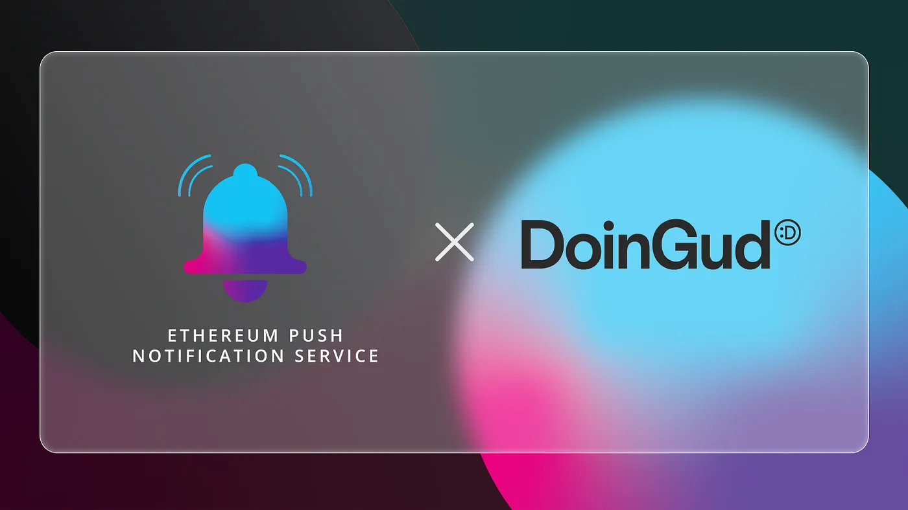

import { ImageText } from '@site/src/css/SharedStyling';

<!--truncate-->

EPNS and DoinGud, the creator ecosystem for the future of digital media and collectibles, team up to establish a decentralized communication channel between the platform and its users. Through decentralized push notifications powered by EPNS, users of DoinGud are poised to receive updates about their NFT sales, purchases, and auctions directly from the platform.

NFTs for a Social Impact
========================

Underpinned by blockchain technology, DoinGud is a platform that is both a social network and an NFT-marketplace to power the future of the creator economy. The platform aims to help creators build sustainable streams of income with their work, while also contributing to the causes they care about.

Creators on the platform can create and launch NFTs while choosing their favorite social cause to impact. Fans of these creators can engage with the content by buying and trading these NFTs on the platform without any platform fees. They have the opportunity to buy these digital goods using their crypto assets or credit cards and as such, DoinGud is one of the first few platforms to accept credit card for NFT-purchases. This helps lower the entry barriers to NFT market, allowing new users to make purchases with ease.

Moreover, DoinGud also has a suite of tools to help creators build an impactful brand and community. Allowing for fan communities to do good while supporting their favorite creator, therefore providing a unique way of interacting with art and community. And of course thanks to blockchain technology, the principles of transparency are always upheld. All the payments made to creators and contributions to social causes are displayed on the public ledger for users to view.

While DoinGud is currently in Beta, its unique approach to NFT-sales and trading is poised to have an influx of NFT-traders and as such needs a communication channel to streamline information about NFT sales.

What Does the Collaboration Entail
==================================

As a result of our collaboration with DoinGud, the platform will have an official channel on the EPNS channel. Users of the platform can subscribe to this channel and on doing so, they receive notifications if and whenever

*   New NFT drops are available
*   They receive an offer on the NFT
*   They’re outbid in an NFT auction
*   Their NFT is sold successfully

Apart from this, if users choose to follow or super-follow creators on the platform, they can also expect to receive updates about them.

As DoinGud aims to make NFT-trading easy and impactful, we’re enthralled to join them on this journey and believe we can make significant contributions to the platform’s overall user-experience.

**About DoinGud**
=================

DoinGud is a next-gen creator ecosystem exploring the future of digital media & collectibles. It strives to be community-owned and curated, working on empowering creators, curators, brands & organizations to engage with their audience, tap into sustainable compensation streams, generate value for their audiences and create meaningful impact.

Stay in touch! [Website](https://doingud.com/)

