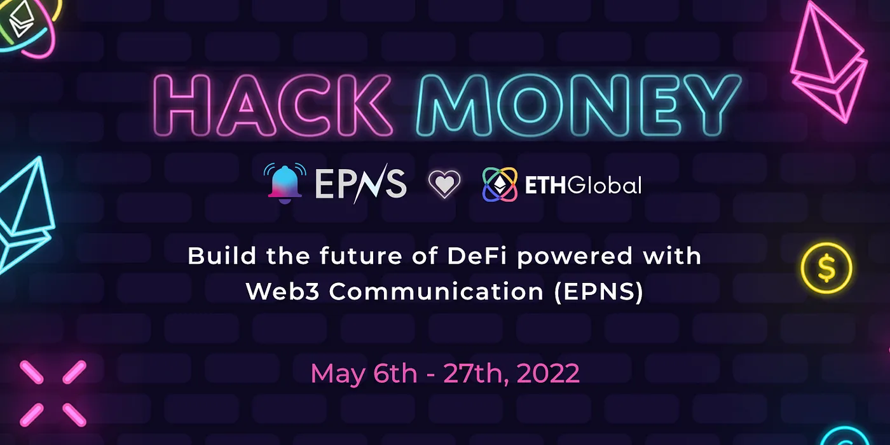

import { ImageText, VideoContainer } from '@site/src/css/SharedStyling';

<!--truncate-->

<ImageText>EPNS at Hack Money 2022</ImageText>

Hey Buidlers 👋! EPNS is calling all hackers to build using EPNS open communication protocol in their project at [#HackMoney2022](https://twitter.com/hashtag/HackMoney2022?src=hashtag_click) — [ETHGlobal](https://medium.com/u/3d1733b8e86a?source=post_page-----52170bcbf460--------------------------------)!

EPNS genesis started from ETHGlobal HackMoney’20 and we are proud of our roots. At HackMoney 2020, we ideated & hacked our proof of concept 💪. Since then we’ve had an awesome journey and are super grateful for all support and love we’ve received along the way. And now, we are proud to sponsor HackMoney’22, a full circle ❤️

<iframe src="https://cdn.embedly.com/widgets/media.html?type=text%2Fhtml&amp;key=a19fcc184b9711e1b4764040d3dc5c07&amp;schema=twitter&amp;url=https%3A//twitter.com/harshrajat/status/1254070990503464967&amp;image=https%3A//i.embed.ly/1/image%3Furl%3Dhttps%253A%252F%252Fabs.twimg.com%252Ferrors%252Flogo46x38.png%26key%3Da19fcc184b9711e1b4764040d3dc5c07" allowfullscreen="" frameborder="0" height="810" width="680" title="Harsh Rajat 🦇🔊 on Twitter: &quot;Ethereum Protocol Notification System (EPNS), a cool way to send push notifications is coming soon!!📩⚡️💥🚀We are super excited to be part @ETHGlobal HackMoney and to share our #buidl story 👩‍💻🧑‍🔧https://t.co/UlaJmCIrtW#DeFi @EthGlobal #Hack #Ethereum #blockchain / Twitter&quot;" class="eo n ff dy bg" scrolling="no"></iframe>

So what’s next! we’re teaming up with ETHGlobal to build the ultimate Web3 hackathon experience, and we want you 🫵 to be a part of it!

# 💰 Let’s talk prizes and our $1M grant!

Prizes Overview for HackMoney 2022

- 1st Prize — $ 2000 USDC
- 2nd Prize — $1500 USDC
- 3rd Prize — $ 500 USDC

You can find the Full Prize Breakdown on [defi.ethglobal.com/](https://defi.ethglobal.com/)

But that’s not it! Over and above this we have EPNS 🗳️ PUSH Grants Program for $1 Million! You’ll be able to find more details of this in our blog [**here**](https://medium.com/ethereum-push-notification-service/push-grants-program-going-live-6841515f95d8)**!**

And of course before you start hacking and reading the blog further, we thought we’d drop something important for you to check out before you get started. And then of course, tune in to our Founder Harsh Rajat, host a workshop Monday!

# 🔗 Important Reference links for Developers

- [EPNS Documentation Hub](https://docs.epns.io/)

# ⏰ Workshop

Date: Monday, 9th May 1.00 PM ET

Topic: Building Web3 Communication in your DeFi application

Speaker: [Harsh Rajat](http://twitter.com/harshrajat), Founder, EPNS

Set your reminders! See you there 👋

<VideoContainer>
<iframe width="100%" height="100%" style={{ borderRadius: "32px" }} src="https://www.youtube.com/embed/XsKGDVdKEFc" title="EPNS  Building Web3 Communication in your DeFi application" frameborder="0" allow="accelerometer; autoplay; clipboard-write; encrypted-media; gyroscope; picture-in-picture; web-share" allowfullscreen></iframe>
</VideoContainer>

<ImageText>Harsh Rajat, Founder & Project Lead — EPNS</ImageText>

# 🔔 Quick Rundown of EPNS

**Ethereum Push Notification Service (EPNS)** is the world’s first decentralized communication & notification protocol for Web3. Using the protocol, any smart contract, dApp or back end can send on-chain or off-chain notifications tied to wallet addresses of a user in a multichain, open, platform agnostic way. Being an open communication middleware, notifs can be integrated and shown on any crypto wallet, mobile apps, extension or dApps.

## Ideas to Buidl. Solve. Conquer.

As the blockchain ecosystem has evolved into a composable, multi-chain network, native Web3 communication is growing more and more necessary for user experience, developer operations, investor security, protocol architecture, and a lot more.

Today’s methods of communication between and among Web3 users and companies — dominated by Twitter, Discord, and Telegram — give rise to poor UX, scams, and sub optimal communication. Among some of the most pressing issues: smart contract version releases are missed, liquidation thresholds are not warned, NFT drops are forgotten, and vulnerabilities aren’t communicated well.

The result is a fractured and siloed approach towards communication in the blockchain ecosystem, making room for an optimised, Web3-native solution. EPNS is created to fix this! This is how:

**Integrate EPNS to your dApp and improve UX for all Web3 users**

- This is probably the easiest, As EPNS is a communication layer, the best and quickest way to get this going is to integrate EPNS in your dApp via our frontend [**sdk & tutorial**](https://github.com/push-protocol/embed-demo-app) here
- This will not only improve the user experience for your dApp as users can now instantly see all their notifications across all their activities that they have opted in for but it also vastly improves the entire UX of the Web3 space.

**_Screen1_**_\- User is connected to their wallet and has loaded their dApp._

**_Screen2_** _— User sees the EPNS notifications if they are subscribed to any channels in a sidebar which comes on the click on the bell icon._

**Create your dApp / protocol channel and send notifs**

- So, you already integrated EPNS but like to also improve the experience for your users. Well, this is where you can jump in and create your own channel (any service that sends notifications are called channels).
- After which you can easily start sending important notifications about your project directly to the wallet address in a gasless way.
- Whether you are creating DAO, DeFi, NFT, Metaverse or anything in between, having a direct form of communication tied to user’s wallet address massively improves the experience of your dApp (and goes extremely well with the bell icon you have integrated)

Check out our [**Showrunners**](https://docs.epns.io/developers/developer-tooling/showrunners-framework) **and** [**Tutorials**](https://docs.epns.io/developers/developer-zone/examples/showrunners-example) here for more details

**Create notifications channel for anything Web3**

- A lot of projects and protocols are popular but still don’t have notifications, you can build notifications for them, not only you get prizes for it but some amazing incentives are coming for the channels that are popular (though this is a different conversation). Some ideas that you can use if you want to build out a notif channel.

**Web3Comm for DeFi**

The DeFi ecosystem is a landscape of constant innovation. We have seen an unprecedented amount of on-chain activity, prompting acute needs from users to keep on top of what is happening. EPNS is poised to accelerate the adoption of the DeFi ecosystem to meet the needs of users and dapps to keep up with rapid innovation.

This of course is one while most important we’ve made quite a headway with a bunch of partners, however if you think you are able to renovate some of this, and build your own technology and have protocols that change the DeFi space for the better, we’d definitely invite you to explore this side of things. Some of the things that EPNS can enable for DeFI protocols and their users is to solve critical DeFi problems as below..

- Near Liquidation Alert (Borrowers & Liquidators)
- Staking Rewards Available to Claim (Stakers)
- Staking Rewards About to Expire (Stakers)
- Price Alerts (Traders)
- Stablecoin Peg Slippage (Arbitrageurs)
- Low Gas Cost (Devs, ETH Power Users)
- Rebalances (Token Set Users)
- Index Selection/Weighting Changes (Index Users)
- Token/Contract Migrations (Protocol Users)
- Governance Updates, Token Launches
- New Collateral Types on Money Markets
- New Liquidity Mining Incentives
- Yield Farming APY alerts
- Escrow Periods Ending / Tokens Coming Unlocked

Besides these there are a ton of other applications that’ll most web3 users in terms of getting communication or help on notification for that are of important notifications across the board.

# 🔗 Important Reference links for Developers

- [EPNS Documentation Hub](https://docs.epns.io/)

# ☎️ Who do we reach out to for assistance?

Feel free to reach out to us on the **sponsor-epns** channel on [**ETHGlobal Discord**](https://discord.gg/ethglobal)

- Pranshu, Tech Lead (pranshu #1367)
- Jaf, Integration Lead (Jaf | EPNS#7611) and their teams will be happy to assist.

# Throwback!! Hackers BUIDLing w/ EPNS at ETHAmsterdam

As you get cracking on BUIDLing with us we thought we’ll sign off with some memorable moments from our last hackathon at [ETHAmsterdam](https://twitter.com/epnsproject/status/1518558686498594816) and you’d know, when we go all out with our hackathons, we go all out!

All the best! 👍🤞👍🍀

[**Website**](http://epns.io/) **|** [**dApp (live tutorial)**](https://github.com/push-protocol/embed-demo-app)**|** [**RoadMap 2022**](https://medium.com/ethereum-push-notification-service/epns-roadmap-2022-2698ab153c1a) **|** [**Twitter**](http://x.com/PushChain) **|** [**Telegram**](https://t.me/epnsproject) **|** [**Discord**](https://discord.com/invite/YVPB99F9W5)
