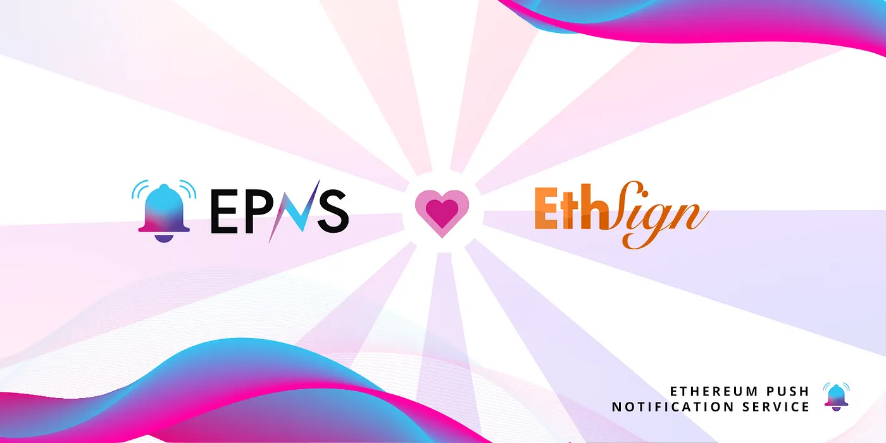

import { ImageText } from '@site/src/css/SharedStyling';

<!--truncate-->

The current generation of E-signing platforms such as DocuSign, HelloSign, PandaDoc, etc. utilizes traditional Web2 technology to make business processes and agreements easier to prepare, negotiate, sign and manage. They provide a “Modern System of Agreement” that automates the lifecycle of these processes by providing a platform for existing systems to connect and collaborate.

Although these current platforms such as DocuSign are remarkable and crucial to the digitalization of business processes, there is still much more possible which has not been envisioned by most of these platforms today.

Enter EthSign, a decentralized, versioned electronic agreement signing dApp built with Web3 technologies. EthSign uses blockchain (specifically Ethereum) to facilitate immutable and verifiable document signing. Blockchain technology undoubtedly has its place in agreement signing, such as providing a transparent audit trail, no server breakdown issues, permanent records of documents, and so on.

EthSign not only incorporates all features of a traditional electronic signing platform but a lot more. Currently, EthSign supports two offerings — EthSign3.0 (PDF Signing) & EthSign Smart Agreements (ESA).

EPNS is proud and thrilled to integrate with EthSign for our pilot program. During our collaboration with EthSign, we will implement the following use cases:

- Notifying a co-signer when added to the contract.
- Notifying when a co-signer signs a contract on EthSign.
- When comments are added to the contract by any of the signing parties.

We are excited to join hands with yet another project that is expanding the Web3 ethos of decentralization and bringing even more utility to Web3. We look forward to working with the EthSign team and bringing a decentralized communication layer to the next generation of electronic agreements.

### About EthSign

EthSign is a decentralized, electronic signing application built on Ethereum that allows users to upload, sign, and verify digital agreements. EthSign brings several advantages to users including decentralized and immutable storage of encrypted files, ease of integration with other protocols and dApps, and transparency in how data is managed that’s entirely subject to users’ consent.
